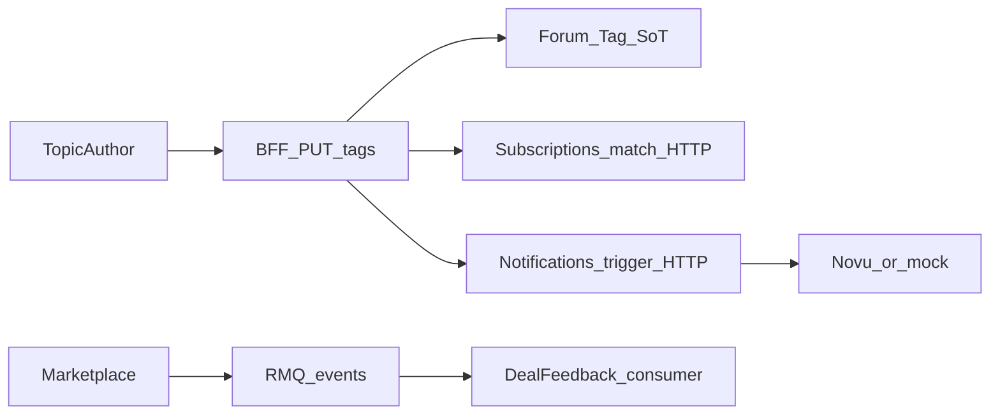

# 📋 WORK-PLAN-NEXT — аудит docs↔код + план на несколько дней

> **Статус:** living · **Дата:** 2026-07-16 · **Горизонт:** 3–4 рабочих дня  
> **Обновлять:** в конце каждого дня (статусы Day 1–4, закрытые коллизии)  
> **Очередь:** [AGENT-TODO.todo](../../AGENT-TODO.todo) · **Индекс:** [AGENT-DOCS-INDEX.md](./AGENT-DOCS-INDEX.md)

---

## 1. Snapshot

| | |
|---|---|
| **Фаза (факт)** | Docs v0.2 + scaffold+ многих сервисов (не «только docs») |
| **Live async** | `marketplace.order_completed` → RMQ → `deal-feedback` |
| **Live sync** | BFF `PUT …/tags` → subscriptions `match` → notifications `trigger` |
| **Docs-only (нет package.json)** | `rating`, `webhooks` |
| **Код есть** | bff, billing, plan-config, auction, subscriptions, forum, user-profile, scalar-config, notifications (:3010), marketplace (:3011), deal-feedback (:3006), periods (:3014) |

**Что в хорошем состоянии:** Formal Tag/ContentTag ≈ [forum/tags.md](../05-microservices/forum/tags.md); exclude actor + dedupe users в fan-out + unit-тесты; TAG → `sourceDomain: platform`; Swarm не публикует domain services через Traefik.

---

## 2. Коллизии docs ↔ код

| Sev | Проблема | Док / код | Исправление |
|-----|----------|-----------|-------------|
| **HIGH** | PROJECT-CONTEXT: `notifications` = «только docs»; фаза «BFF — docs» | [PROJECT-CONTEXT.md](./PROJECT-CONTEXT.md) vs `services/notifications` | Inventory + фаза → Day 1 |
| **HIGH** | Порт **3011**: webhooks (docs) и marketplace (код) | [webhooks/README.md](../05-microservices/webhooks/README.md) · `marketplace` `DEFAULT_PORT` | webhooks → **3015** · Day 1 |
| **HIGH** | event-catalog завышает producers/consumers; имена `auction-subscriptions`, `feedback` | [event-catalog.md](../03-architecture/event-catalog.md) | Implemented/Planned; rename; HTTP `tag.content_tagged` · Day 1 |
| **HIGH** | Каталог микросервисов: порты `—`, статусы 📝 устарели | [05-microservices/README.md](../05-microservices/README.md) | Синхрон с [AGENTS.md](../../AGENTS.md) · Day 1 |
| **MED** | 10-data: схемы `auction_subscriptions` / `feedback` | [10-data/README.md](../10-data/README.md) | → `subscriptions` / `deal_feedback` · Day 1 |
| **MED** | Architecture overview: `settings`, `feedback`, `auction-subscriptions` | [03-architecture/README.md](../03-architecture/README.md) | Canonical names · Day 1 |
| **MED** | local-dev: нет marketplace / deal-feedback / periods | [local-dev.md](../04-deployment/local-dev.md) | Добавить порты · Day 1 |
| **MED** | swarm-stacks / naming examples: старые имена | [swarm-stacks.md](../04-deployment/swarm-stacks.md), [naming.md](../13-maintenance/naming.md) | Rename · Day 1 (по возможности) |
| **LOW** | AGENT-TODO секция «Financial-policy»; item activate+charge вероятно уже есть | [AGENT-TODO.todo](../../AGENT-TODO.todo) · `PlansController.activate` | Проверить · Day 4 |
| **LOW** | DOCS-ROADMAP «код↔docs parity ~15%» занижен относительно факта | [DOCS-ROADMAP.md](./DOCS-ROADMAP.md) | Обновить после Day 1 |

---

## 3. Code review (problems)

### Critical / High — действовать на этой неделе

| # | Sev | Cat | Где | Находка | Рекомендация |
|---|-----|-----|-----|---------|--------------|
| 1 | **critical** | security | `services/bff/.../forum.controller.ts` | `PUT …/tags` возвращает `tagFanout.matchedUserIds` (UUID подписчиков автору) | Публично только `{ notified, skipped }` · **Day 1** |
| 2 | **high** | security | `notifications` / `subscriptions` `/internal/v1/*` | Нет auth; docs обещают service JWT | Shared service-token / deny-by-default · Day 2+ |
| 3 | **high** | reliability | `subscription-fanout.service.ts` | Best-effort без outbox/retry; частичный fail безвозвратен | RMQ / idempotent redelivery · Day 3 |
| 4 | **high** | architecture | BFF tag PUT | Fan-out **await** на write path (match×N + trigger×users) | Post-commit / fire-and-forget / RMQ · Day 3 |
| 5 | **high** | reliability | match + trigger | `DeliveryPreference` (`pushEnabled`, quiet hours) **игнорируется** | Фильтр перед trigger · Day 2 |
| 6 | **high** | reliability | notifications trigger / log | Нет idempotency key → дубли Novu | `idempotencyKey` + unique · Day 2 |
| 7 | **high** | architecture | event-catalog vs код | `tag.content_tagged` только HTTP-оркестрация BFF, не событие | RMQ SoT · Day 3 |

### Medium

| # | Cat | Находка | Когда |
|---|-----|---------|-------|
| 8 | reliability | `replaceTopicTags` без транзакции | после Day 2 |
| 9 | reliability | Legacy jsonb → ContentTag на **GET** без fan-out | после Day 2 |
| 10 | reliability | BFF `fetch` без timeout/AbortSignal | **Day 2** |
| 11 | api | Лимит тегов только `.slice(0, 10)`, не 400 | backlog |
| 12 | api | TAG `options.domains` в docs, не в `match` | backlog |
| 13 | reliability | Digest CRON: `DAILY` всегда due; stub `triggered: 0` | после Novu |
| 14 | security | Unknown `workflowId` только warn, всё равно trigger | **Day 2** |
| 15 | ux | List = truncate UUID; TAG без href | **Day 3** |
| 16 | ux | N× `GET /subscriptions` на chip'ах тегов | Day 3/4 |
| 17 | architecture | Create topic с tags: fan-out легко пропустить | при изменении create |

### Low / tech-debt

- Race create slug tag; UNIQUE NULLS NOT DISTINCT для `DIGEST_GLOBAL`
- Delivery prefs: email digest «Pro» без upsell; quiet hours нет в UI
- ADR-004 `@novu/node` vs raw `fetch` в коде
- Fan-out payload `tagIds` даже при partial match failure

---

## 4. План Day 1–4

### Day 1 — Docs parity + security hotfix

- [x] [PROJECT-CONTEXT.md](./PROJECT-CONTEXT.md): inventory, фаза, порты (webhooks **3015**, marketplace **3011**)
- [x] [05-microservices/README.md](../05-microservices/README.md): статусы/порты
- [x] [webhooks/README.md](../05-microservices/webhooks/README.md): port **3015**
- [x] [local-dev.md](../04-deployment/local-dev.md): marketplace, deal-feedback, periods
- [x] [event-catalog.md](../03-architecture/event-catalog.md): Implemented/Planned; rename; HTTP tag fan-out note
- [x] [10-data/README.md](../10-data/README.md) + architecture overview: canonical schema/service names
- [x] **Code:** убрать `matchedUserIds` из ответа `PUT /forum/topics/:id/tags` (оставить counts + server logs)

### Day 2 — Notifications hardening

- [ ] Ops: Novu Dashboard workflow `tag-content` + `NOVU_API_KEY` (или явно mock-only на staging)
- [ ] Reject unknown `workflowId` → 400
- [ ] `idempotencyKey` на trigger + дедуп в log
- [ ] Учитывать `pushEnabled` (+ quiet hours если дёшево) перед trigger
- [ ] BFF clients: `AbortSignal` timeout ~2s
- [ ] Заложить service-token для `/internal/v1/*` (env в PLATFORM-SECRETS)

### Day 3 — Async fan-out + UX titles

- [ ] Минимальный publish/consume `tag.content_tagged` (BFF или forum → RMQ → subscriptions → notifications)
- [ ] Снять await fan-out с критического write path
- [ ] Enrich subscription list titles через BFF; ссылки на TAG
- [ ] (желательно) shared subscription store для chip'ов

### Day 4 — Product slice + backlog hygiene

- [ ] Закрыть UX titles, если не уложились в Day 3; иначе OpenAPI fragment invites в `docs/06-api`
- [ ] Проверить `POST /plans/activate` + billing charge → ✔ в AGENT-TODO или оставить с пометкой gap
- [ ] Переименовать секцию Financial-policy → plan-config в AGENT-TODO
- [ ] Обновить строки в AGENT-DOCS-INDEX (дата, статусы)

---

## 5. Вне скоупа этой недели

- Полная реализация `webhooks` сервиса
- Periods: d3 timeline + `periodId` на auction/forum
- Vanga: Monte Carlo, CSV/PDF, `services/vanga` :3013
- `rating` microservice
- Legal L-17 webhooks
- Полный E2E invites (можно только OpenAPI на Day 4)

---

## 6. Definition of done (неделя)

| Критерий | Done when |
|----------|-----------|
| Docs parity | PROJECT-CONTEXT, microservices README, ports, event-catalog snapshot без HIGH-коллизий из §2 |
| Security hotfix | PUT tags не отдаёт `matchedUserIds` |
| Notify path | Unknown workflow rejected; prefs частично уважаются; timeouts на BFF clients; idempotency начат |
| Fan-out | Есть путь к async (хотя бы skeleton) **или** явно зафиксирован временный sync + risks |
| UX | Список подписок показывает имена, не только UUID (для topic/tag) |
| Backlog | AGENT-TODO и индекс синхронизированы с фактом |

---

## 7. Связанные документы

- [PROJECT-CONTEXT.md](./PROJECT-CONTEXT.md)
- [AGENT-DOCS-INDEX.md](./AGENT-DOCS-INDEX.md)
- [DOCS-ROADMAP.md](./DOCS-ROADMAP.md)
- [event-catalog.md](../03-architecture/event-catalog.md)
- [subscriptions/README.md](../05-microservices/subscriptions/README.md)
- [notifications/README.md](../05-microservices/notifications/README.md)
- [forum/tags.md](../05-microservices/forum/tags.md)
- [security-ops.md](../09-security/security-ops.md)

---

**Автор:** AI session audit 2026-07-16 · **Версия:** 0.1
