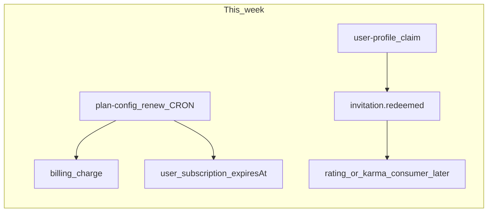

# 📋 WORK-PLAN-NEXT — неделя: billing renew + referral event

> **Статус:** living · **Дата:** 2026-07-16 · **Горизонт:** 3–4 рабочих дня  
> **Фокус:** plan-config CRON auto-renew + `invitation.redeemed` (RMQ)  
> **Обновлять:** в конце каждого дня (чеклисты Day 1–4)  
> **Очередь:** [AGENT-TODO.todo](../../AGENT-TODO.todo) · **Индекс:** [AGENT-DOCS-INDEX.md](./AGENT-DOCS-INDEX.md)

**Предыдущая неделя (закрыта):** docs parity · notifications harden · RMQ `tag.content_tagged` · titles/store · invites OpenAPI/quota/flow test — см. git log `e43cc44`…`a7a809e`.

---

## 1. Snapshot (после прошлой недели)

| | |
|---|---|
| **Фаза** | Scaffold+ · BFF/SPA живые · docs в целом в паритете по портам/именам |
| **Live RMQ** | `marketplace.order_completed` → deal-feedback · `tag.content_tagged` → subscriptions → notifications |
| **Live sync fallback** | BFF PUT tags → HTTP match/trigger если RMQ недоступен (`mode: async`) |
| **Plans** | `POST /plans/activate` + billing charge при `price>0` ✅ · **auto-renew CRON ❌** |
| **Invites** | create/resolve/claim + plan-config quota ✅ · BFF flow test ✅ · **`invitation.redeemed` RMQ stub** |
| **Ops open** | Novu Dashboard `tag-content` (не блокирует код) |

---

## 2. Коллизии / gaps (актуальные)

| Sev | Проблема | Где | Когда |
|-----|----------|-----|-------|
| **HIGH** | Paid plan не продлевается после `expiresAt` | plan-config · нет CRON/job | **Day 1–2** |
| **HIGH** | Claim не публикует domain event | user-profile TODO · [event-catalog](../03-architecture/event-catalog.md) `invitation.redeemed` | **Day 3** |
| **MED** | Activate idempotencyKey = `randomUUID()` каждый раз | plan-config `subscriptions.service` | Day 2 (stable key) |
| **MED** | Digest CRON stub `triggered: 0` | subscriptions | backlog (после Novu) |
| **MED** | `INTERNAL_SERVICE_TOKEN` optional (fail-open unset) | notifications/subscriptions | harden later / ops |
| **LOW** | Quiet hours нет в UI delivery prefs | frontend `/subscriptions` | backlog |
| **LOW** | Create topic с tags — fan-out легко пропустить | forum/BFF | при изменении create |
| **LOW** | DOCS-ROADMAP parity % возможно устарел | [DOCS-ROADMAP.md](./DOCS-ROADMAP.md) | Day 4 hygiene |

---

## 3. Code review leftovers (не закрывать всё сразу)

Из прошлой недели **ещё open / частично**:

| # | Тема | Статус |
|---|------|--------|
| — | matchedUserIds leak | ✔ закрыто |
| — | prefs + idempotency + AbortSignal | ✔ закрыто |
| — | RMQ tag fan-out + async write path | ✔ закрыто |
| — | titles + TAG href + shared store | ✔ закрыто |
| M8 | `replaceTopicTags` без транзакции | backlog |
| M13 | Digest delivery | после Novu ops |
| — | service-token required in non-dev | ops / Day 4 optional |

---

## 4. План Day 1–4

### Day 1 — Design + renew skeleton (plan-config)

- [x] Spec slice в [plan-config/README.md](../05-microservices/plan-config/README.md): due / charge / fail → `EXPIRED`
- [x] `POST /internal/v1/subscription/renew/run` (external CRON)
- [x] Pure logic unit tests + `runRenew` service test
- [x] PLATFORM-SECRETS ops note (curl/CRON); колонка `billingPeriod`

### Day 2 — Billing charge + harden activate

- [x] Wire renew → `BillingClient.charge` (`plan-config.renew-plan:{planId}`) — сделано вместе с Day 1
- [x] Stable idempotencyKey: renew + activate (day-scoped)
- [x] Tests: success extends; fail → `EXPIRED` без extend
- [ ] Docs: event-catalog — publish `subscription.activated` / `subscription.expired` ещё не из кода (опционально Day 2 хвост или с Day 3)

### Day 3 — `invitation.redeemed` RMQ

- [x] Publish из user-profile после успешного **первого** claim (`InviteEventsPublisher`)
- [x] Payload: inviteeId / inviterId / inviteCodeId / acceptedAt
- [x] Consumer: документирован bind + planned (rating svc вне скоупа)
- [x] Unit test: claim twice → одна публикация
- [x] event-catalog / AGENT-TODO ✔

### Day 4 — Product glue + hygiene

- [ ] BFF/frontend: убедиться что claim path после Logto callback не ломается; при необходимости smoke note в invites-api
- [ ] Ops checklist: Novu `tag-content` остаётся ☐ (не блокер кода) — явно в AGENT-TODO
- [ ] AGENT-DOCS-INDEX + PROJECT-CONTEXT pointer на этот work plan
- [ ] (если успеем) quiet-hours UI **или** DOCS-ROADMAP parity refresh — одно небольшое

---

## 5. Вне скоупа этой недели

- Periods: d3 timeline + `periodId` на auction/forum *(следующий кандидат после billing)*
- Vanga: Monte Carlo, CSV/PDF, `services/vanga` :3013, founder checkpoint 0
- Полный `rating` microservice / karma side-effects от `invitation.redeemed`
- `webhooks` outbound service
- Digest email real delivery
- Playwright/browser E2E invites

---

## 6. Definition of done (неделя)

| Критерий | Done when |
|----------|-----------|
| Auto-renew | Due subscriptions с `autoRenew` продлеваются через billing charge (хотя бы internal run + tests) |
| Fail path | Неуспешный charge не сдвигает `expiresAt` безосновательно; поведение задокументировано |
| Referral event | `invitation.redeemed` уходит в RMQ при первом claim; идемпотентность claim сохраняется |
| Docs/backlog | event-catalog, plan-config README, AGENT-TODO, AGENT-DOCS-INDEX синхронизированы |
| Не расползтись | Periods/Vanga/webhooks не начаты «заодно», кроме явного Day 4 tiny hygiene |

---

## 7. Связанные документы

- [plan-config/README.md](../05-microservices/plan-config/README.md)
- [billing/README.md](../05-microservices/billing/README.md)
- [invites-api.md](../05-microservices/bff/invites-api.md) · [06-api/invites-api.md](../06-api/invites-api.md)
- [event-catalog.md](../03-architecture/event-catalog.md) · [messaging.md](../03-architecture/messaging.md)
- [club-access.md](../01-goal/club-access.md) · [ADR-012](../03-architecture/adr/012-club-invite-via-logto.md)
- [PLATFORM-SECRETS.md](../02-infrastructure/PLATFORM-SECRETS.md) · [PLATFORM-REGISTRY.md](../05-microservices/PLATFORM-REGISTRY.md)

---

**Автор:** AI session 2026-07-16 · **Версия:** 0.2 (week: billing + invites event)
