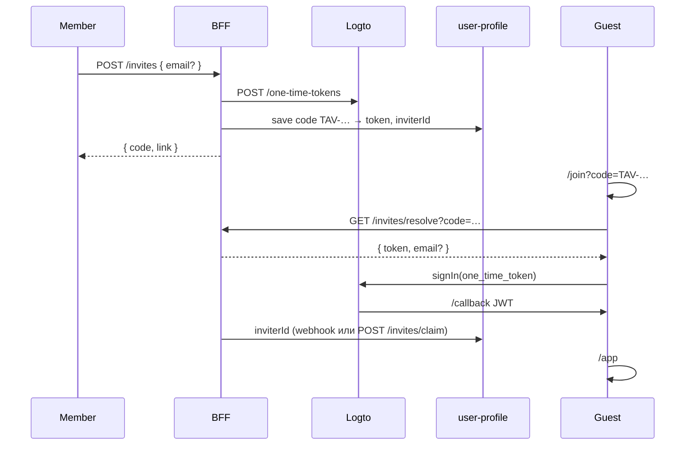

# 🏛️ Клуб: доступ и инвайты

> **Статус:** spec ready · **Версия:** 0.2  
> **ADR:** [012-club-invite-via-logto](../03-architecture/adr/012-club-invite-via-logto.md)  
> **Связано:** [platform-for-users.md](./platform-for-users.md) · [roles.md](./roles.md) · [karma-and-rating.md](./karma-and-rating.md)

## Простыми словами

**Tavrida Lot — закрытый клуб.** С улицы виден только лендинг.

| Вопрос | Ответ |
|--------|--------|
| Кто такой member? | Любой, кто **вошёл через Logto** нашего tenant |
| Зачем инвайт? | Чтобы **новый человек мог зарегистрироваться** (публичная регистрация выключена) и чтобы знать **кто кого пригласил** |
| Нужен ли инвайт после входа? | **Нет.** Учётка в Logto = доступ в клуб |
| Что делить: код или ссылку? | Оба. Код `TAV-XXXX-XXXX` — короткий alias той же magic-ссылки |

---

## 🚪 Уровни доступа

| Уровень | Кто | Маршруты |
|---------|-----|----------|
| **Visitor** | Не вошёл в Logto | `/`, `/about`, `/join` |
| **Member** | Есть JWT Logto | Весь SPA (`/app`, аукционы, форум, …) |
| **Moderator / Expert / Admin** | Member + Keto role | + mod/admin UI |

Router: `requiresMember` → нет JWT → redirect на `/` или «Войти».

---

## ✉️ Инвайты (регистрация + сетка)

### Для гостя

1. Получает **ссылку** или **код** от участника клуба.
2. Открывает `/join?token=…&email=…` или `/join?code=TAV-XXXX-XXXX`.
3. Logto: регистрация (новый) или вход (уже был аккаунт).
4. Сразу member — редирект в `/app`.

### Для участника

1. `/invites` → «Пригласить» → email (опционально) или «Скопировать ссылку / код».
2. BFF создаёт one-time token в Logto + код `TAV-…`.
3. Друг переходит по ссылке — попадает в клуб; мы записываем `inviterId`.

### День 0 (bootstrap)

1. Admin / основатель — пользователь в Logto (Console или первый magic link).
2. Публичная регистрация в Logto **выключена**.
3. Admin создаёт первые инвайты; дальше — цепочка members.

---

## Поток (технический)

---

## Правила (draft)

| Правило | Значение |
|---------|----------|
| Кто выдаёт | Member (лимит per plan — FP) |
| Код | `TAV-XXXX-XXXX`, alias magic link |
| Срок | `club.invite.validityDays` (default 14) |
| Admin | Без лимита; audit log |
| Реферал | `inviterId` при первом входе по invite — [karma-and-rating.md](./karma-and-rating.md) |
| Денежные бонусы | Опционально — [referral-rewards](../05-microservices/referral-rewards/README.md) (если программа включена) |

---

## ⚙️ Переменные

### settings

| Ключ | Default | Описание |
|------|---------|----------|
| `club.registration.inviteOnly` | `true` | Sign-up только по invite link — **frontend:** `GET /api/v1/settings/public`, landing/join copy |
| `club.invite.validityDays` | `14` | TTL кода / token |
| `club.landing.publicSections` | `about,rules,request` | Блоки лендинга |

### financial-policy (per plan)

| Ключ | Free | Basic | Pro |
|------|------|-------|-----|
| `club.invitesPerMonth` | 1 | 3 | 10 |

---

## Logto Console (чеклист)

- [ ] Sign-in experience → **Disable user registration** (invite-only)
- [ ] SPA app: redirect `http://localhost:5173/callback`
- [ ] M2M app для BFF → Management API (`one-time-tokens`)
- [ ] Email connector (если шлём письма из Logto; иначе — своё)

---

## 🔗 Связанные разделы

- [logto-setup.md](../14-frontend/logto-setup.md) — фронт + env
- [bff/invites-api.md](../05-microservices/bff/invites-api.md) — REST spec
- [user-profile](../05-microservices/user-profile/README.md) — коды, `inviterId`
- [referral-rewards](../05-microservices/referral-rewards/README.md) — денежные вознаграждения (опционально)
- [roles.md](./roles.md) — Guest vs Member

---

**v0.2-spec** · ADR-012
