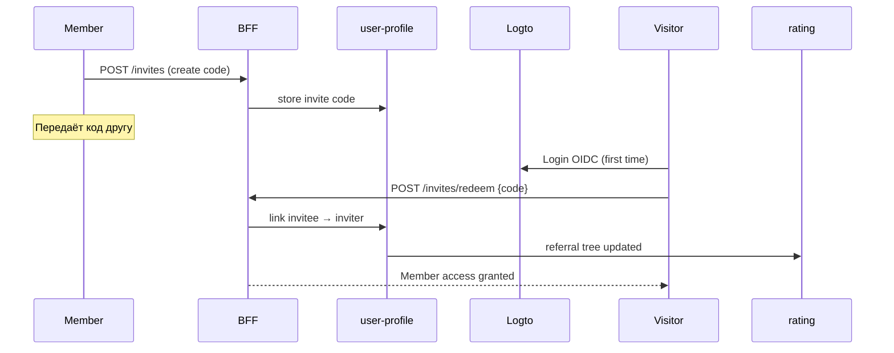

# 🏛️ Клуб: доступ и инвайты

> **Статус:** spec ready · **Версия:** 0.1  
> **Связано:** [platform-for-users.md](./platform-for-users.md) · [roles.md](./roles.md) · [karma-and-rating.md](./karma-and-rating.md)

## 🎯 Позиционирование

**Tavrida Lot — клуб**, а не открытый маркетплейс. Участники попадают внутрь по **приглашению**; снаружи — только **лендинг** (о клубе, правила, запрос инвайта).

| Снаружи (без аккаунта) | Внутри (член клуба) |
|------------------------|---------------------|
| Лендинг `/` | Аукционы, форум, профиль, кошелёк |
| Описание клуба | Ставки, посты, сделки |
| «У меня есть инвайт» → вход | Полный продукт |

**Открытая регистрация отключена** (`club.registration.inviteOnly = true` в settings).

---

## 🚪 Уровни доступа

| Уровень | Кто | Маршруты |
|---------|-----|----------|
| **Visitor** | Не авторизован | Только `/`, `/about`, `/invite` (ввод кода), legal |
| **Member** | Logto + принятый инвайт | Весь SPA за auth-guard |
| **Moderator / Expert / Admin** | Member + Keto role | + mod/admin UI |

Router: `requireMember` — без JWT или без `invitationAcceptedAt` → redirect `/invite` или landing.

---

## ✉️ Инвайты

### Жизненный цикл

### Правила (draft)

| Правило | Значение |
|---------|----------|
| Кто выдаёт инвайт | Member (лимит per plan — FP) |
| Код | Одноразовый или multi-use — `club.invite.codeType` |
| Срок жизни | `club.invite.validityDays` |
| Admin | Неограниченно; audit log |

### Влияние на рейтинг/карму пригласившего

Зависит от успехов и провалов **приглашённых** на **N уровней** вглубь — см. [karma-and-rating.md § Реферальное дерево](./karma-and-rating.md#-6-реферальное-дерево-инвайты).

---

## ⚙️ Переменные

### settings (глобальные)

| Ключ | Тип | Default | Описание |
|------|-----|---------|----------|
| `club.registration.inviteOnly` | boolean | `true` | Закрытая регистрация |
| `club.invite.validityDays` | number | 14 | Срок действия кода |
| `club.invite.codeType` | enum | `SINGLE_USE` | `SINGLE_USE` \| `MULTI_USE` |
| `club.landing.publicSections` | string[] | `about,rules,request` | Блоки лендинга |

### financial-policy (per plan)

| Ключ | Тип | Free | Basic | Pro | Описание |
|------|-----|------|-------|-----|----------|
| `club.invitesPerMonth` | limit | 1 | 3 | 10 | Новых кодов в месяц |
| `club.referralInfluenceEnabled` | feature | true | true | true | Учитывать дерево в rating/karma |

> Полный реестр referral coeffs: [karma-and-rating.md](./karma-and-rating.md) · [PLATFORM-REGISTRY](../05-microservices/PLATFORM-REGISTRY.md)

---

## 🔗 Связанные разделы

- [karma-and-rating.md](./karma-and-rating.md)
- [user-profile](../05-microservices/user-profile/README.md) — хранение `inviterId`, коды
- [14-frontend](../14-frontend/README.md) — guards, landing route

---

**Автор:** команда разработки · **Версия:** 0.1-spec
