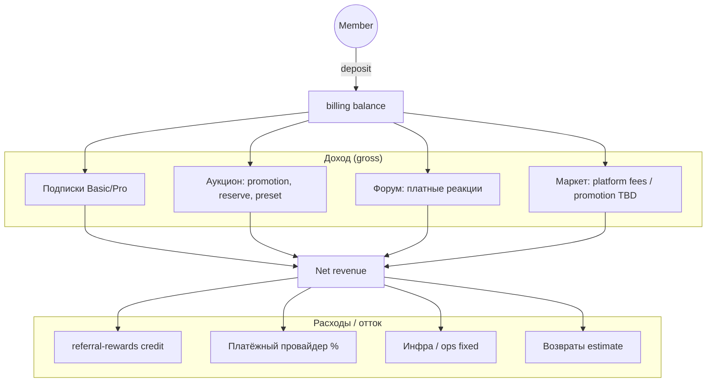

# 💰 Каталог монетизации Tavrida Lot

> **Статус:** draft · **Версия:** 0.1 · **Аудитория:** PM, founder, admin, Oracle  
> **Связано:** [platform-for-users](./platform-for-users.md) · [PLATFORM-REGISTRY](../05-microservices/PLATFORM-REGISTRY.md) · [Oracle](../05-microservices/oracle/README.md)

## 🎯 Назначение

**Единый указатель** всех потоков денег в системе: что приносит доход, что списывает, откуда берутся формулы и параметры.

- Для людей — [platform-for-users.md](./platform-for-users.md) (§ «Деньги и тарифы»).
- Для конфигурации — [PLATFORM-REGISTRY.md](../05-microservices/PLATFORM-REGISTRY.md).
- Для **прогноза** — [Oracle](../05-microservices/oracle/README.md) ([topic-index](../05-microservices/oracle/topic-index.md))

---

## 📊 Карта потоков (упрощённо)



> **Не монетизируем:** GMV сделок между участниками (аукцион победитель↔продавец, заказ маркета provider↔customer) — см. [legal-scope](../05-microservices/referral-rewards/requirements/legal-scope.md).

---

## 1️⃣ Подписки (recurring)

| Источник | planId | Где хранится цена | Алгоритм списания | Событие |
|----------|--------|-------------------|-------------------|---------|
| Активация плана | `basic`, `pro` | `financial_policy.plan.monthlyPrice` / `yearlyPrice` | FP → `billing.charge` target `financial-policy.activate-plan:{planId}` | `subscription.activated` |
| Автопродление | тот же | то же | CRON FP: `expiresAt <= now` ∧ `autoRenew` → charge → extend | `subscription.activated` или `subscription.expired` |

**Oracle assumptions (входные ползунки):**

| Параметр | Описание | Default (draft) |
|----------|----------|-----------------|
| `newRegistrationsPerMonth` | Новые members (Logto) | admin |
| `planMix.free` / `basic` / `pro` | Доля новых на плане (сумма = 100%) | 70 / 25 / 5 |
| `monthlyChurnRate` | % подписок Basic+ → Free / месяц | 5% |
| `autoRenewRate` | % с включённым автопродлением | 60% |
| `yearlyShare` | % выбравших годовой биллинг | 20% |

**Формула (месяц):**

```
MRR_subscriptions =
  count_basic_active × price_basic_monthly
+ count_pro_active × price_pro_monthly
+ yearly_amortized (yearlyPrice/12 × count_yearly)
```

Детали: [financial-policy/README](../05-microservices/financial-policy/README.md).

---

## 2️⃣ Разовые списания (one-time)

Фиксированные цены → `billing.charge` + `target`. Реестр: [PLATFORM-REGISTRY § Разовые](../05-microservices/PLATFORM-REGISTRY.md).

### auction

| Target | ₽ | Кто платит | Условие |
|--------|---|------------|---------|
| `auction.promotion` | 200 | Pro (feature) | [financial-features](../05-microservices/auction/requirements/financial-features.md) |
| `auction.reservePrice` | 100 | Pro | то же |
| `auction.customDurationPreset` | 50 | Pro | то же |

### forum

| Target | ₽ | Примечание |
|--------|---|------------|
| `forum.reaction.*` | 50–100 | Только Pro; pin — модератор, бесплатно |

### marketplace (TBD)

| Target | Статус |
|--------|--------|
| `marketplace.listingPromotion` | TBD |
| `marketplace.featuredPlacement` | TBD |
| `marketplace.platformFee` | TBD |

**Oracle assumptions:**

| Параметр | Описание |
|----------|----------|
| `auctionsCreatedPerUserPerMonth` | по плану (из FP limits × activity) |
| `promotionAttachRate` | % лотов с promotion среди Pro |
| `forumPaidReactionRate` | % тем с платной реакцией / месяц |
| `marketplaceAttachRate` | TBD до утверждения цен |

**Формула:**

```
one_time_revenue = Σ (events_i × price_i × attach_rate_i)
```

---

## 3️⃣ Пополнения баланса (не доход)

`billing.deposit` — перевод **собственных** денег пользователя на баланс. Для P&L это **не выручка**, но влияет на:

- конверсию в подписку / разовые покупки;
- cash flow (если Oracle считает «деньги в системе»).

| Параметр | Источник |
|----------|----------|
| `billing.minDepositAmount` | settings `billing.*` |

---

## 4️⃣ Реферальные выплаты (outflow)

Денежные бонусы — **расход** (credit через billing). Не от GMV сделок.

| Категория charge | Триггер | Настройки |
|------------------|---------|-----------|
| `SUBSCRIPTION` | `billing.charge_completed` | `referralRewards.*` в settings |
| `AUCTION_SERVICES` | promotion и др. | [charge-categories](../05-microservices/referral-rewards/requirements/charge-categories.md) |
| `MARKETPLACE_SERVICES` | platform charges | то же |

**Oracle assumptions:**

| Параметр | Описание |
|----------|----------|
| `referralProgramEnabled` | checkbox |
| `referralAttachRate` | % платящих с inviter |
| `avgReferralDepth` | 1…N по `referralRewards.maxDepth` |

---

## 5️⃣ Затраты (cost sliders в Oracle)

| Категория | Примеры | Период |
|-----------|---------|--------|
| **Fixed** | VPS, Logto, Novu, домен, мониторинг | ₽/мес |
| **Variable** | % платёжного провайдера от deposit | % от gross |
| **Variable** | RabbitMQ / storage рост | ₽/active user |
| **People** | поддержка, модерация (опционально) | ₽/мес |

---

## 6️⃣ Где живут параметры (для чекбоксов Oracle)

| Слой | Сервис | Примеры ключей | Редактирует |
|------|--------|----------------|-------------|
| **Settings** | `settings` | `billing.minDepositAmount`, `referralRewards.*`, `club.*` | admin |
| **Plans & limits** | `financial-policy` | `Plan` prices, `auction.activeAuctions`, `club.invitesPerMonth` | admin |
| **One-time prices** | billing constants + registry | `auction.promotion` = 200 | code + registry |
| **Assumptions** | **Oracle only** | registrations, mix, churn, attach rates, tree | admin (simulation); defaults: `config/oracle.defaults.yaml` |

---

## 7️⃣ Индекс по сервисам

| Сервис | Доход | Расход | Документ |
|--------|-------|--------|----------|
| financial-policy | подписки | — | [README](../05-microservices/financial-policy/README.md) |
| billing | исполнение charge/deposit | referral credit | [README](../05-microservices/billing/README.md) |
| auction | promotion, reserve, preset | — | [financial-features](../05-microservices/auction/requirements/financial-features.md) |
| forum | paid reactions | — | [requirements](../05-microservices/forum/requirements/README.md) |
| marketplace | platform fees TBD | — | [README](../05-microservices/marketplace/README.md) |
| referral-rewards | — | payouts | [README](../05-microservices/referral-rewards/README.md) |
| **oracle** | прогноз (read-only) | — | [README](../05-microservices/oracle/README.md) |

---

## 🔄 Обновление каталога

1. Новая платная фича → строка в §2 + `billing.target` + PLATFORM-REGISTRY.
2. Новая подписка / цена → `financial_policy.plan` + §1.
3. Новая формула Oracle → [oracle/README](../05-microservices/oracle/README.md) + `config/oracle.defaults.yaml` + `@tavrida/monetization-engine`.

---

**Автор:** команда разработки · **Версия:** 0.1-draft
