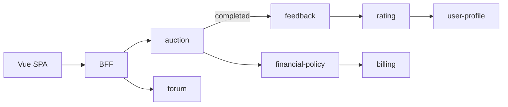

# 🎬 Сценарии платформы — индекс

> **Статус:** spec ready · **Версия:** 0.2  
> **Назначение:** поведение Tavrida Lot в **трёх группах по частоте** — разные стандарты качества на каждую.

Не заменяет [platform-for-users.md](./platform-for-users.md) (проза) и README сервисов.

---

## 📂 Три группы

| Группа | Доля (ориентир) | Документ | Сценарии |
|--------|-----------------|----------|----------|
| **Частые** | ~85% | [frequent.md](./scenarios/frequent.md) | S-001…S-017 |
| **Средние** | ~12% | [occasional.md](./scenarios/occasional.md) | S-020…S-026 |
| **Редкие** | ~3% | [rare.md](./scenarios/rare.md) | S-030…S-037 |

---

## 🧭 Формат сценария

| Поле | Смысл |
|------|--------|
| **ID** | `S-xxx` — issues, `.feature`, Playwright |
| **G/W/T** | Given / When / Then |
| **Компоненты** | Сервисы и каналы |
| **Тест** | E2E · INT · UNIT |

**Traceability:** сценарий → [wireframe](../11-ux-ui/wireframes/README.md) → [API](../06-api/README.md) / [events](../03-architecture/event-catalog.md) → тест.

---

## 🧪 Стандарты по группам

| Стандарт | Частые | Средние | Редкие |
|----------|--------|---------|--------|
| **BDD (E2E)** | Smoke на каждый PR; полный набор nightly | Перед релизом; happy path обязателен | При поставке фичи mod/admin |
| **TDD (UNIT)** | Обязателен для изменённой domain-логики | Обязателен для billing/FP/charge | Keto/authz, penalty math |
| **Integration** | Bid, feedback chain, WS | Payment saga, subscribe fan-out | Mod promote, ban CRON |
| **SLO** | [Строгие](../07-observability/slo.md) p95/p99 | Стандартные | Best-effort |
| **Perf (k6)** | Ставки, каталог | — | — |
| **Документация** | Wireframe + API sync | Registry + billing target | ADR + Keto tuples |

**MVP gate (prod):** частые — S-010, S-003, S-011, S-012, S-015; средние — S-021; редкие — S-036 (negative).

---

## 🫀 Платформа как организм

**Кровоток** — группа «Частые» (просмотр → действие → событие → репутация):

Позвоночник событий: `auction.completed` → `feedback.submitted` → `rating.updated` → `billing.charge_completed`.

---

## 📋 Открытые решения

| Сценарий | Вопрос |
|----------|--------|
| S-020 | Payment provider |
| S-015 | Disclaimer: расчёт между пользователями off-platform |
| S-037 | Marketplace dispute flow |
| cross | Service JWT vs mTLS |

---

## 🔗 Связанные документы

- [platform-for-users.md](./platform-for-users.md)
- [roles.md](./roles.md)
- [08-testing](../08-testing/README.md)

---

**Автор:** команда разработки · **Версия:** 0.2-spec
