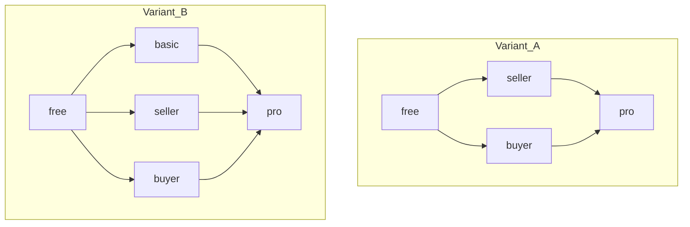

# 📐 Тарифы Seller / Buyer / Pro — proposal для обсуждения

> **Статус:** proposal · **Версия:** 0.2-draft · **Дата:** 2026-07-16  
> **Аудитория:** founder, PM, команда (консенсус **до** правок реестра и кода)  
> **Не accepted:** пока нет командного фидбека — **не** обновлять PLATFORM-REGISTRY, roles, platform-for-users, seed plan-config, Vanga.

Исходные числа Free/Basic/Pro — из [PLATFORM-REGISTRY.md](../05-microservices/PLATFORM-REGISTRY.md).  
Ниже **два варианта** упаковки и общая классификация параметров S / B / N. Числа — черновик для дискуссии.

---

## 🎯 Зачем этот файл

1. Зафиксировать **проблему** «универсального» mid-тарифа при двустороннем рынке.
2. Разложить plan variables на **S / B / N** (общая база для любого варианта).
3. Сравнить **два варианта** линейки планов:
   - **A** — заменить `basic` на Seller + Buyer; Pro = union;
   - **B** — **оставить Free / Basic / Pro** и **добавить** Seller + Buyer.
4. Для **B** отдельно продумать **стратегию разделения** фич и лимитов (иначе пять планов размоются).
5. Собрать открытые вопросы → после консенсуса каскад docs/кода.

---

## 1. Проблема

### 1.1. Что уже заложено в системе

Платформа — клуб: аукционы, форум, маркет услуг. Участник почти всегда играет **две стороны**:

"почти всегда" - такли это ?

| Сторона | Аукцион | Маркет | Типичная мотивация |
|---------|---------|--------|--------------------|
| **Продавец / provider** | Выставляет лоты, продвижение, резерв, аналитика | Листинги, портфолио | Оборот, витрина, доверие |
| **Покупатель / bidder / customer** | Ставки, типы аукционов, поиск/фильтры | Заказы услуг | Находки, удобный поиск, объём участия |

Лимиты и фичи в plan-config **уже размечены facet’ами** (`seller` / `bidder` / `buyer` / `author` / `member`) — см. [registry-keys.md](../13-maintenance/registry-keys.md). То есть **технически** ориентация «в сторону продавца или покупателя» уже есть в ключах.

### 1.2. Что ломается в упаковке Free / Basic / Pro

| planId | Смысл сейчас |
|--------|----------------|
| `free` | Старт, жёсткие лимиты |
| `basic` | «Активный участник» — **и** продавцу, **и** покупателю чуть больше всего |
| `pro` | Почти без лимитов + seller-фичи |

**Basic — компромисс «среднее по больнице»:**

- Продавцу часто **мало** seller-фич (promotion / reserve / analytics / листинги).
- Покупателю дают рост demand, но он **переплачивает** за неиспользуемый supply (и наоборот).
- Сдвиг экономики через settings усиливает перекос → «универсальный Basic» ещё хуже матчится с ценностью.
- Vanga / ARPU: один mid-сегмент смешивает seller-heavy и buyer-heavy.

Итог: нужны **ориентированные** планы. Вопрос команды — **заменять** Basic или **дополнять** линейку.

---

## 2. Два варианта линейки (сравнение)

| | **Вариант A — замена Basic** | **Вариант B — Basic + два новых** |
|--|------------------------------|-----------------------------------|
| Планы | `free`, `seller`, `buyer`, `pro` | `free`, `basic`, `seller`, `buyer`, `pro` |
| Роль Basic | Удаляется (миграция подписчиков) | Остаётся «универсальный mid» как сейчас |
| Роль Seller/Buyer | Единственные mid-тарифы по осям | Специализированные планы **рядом** с Basic |
| Роль Pro | Union обеих осей | Вершина: ≥ max(Basic, Seller, Buyer) |
| Миграция | Обязательна: куда деть `basic` | Мягче: `basic` живёт; новые — opt-in |
| Риск UX | Проще меню (4 плана) | Сложнее выбор (5 планов) → нужна чёткая дифференциация |
| Риск экономики | Чистые сегменты | Каннибализация Basic ↔ Seller/Buyer без жёстких trade-off |

Группы **S / B / N** (§3) общие. Отличаются **правила заполнения колонок** (§4 и §5).

---

## 3. Три группы параметров (общая база)

| Группа | Смысл | Типичные facet |
|--------|-------|----------------|
| **S — Seller** | Supply: лоты, листинги, seller-фичи | `seller`, auction-link |
| **B — Buyer** | Demand: ставки, поиск, заказы, подписки на лоты | `bidder`, `buyer`, auction search/subs |
| **N — Neutral** | Клуб, форум-community, rating, referral, webhooks* | `member`, `author`, `reaction` |

\*Webhooks → S или N — открытый вопрос.

### 3.1. Seller (S)

| Ключ | Тип | Почему S |
|------|-----|----------|
| `auction.seller.lot.activeMax` | limit | Свои ACTIVE лоты |
| `auction.seller.lot.dailyCreateMax` | limit | Темп выставления |
| `auction.seller.image.countMax` | limit | Витрина лота |
| `auction.seller.image.sizeMaxMb` | limit | Качество медиа |
| `auction.seller.lot.durationMaxHours` | limit | Гибкость длительности |
| `auction.seller.promotion.enabled` | feature | Продвижение |
| `auction.seller.reservePrice.enabled` | feature | Резерв |
| `auction.seller.durationPreset.customEnabled` | feature | Шаблоны длительности |
| `auction.seller.analytics.dashboardEnabled` | feature | Аналитика продавца |
| `auction.seller.promotion.unitPrice` | price | Разовая цена |
| `auction.seller.reservePrice.unitPrice` | price | то же |
| `auction.seller.durationPreset.unitPrice` | price | то же |
| `marketplace.seller.listing.activeMax` | limit | Витрина услуг |
| `marketplace.seller.portfolio.itemMax` | limit | Портфолио |
| `marketplace.seller.portfolio.image.sizeMaxMb` | limit | Медиа портфолио |
| `marketplace.seller.listing.promotionUnitPrice` | price | TBD |
| `marketplace.seller.listing.featuredUnitPrice` | price | TBD |
| `forum.author.19topic.auctionLinkEnabled` | feature | Тема «обсуждение лота» — lean S |

### 3.2. Buyer (B)

| Ключ | Тип | Почему B |
|------|-----|----------|
| `auction.bidder.participation.activeMax` | limit | Параллельное участие |
| `auction.bidder.bid.hourlyMax` | limit | Темп ставок |
| `auction.bidder.auctionTypes.allowed` | enum | DUTCH / all |
| `auction.member.search.scope` | enum | Поиск каталога |
| `auction.member.search.filtersEnabled` | feature | Фильтры каталога |
| `marketplace.buyer.order.monthlyMax` | limit | Заказы |
| `subscriptions.member.auction.categoryMax` | limit | Подписки на категории лотов |
| `subscriptions.member.auction.lotMax` | limit | Подписки на лоты |

### 3.3. Neutral (N)

| Ключ | Тип | Почему N |
|------|-----|----------|
| `forum.author.post.dailyMax` | limit | Community |
| `forum.author.comment.perTopicMax` | limit | то же |
| `forum.admin.category.depthMax` | limit | кандидат в scalar |
| `forum.author.thread.depthMax` | limit | то же |
| `forum.author.attachment.*` | limit | то же |
| `forum.author.tag.countMax` | limit | то же |
| `forum.author.topic.pinnedMax` | limit | то же |
| `forum.author.media.embeddedEnabled` | feature | то же |
| `forum.author.post.anonymousEnabled` | feature | то же |
| `forum.author.reply.nestedEnabled` | feature | то же |
| `forum.author.11notify.pushEnabled` | feature | то же |
| `forum.author.12notify.emailDigestEnabled` | feature | то же |
| `forum.author.13topic.chatEnabled` | feature | то же |
| `forum.author.14search.filtersEnabled` | feature | то же |
| `forum.author.15search.scope` | enum | то же |
| `forum.author.16post.lengthMax` | limit | то же |
| `forum.author.17topic.customFieldsEnabled` | feature | то же |
| `forum.author.18tag.priorityEnabled` | feature | то же |
| `forum.reaction.*.unitPrice` | price | не ориентация |
| `rating.member.pending.dealMax` | limit | репутация |
| `rating.member.auction.activeWhenLimitedMax` | limit | то же |
| `club.member.invite.monthlyMax` | limit | рост клуба |
| `club.member.referral.influenceEnabled` | feature | tree |
| `referralRewards.program.enabled` | feature | referral $ |
| `referralRewards.payout.multiplier` | limit | то же |
| `referralRewards.earning.monthlyMax` | limit | то же |
| `subscriptions.member.forum.categoryMax` | limit | форум-подписки |
| `subscriptions.member.forum.topicMax` | limit | то же |
| `subscriptions.member.tag.max` | limit | теги |
| `subscriptions.member.notify.emailDigestEnabled` | feature | digest |
| `webhooks.member.endpoint.max` | limit | интеграции |
| `webhooks.member.replay.dailyMax` | limit | то же |
| `webhooks.member.userScope.enabled` | feature | то же |

---

## 4. Вариант A — заменить Basic на Seller + Buyer

### 4.1. Смысл

Линейка: **Free → Seller | Buyer → Pro**.  
Basic исчезает; Pro = union сильных осей.

### 4.2. Принципы заполнения

1. Free — как сейчас (узко с обеих сторон; marketplace seller = 0).
2. Seller — сильный **S**; по **B** ≈ Free; по **N** ≈ бывший Basic.
3. Buyer — сильный **B**; по **S** ≈ Free; по **N** ≈ бывший Basic.
4. Pro — max/union по каждой оси; N = бывший Pro.
5. Разовые `price` пока одинаковые по тарифам.

### 4.3. Цены (ориентир)

| planId | UI | Monthly |
|--------|-----|---------|
| `free` | Free | 0 |
| `seller` | Продавец | ~149 ₽ |
| `buyer` | Покупатель | ~99 ₽ |
| `pro` | Pro | ~399 ₽ |

### 4.4. Черновик значений (A)

**S:**

| Ключ | Free | Seller | Buyer | Pro |
|------|------|--------|-------|-----|
| `auction.seller.lot.activeMax` | 2 | **12** | 2 | ∞ |
| `auction.seller.lot.dailyCreateMax` | 3 | **20** | 3 | ∞ |
| `auction.seller.image.countMax` | 3 | **8** | 3 | 8 |
| `auction.seller.image.sizeMaxMb` | 3 | **10** | 3 | 10 |
| `auction.seller.lot.durationMaxHours` | 72 | **∞** | 72 | ∞ |
| `auction.seller.promotion.enabled` | false | **true** | false | true |
| `auction.seller.reservePrice.enabled` | false | **true** | false | true |
| `auction.seller.durationPreset.customEnabled` | false | **true** | false | true |
| `auction.seller.analytics.dashboardEnabled` | false | **true** | false | true |
| `marketplace.seller.listing.activeMax` | 0 | **10** | **0** | ∞ |
| `marketplace.seller.portfolio.itemMax` | 0 | **12** | 0 | 20 |
| `marketplace.seller.portfolio.image.sizeMaxMb` | 0 | **5** | 0 | 8 |
| `forum.author.19topic.auctionLinkEnabled` | false | **true** | false | true |

**B:**

| Ключ | Free | Seller | Buyer | Pro |
|------|------|--------|-------|-----|
| `auction.bidder.participation.activeMax` | 5 | 5 | **40** | ∞ |
| `auction.bidder.bid.hourlyMax` | 20 | 20 | **150** | ∞ |
| `auction.bidder.auctionTypes.allowed` | ENGLISH | ENGLISH | **ENGLISH,DUTCH** | all |
| `auction.member.search.scope` | TITLE | TITLE | **FULL_TEXT** | FULL_TEXT,FILTERS |
| `auction.member.search.filtersEnabled` | false | false | **true** | true |
| `marketplace.buyer.order.monthlyMax` | 2 | 2 | **30** | ∞ |
| `subscriptions.member.auction.categoryMax` | 3 | 3 | **25** | ∞ |
| `subscriptions.member.auction.lotMax` | 5 | 5 | **50** | ∞ |

**N:** Seller = Buyer = бывший Basic; Pro = бывший Pro  
(forum mid 50/∞, invites 3/10, referral on mid, webhooks 2/10; digests/filters форума в основном Pro — как в текущем реестре Basic→Pro).

### 4.5. Плюсы / минусы A

| + | − |
|---|---|
| Чистые сегменты, простое меню | Миграция всех `basic` |
| Нет каннибализации с «универсальным mid» | Кто хочет **умеренно обе** оси — только Pro |
| Легче Vanga (2 mid-сегмента) | Потеря имени Basic в UX |

---

## 5. Вариант B — оставить Basic, добавить Seller и Buyer

### 5.1. Смысл

Линейка: **Free / Basic / Pro** без ломки + **два ориентированных плана** рядом.

| planId | Роль в линейке |
|--------|----------------|
| `free` | Старт |
| `basic` | Универсальный mid (**баланс** S+B+N = текущий реестр) |
| `seller` | Специализация **supply** |
| `buyer` | Специализация **demand** |
| `pro` | Верх: не хуже max(Basic, Seller, Buyer) по каждому ключу |

Миграция существующих Basic-подписчиков **не нужна**. Новые планы — для тех, кому «универсальный mid» мало по одной оси.

### 5.2. Зачем отдельная стратегия разделения

Если просто «Seller = чуть больше Basic по лотам»:

- Basic ≈ Seller по цене → Seller не берут;
- Seller ≫ Basic по **всем** осям → Basic умирает;
- пять почти одинаковых колонок → support / admin / Vanga кошмар.

Нужны **явные правила**, чем Basic отличается от Seller/Buyer и чем Pro остаётся вершиной.

### 5.3. Стратегия разделения фич и лимитов (B)

#### Правило 1 — Basic = «сбалансированный mid» (заморозить текущую сетку)

Колонка **Basic** в PLATFORM-REGISTRY **не переписывается** под этот proposal.

- По **S**: mid-лимиты; **без** Pro-only seller features (promotion/reserve/analytics = false, как сейчас).
- По **B**: mid + DUTCH; поиск FULL_TEXT **без** расширенных фильтров (как сейчас).
- По **N**: mid (invites 3, nested replies, webhooks 2, …).

Basic отвечает: *«Хочу и продавать, и покупать умеренно, без специализации»*.

#### Правило 2 — чужая ось намеренно слабее Basic

| Ось ключа | На плане **Seller** | На плане **Buyer** |
|-----------|---------------------|--------------------|
| **S** | **≥ Basic** (лимиты) + **включить** seller-фичи, выключенные на Basic | **≤ Free** (не продаём витрину) |
| **B** | **≤ Free** (строго слабее Basic) | **≥ Basic**, часто ближе к Pro |
| **N** | **= Basic** | **= Basic** |

Seller — не «Basic++ по всему», а **усиленная seller-ось + seller-фичи ценой урезания buyer-оси**.  
Buyer — зеркально.

#### Правило 3 — разделять «лимиты» и «фичи»

| Слой | Basic | Seller | Buyer | Pro |
|------|-------|--------|-------|-----|
| Лимиты **S** | mid | **high** | low (Free) | ∞ / top |
| Фичи **S** (promotion, reserve, analytics, presets, auction-link) | **off** | **on** | off | on |
| Лимиты **B** | mid | low | **high** | ∞ / top |
| Фичи/enum **B** (DUTCH, search filters) | DUTCH; filters **off** | как Free | DUTCH + filters **on** | all / on |
| **N** | mid | = Basic | = Basic | top |

Тезис для варианта B:

> **Basic** продаёт **баланс лимитов**.  
> **Seller / Buyer** продают **ориентацию**: высокие лимиты своей оси **+ фичи, которых нет на Basic**.  
> **Pro** — без компромисса по обеим осям + N-top.

Иначе Seller = «Basic с большим `activeMax`» — слабый апгрейд с Basic.

#### Правило 4 — цена и анти-каннибализация

| План | Monthly (ориентир) | Отношение к Basic (~99) |
|------|--------------------|-------------------------|
| `basic` | ~99 ₽ | якорь |
| `seller` | **~129–149 ₽** | ≈ или чуть дороже Basic: **фичи S + high S**, mid-B **теряешь** |
| `buyer` | **~99–119 ₽** | ≈ Basic: **high B + filters**, mid-S **теряешь** |
| `pro` | ~399 ₽ | заметно дороже любого mid |

Запрещено: Seller ≥ Basic по **S и B и N** при цене ≤ Basic.  
Разрешено: Seller **хуже Basic по B** при цене ≈ Basic — явный trade-off «я продавец».

Смысл апгрейда Basic→Seller: получить **seller-фичи** (сейчас только у Pro) **без** полного Pro.  
Basic→Buyer: **filters / высокий bid ceiling**, если витрина не нужна.

#### Правило 5 — Pro = вершина

Для каждого ключа: `Pro ≥ max(Basic, Seller, Buyer)`  
(feature OR; enum — самый широкий набор; limit — max / ∞).

#### Правило 6 — один planId vs add-on

| Подвариант | Суть | Когда |
|------------|------|-------|
| **B1 — exclusive** (рекомендация v0.2) | Один активный `planId`; Seller/Buyer **не** стакаются с Basic | Проще billing/renew |
| **B2 — add-on** | Basic/Free + add-on оси; effective = merge(max) | Гибче, сложнее activate/UI |

Первый релиз proposal: **B1**. Add-on — отдельное решение позже.

### 5.4. Черновик сетки (B) — иллюстрация

**Basic** = текущий реестр. Seller/Buyer по §5.3.

**S (фрагмент):**

| Ключ | Free | Basic | Seller | Buyer | Pro |
|------|------|-------|--------|-------|-----|
| `auction.seller.lot.activeMax` | 2 | 5 | **12** | 2 | ∞ |
| `auction.seller.lot.dailyCreateMax` | 3 | 10 | **20** | 3 | ∞ |
| `auction.seller.promotion.enabled` | false | false | **true** | false | true |
| `auction.seller.reservePrice.enabled` | false | false | **true** | false | true |
| `auction.seller.analytics.dashboardEnabled` | false | false | **true** | false | true |
| `marketplace.seller.listing.activeMax` | 0 | 3 | **10** | **0** | ∞ |
| `forum.author.19topic.auctionLinkEnabled` | false | false | **true** | false | true |

**B (фрагмент):**

| Ключ | Free | Basic | Seller | Buyer | Pro |
|------|------|-------|--------|-------|-----|
| `auction.bidder.participation.activeMax` | 5 | 20 | **5** | **40** | ∞ |
| `auction.bidder.auctionTypes.allowed` | ENGLISH | ENGLISH,DUTCH | ENGLISH | ENGLISH,DUTCH | all |
| `auction.member.search.filtersEnabled` | false | false | false | **true** | true |
| `marketplace.buyer.order.monthlyMax` | 2 | 10 | **2** | **30** | ∞ |
| `subscriptions.member.auction.lotMax` | 5 | 20 | **5** | **50** | ∞ |

> На Seller колонка B **как Free** (хуже Basic) — иначе Basic бессмысленен.

**N:** Free/Basic/Pro как в реестре; **Seller = Buyer = Basic**.

### 5.5. Подсказка выбора (B)

| Хочу… | Беру |
|-------|------|
| Попробовать клуб | Free |
| И продавать, и покупать умеренно | **Basic** |
| Много лотов / листинги / promotion; ставки не важны | **Seller** |
| Много ставок / поиск / заказы; витрина не нужна | **Buyer** |
| Всё без компромисса | **Pro** |

### 5.6. Плюсы / минусы B

| + | − |
|---|---|
| Нет миграции Basic | 5 планов — сложнее онбординг |
| Basic = «безопасный» выбор | Каннибализация без §5.3 |
| Seller/Buyer открывают часть Pro-фич дешевле Pro | Больше колонок в admin / Vanga / тестах |
| Эволюционный путь | Нужна сильная UX-копия отличий |

---

## 6. Сводка A vs B (для голосования)

| Критерий | A (замена) | B (расширение) |
|----------|------------|----------------|
| Mid-планы | 2 ориентированных | 1 баланс + 2 ориентированных |
| Миграция | Да | Нет |
| Дифференциация | Проще | Обязателен каркас §5.3 |
| «Обе оси mid» | Только Pro | **Basic** |
| Сложность seed/кода | 4 planId | 5 planId |
| Billing | 1 активный | B1: 1 активный; B2: add-on позже |

---

## 7. Открытые вопросы

### Выбор варианта

1. Идём в **A** или **B**?
2. Если **B**: **B1** (один planId) или **B2** (add-on)?

### Продукт

3. Upgrade / switch / proration между планами?
4. Buyer: `listing.activeMax=0` или 1 «пощупать»?
5. Имена planId / UI.
6. Yearly сразу?

### Классификация

7. Webhooks → S или N?
8. Forum digests → N или B?
9. `subscriptions.member.tag.max` → N или B?
10. `forum.admin.category.depthMax` → scalar?

### Экономика

11. Финальные monthlyPrice (якорь Basic при B).
12. Скидки на разовые `price`?
13. Referral: с какого плана?
14. Vanga-сегменты после A/B.

### Миграция

15. Только **A**: маппинг существующих `basic`.
16. После принятия — seed, admin UI, тексты, тесты.

---

## 8. Что **не** делаем сейчас

- [ ] Не меняем PLATFORM-REGISTRY / seed / ADR
- [ ] Не каскадим roles / platform-for-users / monetization-catalog
- [ ] Не пишем код миграции

После фидбека: принять **A или B** (+ B1/B2) → один проход docs → seed → код.

---

## 9. Чеклист обсуждения команды

- [ ] Выбрать **вариант A или B**
- [ ] Если B — зафиксировать §5.3 (trade-off чужой оси ≤ Free)
- [ ] Согласовать S / B / N
- [ ] Контр-таблица чисел или ok черновику
- [ ] Ответы на §7 (хотя бы 1–2, 11, 15)
- [ ] Owner на каскад docs после принятия

---

## 🔗 Связанные (read-only)

- [PLATFORM-REGISTRY.md](../05-microservices/PLATFORM-REGISTRY.md)
- [registry-keys.md](../13-maintenance/registry-keys.md)
- [roles.md](./roles.md)
- [platform-for-users.md](./platform-for-users.md)
- [monetization-catalog.md](./monetization-catalog.md)
- [plan-config/README.md](../05-microservices/plan-config/README.md)

---

**Автор:** команда (draft для консенсуса) · **Версия:** 0.2-draft
