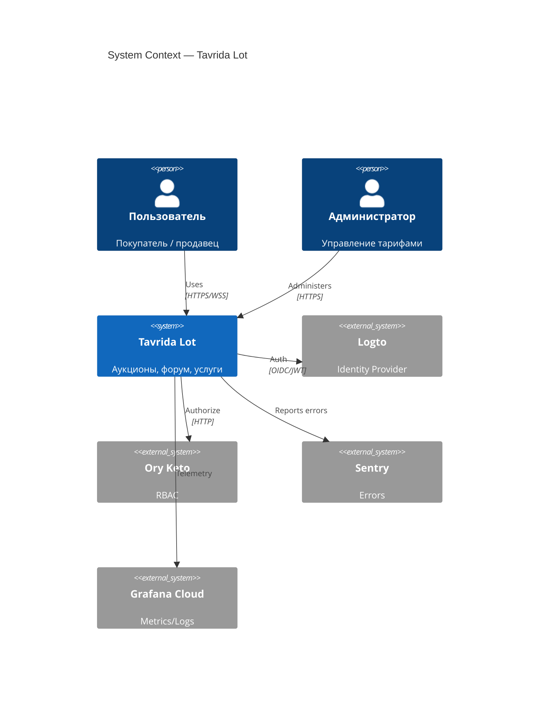
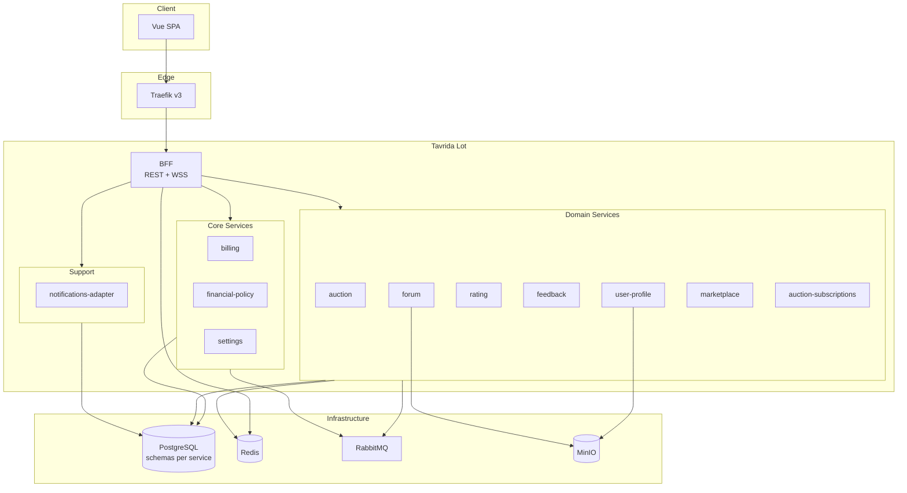
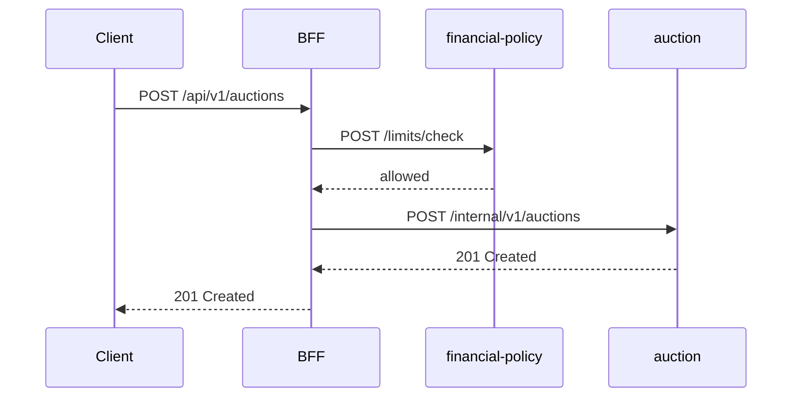
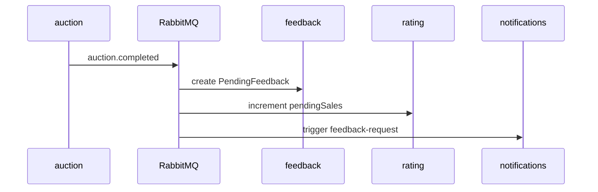

# 🏛️ Архитектура Tavrida Lot

> **Статус:** draft v0.2 · **Версия:** 0.2

## 🎯 Обзор

Tavrida Lot — микросервисная платформа (NestJS + Vue) для аукционов, форума и маркета услуг.  
Публичный доступ — **только через BFF** (REST + WebSocket).

## 🗺️ C4 Level 1 — System Context

## 🗺️ C4 Level 2 — Containers

## 🔄 Паттерны взаимодействия

| Паттерн | Когда | Пример |
|---------|-------|--------|
| **Sync HTTP** | Нужен немедленный ответ | BFF → `financial-policy.limits/check` |
| **Async event** | Side effects, fan-out | `auction.completed` → feedback, rating |
| **WS relay** | Realtime UI | auction → Redis pub/sub → BFF → client |
| **Denormalized cache** | Частое чтение агрегата | user-profile ← rating |
| **Saga (choreography)** | Мulti-step без оркестратора | activate plan: FP → billing.charge → FP.subscription |

### Синхронный flow: создание аукциона

### Асинхронный flow: завершение аукциона

## 🌐 Границы доступа

| Слой | Доступность | Протокол |
|------|-------------|----------|
| BFF `/api/v1/*` | Public (JWT) | HTTPS |
| BFF `/ws/v1` | Public (JWT) | WSS |
| Services `/internal/v1/*` | Internal network only | HTTP |
| RabbitMQ | Internal only | AMQP |

## 📨 События

Полный каталог: [event-catalog.md](./event-catalog.md)

## 📋 ADR (принятые решения)

| ADR | Решение |
|-----|---------|
| [001](./adr/001-database-schema-per-service.md) | PostgreSQL schema per service |
| [002](./adr/002-bff-rest-wss.md) | REST + WebSocket на BFF |
| [003](./adr/003-settings-vs-financial-policy.md) | Два реестра переменных |
| [004](./adr/004-notifications-adapter.md) | Novu Cloud Free + adapter |

## 📋 TODO

- [ ] C4 Level 3 — компоненты BFF и auction
- [ ] Service mesh / mTLS между internal services
- [ ] Saga: компенсация при failed charge
- [ ] admin-ui — отдельное приложение или модуль BFF

## 🔗 Связанные разделы

- [Микросервисы](../05-microservices/README.md)
- [MICROSERVICE-SPEC](../05-microservices/MICROSERVICE-SPEC.md)
- [API](../06-api/README.md)
- [Data](../10-data/README.md)
- [Notifications analysis](./notifications-analysis.md)

---

**Автор:** команда разработки · **Версия:** 0.2-draft
