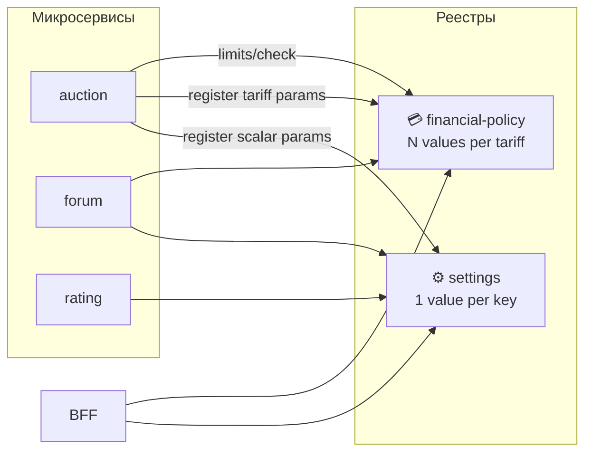

# ADR-003: Settings vs Financial-policy — два реестра переменных

> **Статус:** accepted · **Дата:** 2026-07-06

## 🎯 Контекст

Конфигурация платформы размазана:

- `settings` — JSON-конфиги (`rating.*`, `billing.*`);
- `financial-policy` — лимиты и фичи по тарифам;
- hardcoded JSON в docs rating.

Нужна чёткая модель: кто хранит что, как сервисы регистрируют параметры.

## ✅ Решение

**Два сервиса, два реестра. Каждый микросервис документирует оба набора переменных в своём README.**

### Settings — скалярные переменные

- **Одно значение** на ключ (global или per-user)
- **Не зависят от тарифа**
- Примеры: `rating.authorityExponent`, `forum.bannedWordsList`, `auction.bidIncrementDefault`
- Сервис регистрирует ключи при деплое
- Admin меняет через BFF → settings

### Financial-policy — тарифные переменные

- **Пакет значений** — по одному на каждый тариф (Free, Basic, Pro)
- Только переменные, влияющие на **лимиты, доступность фич или стоимость**
- Примеры: `auction.activeAuctions`, `forum.postsPerDay`, `auction.promotionEnabled`
- Типы: `limit` (число), `feature` (boolean), `enum` (набор значений)
- Проверка: `limits/check`, `features/can-use`

### Namespace

Оба используют `{service}.{parameterName}` — **одинаковый формат ключей**, **разные реестры**. Ключ не может быть одновременно в обоих реестрах.

### Диаграмма

## 🔄 Альтернативы

| Вариант | Плюсы | Минусы |
|---------|-------|--------|
| Всё в financial-policy | Один сервис | Формулы rating не тарифные — лишняя сложность |
| Всё в settings | Просто | Нет модели «значение per plan» |
| Merge в один config-сервис | Один API | Перегрузка домена, смешение concerns |
| **Два реестра** | Чёткое разделение | Два сервиса, но разные bounded contexts |

## 📌 Последствия

- ✅ [MICROSERVICE-SPEC](../../05-microservices/MICROSERVICE-SPEC.md) — обязательные секции ⚙️ и 💳
- ✅ Убрать hardcoded JSON из rating README → ссылка на settings
- ✅ forum: `bannedWordsList` → settings; `postsPerDay` → financial-policy
- ✅ financial-policy **не** хранит формулы голосования
- ✅ settings **не** хранит лимиты по тарифам

## 🔗 Связанные документы

- [settings README](../../05-microservices/settings/README.md)
- [financial-policy README](../../05-microservices/financial-policy/README.md)
