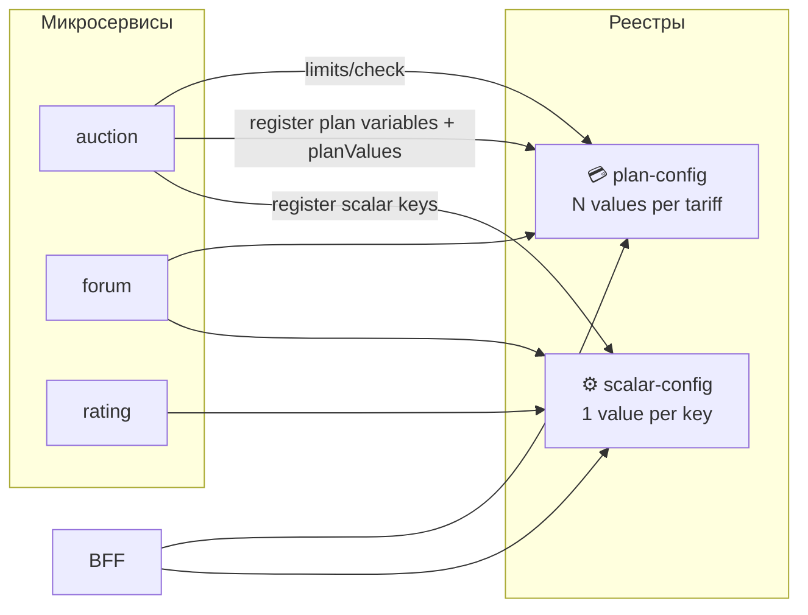

# ADR-003: Scalar-config vs Plan-config — два реестра переменных

> **Статус:** accepted · **Дата:** 2026-07-06 · **Обновлено:** 2026-07-11  
> **Canonical names:** `scalar-config` / `plan-config` ([ADR-017](./017-plan-config-scalar-config-rename.md))  
> **Legacy filename:** «Settings vs Financial-policy» — сохранён для поиска и ссылок.

## 🎯 Контекст

Конфигурация платформы размазана:

- scalar config — JSON-конфиги (`rating.*`, `billing.*`);
- plan config — лимиты, фичи и цены по тарифам;
- hardcoded JSON в docs rating.

Нужна чёткая модель: кто хранит что, как сервисы регистрируют переменные.

## ✅ Решение

**Два сервиса, два реестра. Каждый микросервис документирует оба набора переменных в своём README.**

### Scalar-config — скалярные переменные

- **Одно значение** на ключ (global или per-user)
- **Не зависят от тарифа**
- Примеры: `rating.authorityExponent`, `forum.bannedWordsList`, `auction.bid.incrementDefault`
- Сервис регистрирует ключи при деплое (`POST /internal/v1/settings/sync`)
- Admin меняет через BFF → scalar-config
- Schema PG: `scalar_config`

### Plan-config — plan variables (per plan)

- **Пакет значений** — по одному на каждый тариф (Free, Basic, Pro)
- Лимиты, доступность фич, enum и **разовые цены** (`valueType: price`)
- Типы: `limit`, `feature`, `enum`, `price`
- Проверка: `limits/check`, `features/can-use`; цены — `charges/resolve`
- **Plan-config не знает конкретных ключей в коде** — plan variables попадают в матрицу только через register/sync от domain-сервисов (см. [ADR-016](./016-financial-policy-parameter-registration.md))
- Ключи **≥3 сегмента** с facet и numeric prefix — [registry-keys.md](../../13-maintenance/registry-keys.md)
- Каталог проектирования: [PLATFORM-REGISTRY.md](../../05-microservices/PLATFORM-REGISTRY.md) — не равен runtime-реестру в БД
- Schema PG: `plan_config`

### Namespace

Оба используют `{domain}.{…}` — **одинаковый синтаксис ключей**, **разные реестры**. Ключ не может быть одновременно в обоих.

### Диаграмма

## 🔄 Альтернативы

| Вариант | Плюсы | Минусы |
|---------|-------|--------|
| Всё в plan-config | Один сервис | Формулы rating не тарифные — лишняя сложность |
| Всё в scalar-config | Просто | Нет модели «значение per plan» |
| Merge в один config-сервис | Один API | Перегрузка домена, смешение concerns |
| **Два реестра** | Чёткое разделение | Два сервиса, но разные bounded contexts |

## 📌 Последствия

- ✅ [MICROSERVICE-SPEC](../../05-microservices/MICROSERVICE-SPEC.md) — обязательные секции ⚙️ и 💳
- ✅ Убрать hardcoded JSON из rating README → ссылка на scalar-config
- ✅ forum: `bannedWordsList` → scalar-config; `author.post.dailyMax` → plan-config
- ✅ plan-config **не** хранит формулы голосования
- ✅ scalar-config **не** хранит лимиты по тарифам
- ✅ Регистрация plan variables — только от domain-сервисов ([ADR-016](./016-financial-policy-parameter-registration.md))
- ✅ Переименование сервисов: [ADR-017](./017-plan-config-scalar-config-rename.md)

## 🔗 Связанные документы

- [scalar-config README](../../05-microservices/scalar-config/README.md)
- [plan-config README](../../05-microservices/plan-config/README.md)
- [registry-keys.md](../../13-maintenance/registry-keys.md)
- [ADR-016](./016-financial-policy-parameter-registration.md)
- [ADR-017](./017-plan-config-scalar-config-rename.md)
