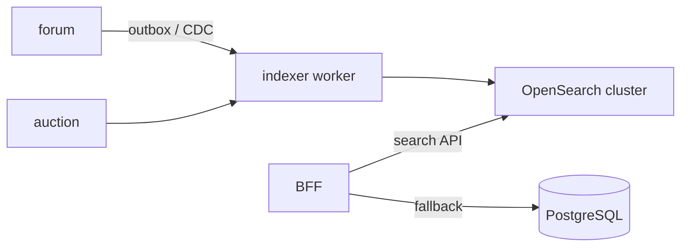

# ADR-008: OpenSearch для полнотекстового поиска (post-MVP)

> **Статус:** proposed · **Дата:** 2026-07-09 · **Фаза:** после MVP

## 🎯 Контекст

MVP: поиск форума — PostgreSQL (`forum.searchScope`: TITLE → FULL_TEXT). При росте контента и справочных материалов нужны:
- релевантность, fuzzy, морфология RU;
- кросс-доменный поиск (forum + auctions + tags);
- фильтры Pro (`forum.searchFilters`).

## ✅ Решение (целевое)

### Когда включать

| Триггер | Порог (ориентир) |
|---------|------------------|
| Latency p95 `GET /forum/topics?q=` | > 300 ms |
| Объём topic+comment | > 100k документов |
| Запрос business | Единый поиск «находка + тема + лот» |

До триггера — **не** поднимать OpenSearch (сложность ops).

### Архитектура

- **Индексы:** `forum_topics`, `forum_comments`, `auctions`, `tags` (unified alias `platform_search`).
- **Запись:** async из RMQ (`forum.topic_created`, `forum.comment_created`, `auction.created`) или outbox.
- **Чтение:** BFF `GET /api/v1/search?q=&domains=forum,auction&tags=` → OpenSearch; PG fallback при degraded.

### Синхронизация с тегами

Теги — facet в OS (`tags.keyword[]`). Источник истины остаётся PostgreSQL ([forum/tags.md](../../05-microservices/forum/tags.md)).

## 🔄 Альтернативы

| Вариант | Оценка |
|---------|--------|
| PostgreSQL FTS only | OK для MVP |
| Elasticsearch managed | Дороже; OpenSearch — совместимый OSS |
| Typesense / Meilisearch | Проще, но второй стек без кросс-кластера |

## 📌 Последствия

- Новый compose stack `opensearch` (dev: single-node).
- SLO search отдельно от core API.
- Не блокирует MVP.

---

**Связано:** [forum/tags.md](../../05-microservices/forum/tags.md)
