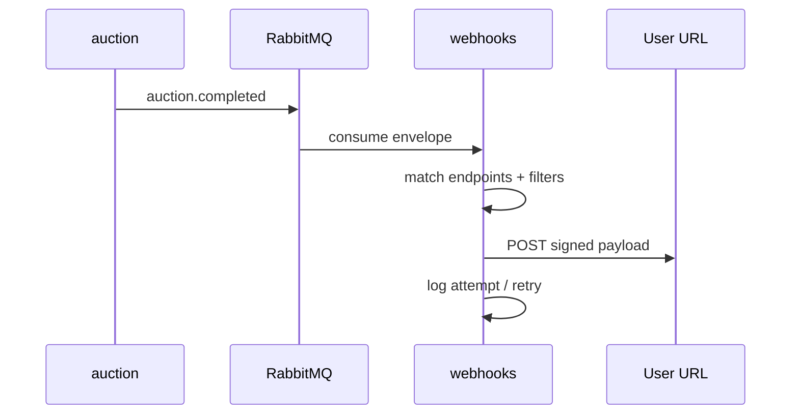

# ADR-011: Централизованный сервис исходящих webhooks

> **Статус:** accepted · **Дата:** 2026-07-09

## 🎯 Контекст

Несколько доменных сервисов (auction, forum, billing, …) могут захотеть дать пользователям и интеграторам реагировать на события через **HTTP callbacks**. Без общего слоя каждый сервис дублирует:

- хранение подписок и URL;
- подпись payload, таймауты, retry;
- журнал доставки и DLQ.

При этом **scalar-config** хранит скаляры, но не endpoints и не delivery log.

> **Не путать:** входящие webhooks платёжного провайдера (billing) и Novu — остаются в своих адаптерах. ADR-011 — только **исходящие** (outbound) вызовы **наружу**.

## ✅ Решение

Выделить микросервис **`webhooks`**:

| Ответственность | Кто |
|-----------------|-----|
| Реестр типов событий для подписки | **Генераторы** (доменные сервисы) регистрируют при старте; platform-типы — admin |
| CRUD hooks (endpoints) | **User** — несколько hooks по тарифу; URL + чекбоксы событий из реестра / **Admin** (platform) |
| Доставка HTTP POST при событии RMQ | `webhooks` consumer |
| Retry, учёт попыток, журнал | `webhooks` |
| Redaction payload перед HTTP | `webhooks.redactWebhookPayload()` + rules при register |
| USER filter (auction) | `AUCTION_PARTICIPANT` — только лоты, где user участник (любая роль) |
| Таймауты | per-event → per-user default → global (`scalar-config`) |
| Auto-disable после DEAD | `webhooks.autoDisableOnDead` (bool, default **true**) |

Доменные сервисы **не** делают HTTP наружу — только публикуют в [event-catalog](../event-catalog.md). Fan-out: [messaging.md](../messaging.md).

## 🔄 Альтернативы

| Вариант | Почему нет |
|---------|------------|
| Webhook в каждом сервисе | Дублирование retry/log/SSRF |
| Расширить `notifications` | M2H (email/push) ≠ M2M (webhooks) — дополнение |
| Только BFF | BFF не должен держать очереди retry |

## 📌 Последствия

- Новый сервис `webhooks`, schema `webhooks`, docs [webhooks/README.md](../05-microservices/webhooks/README.md)
- Event catalog: consumer `webhooks` на whitelisted `eventType`
- BFF: `/api/v1/webhooks`, `/api/v1/admin/webhooks`
- Ключи `webhooks.*` в [PLATFORM-REGISTRY](../05-microservices/PLATFORM-REGISTRY.md)

---

**Связано:** [scalar-config](../05-microservices/scalar-config/README.md) · [ADR-003](./003-settings-vs-financial-policy.md)
