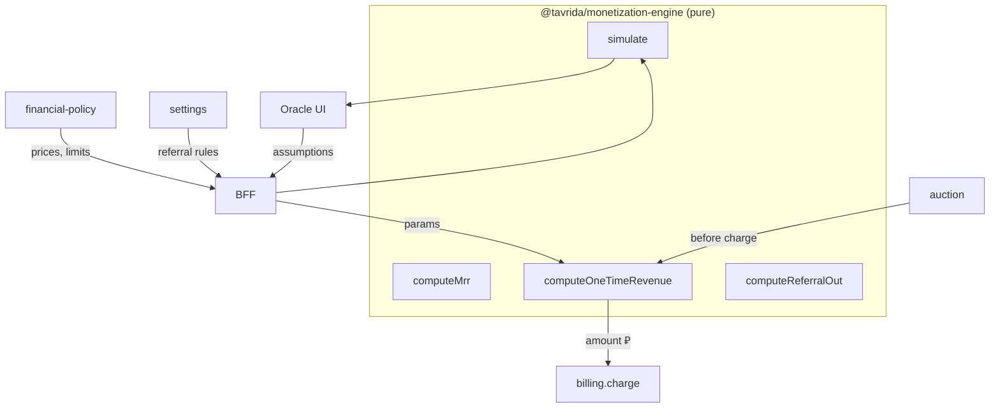

# ADR-015: Monetization engine — общие детерминированные формулы

> **Статус:** accepted · **Дата:** 2026-07-11

## 🎯 Контекст

Деньги в Tavrida Lot считаются в нескольких местах: `billing` (списание), `financial-policy` (цена плана), domain-сервисы (когда charge), **Oracle** (прогноз). Дублирование формул в сервисах и UI ведёт к расхождению: «в Оракуле 48k, в отчёте 41k».

Нужно **чётко разделить ответственность** и вынести математику в один stateless-модуль.

## ✅ Решение

### Пакет `packages/monetization-engine` (`@tavrida/monetization-engine`)

- **Только чистые функции** (детерминированные: одинаковый вход → одинаковый выход).
- **Без состояния**: нет БД, HTTP, env, singleton с кэшем.
- **Без I/O**: не читает settings/FP; caller передаёт числа и конфиг как аргументы.
- Доступен **и платформе, и Oracle** до появления `services/oracle`.

### Класс-фасад (опционально)

`MonetizationMath` — **static methods only**, `private constructor()` — нельзя инстанцировать. Дублирует named exports для удобства IDE.

```typescript
MonetizationMath.computeMrr(state, prices) // то же, что computeMrr(...)
```

### Матрица ответственности

| Компонент | Отвечает за | Не отвечает за |
|-----------|-------------|----------------|
| **monetization-engine** | Формулы: MRR, one-time сумма, referral out, net, break-even, рост регистраций | Хранение, auth, HTTP |
| **billing** | Баланс, `Transaction`, идемпотентность, **вызов** `computeChargeAmount` перед charge | Формула цены promotion |
| **financial-policy** | Планы, лимиты, **хранение** `monthlyPrice` | Прогноз когорт |
| **referral-rewards** | Orchestration выплат, hold, cron | Процент по глубине (берёт из engine + settings) |
| **Oracle / BFF** | Assumptions, YAML defaults, **вызов** `simulate()` | Свои формулы в UI |
| **Frontend** | Ползунки, графики | Любая математика кроме отображения |

### Потоки данных



### Версионирование формул

- Пакет semver; breaking change формулы → minor/major + запись в [monetization-catalog](../../01-goal/monetization-catalog.md).
- Unit-тесты с **golden fixtures** (JSON in/out).

## ❌ Отклонённые варианты

| Вариант | Почему нет |
|---------|------------|
| Формулы внутри Oracle-сервиса | Платформа не переиспользует |
| Shared class со state (кэш цен) | Скрытое состояние → расхождения в тестах |
| Один god-service «calculator» | Смешивает math и HTTP |

## 📎 Последствия

- Новая платная фича → функция в engine + тест + monetization-catalog.
- `billing` / domain вызывают engine **перед** charge (фаза внедрения по сервисам).
- Oracle **никогда** не дублирует формулы во Vue.

## 🔗 Связанные

- [ADR-014](./014-oracle-revenue-forecast.md)
- [packages/monetization-engine/README.md](../../packages/monetization-engine/README.md)
- [engine-and-api.md](../../05-microservices/oracle/topics/engine-and-api.md)
