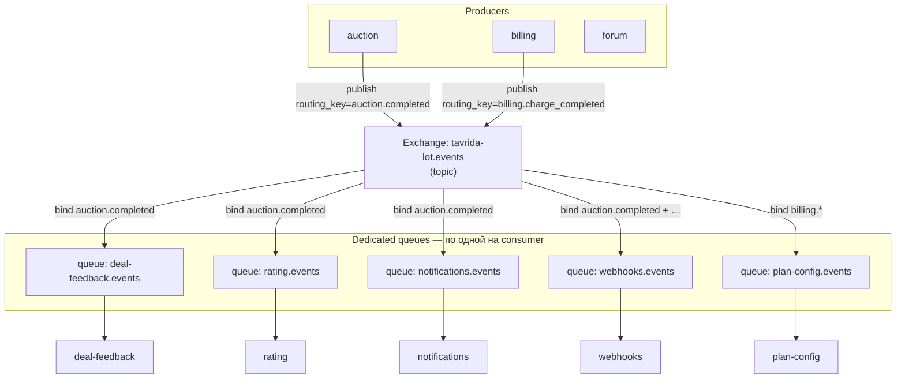
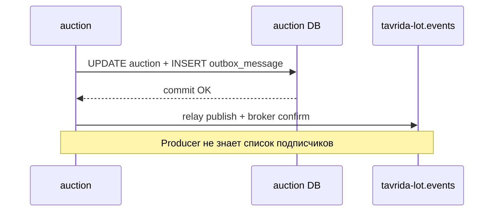
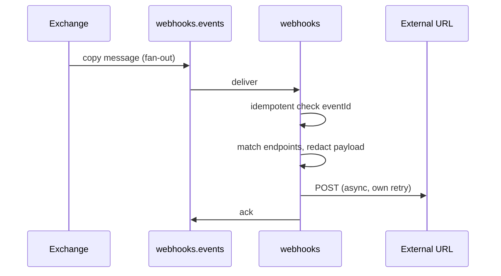
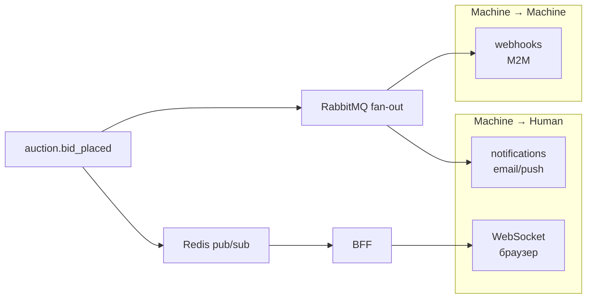

# 📨 Асинхронное взаимодействие (RabbitMQ)

> **Статус:** implemented (core producers) · **Версия:** 0.2
> Каталог событий: [event-catalog.md](./event-catalog.md)

## 🎯 Зачем

Доменный сервис завершает свою транзакцию и **публикует факт** («аукцион завершён»). Остальные сервисы реагируют **независимо** — без цепочки синхронных HTTP и без знания всех подписчиков.

Один producer → **много consumers** (fan-out). Каждый слушатель — отдельная очередь.

## 🏗️ Топология

| Элемент | Значение |
|---------|----------|
| **Exchange** | `tavrida-lot.events` |
| **Тип** | `topic` |
| **Routing key** | = `eventType` (`auction.completed`, `billing.charge_completed`, …) |
| **Формат** | JSON envelope v1 ([event-catalog](./event-catalog.md)) |
| **Доступ** | Internal network only |

### Правило: очередь на сервис, не на событие

| ✅ Правильно | ❌ Неправильно |
|-------------|----------------|
| `webhooks.events` — одна очередь сервиса `webhooks`, bind на N routing keys | Одна общая очередь `all.events` — competing consumers разных сервисов |
| `rating.events` слушает только `auction.completed`, `deal_feedback.submitted`, … | Несколько сервисов читают из одной очереди |

**Fan-out:** RabbitMQ **копирует** сообщение в каждую очередь, чей binding совпал с routing key. Сервисы не блокируют друг друга.

### Именование

| Объект | Шаблон | Пример |
|--------|--------|--------|
| Queue | `{service}.events` | `webhooks.events` |
| DLQ | `{service}.events.dlq` | `rating.events.dlq` |
| Binding | routing key = точный `eventType` или паттерн `auction.*` | `auction.completed` |

Паттерны (`auction.*`) — только если сервису реально нужен весь домен; иначе явный список типов.

## 📤 Producer (доменный сервис)

1. В одной транзакции изменить бизнес-состояние и добавить envelope в
   schema-local `outbox_message`.
2. После commit relay публикует pending-записи в `tavrida-lot.events` с
   `routing_key = eventType`.
3. Relay использует persistent messages и RabbitMQ publisher confirms; при
   ошибке сохраняет тот же `eventId` и повторяет доставку с bounded
   exponential backoff.
4. При регистрации webhook-типов — **генератор** вызывает `POST /internal/v1/webhooks/event-types/register` (см. [webhooks](../05-microservices/webhooks/README.md)).

**Гарантия:** доставка at-least-once. `eventId` создаётся при записи outbox и не
меняется на retry, поэтому consumer обязан быть идемпотентным.

Сейчас transactional outbox включён у `auction`, `marketplace`,
`user-profile` и `forum`. Общая реализация — `@tavrida/outbox`; таблица и
история migrations остаются в schema владельца.

## 📥 Consumer (любой подписчик)

1. **Отдельная** очередь `{service}.events`.
2. Binding только на нужные `eventType`.
3. Обработка должна быть **идемпотентна** по `eventId` (таблица
   `processed_events` или unique constraint).
4. `ack` после успешной обработки; при ошибке — republish с broker confirm и
   exponential delay → **DLQ** после 5 попыток. Это реализовано в
   `subscriptions` и `deal-feedback`. У `deal-feedback` есть persisted
   `processed_event`; subscriptions пока полагается только на downstream
   notification idempotency key, поэтому полная consumer-idempotency остаётся
   обязательным follow-up.

## 🔀 Три канала доставки «наружу»

Одно доменное событие может одновременно идти по разным путям:

| Канал | Назначение | Аудитория | Пример |
|-------|------------|-----------|--------|
| **RabbitMQ fan-out** | Side effects между сервисами | Микросервисы | `auction.completed` → rating, deal-feedback |
| **Redis pub/sub → BFF → WS** | Realtime UI | Браузер пользователя | `bid.placed` на канале `auction:{id}` |
| **webhooks HTTP POST** | Интеграции M2M | CRM, скрипты пользователя | redacted payload на URL клиента |

| Сервис | Роль | Не заменяет |
|--------|------|-------------|
| **subscriptions** | Пользователь подписывается на темы/лоты → **уведомления** | webhooks |
| **notifications** | Email, push, in-app (Novu) — **человеку** | webhooks |
| **webhooks** | HTTP callback на URL — **интеграциям** | push/email |

## 📋 Матрица очередей (draft)

| Queue | Service | Примеры bindings |
|-------|---------|------------------|
| `deal-feedback.events` | deal-feedback | `auction.completed`, `marketplace.order_completed` |
| `rating.events` | rating | `auction.completed`, `deal_feedback.submitted`, … |
| `notifications.events` | notifications | `auction.*`, `billing.*`, `webhooks.delivery_failed`, … |
| `webhooks.events` | webhooks | whitelist из `EventTypeRegistration` |
| `plan-config.events` | plan-config | `billing.deposit_completed`, `subscription.activated` |
| `bff.events` | BFF (optional) | агрегация для WS, если не Redis | 

> Точный список — [event-catalog](./event-catalog.md) (матрица producer → consumer).

## ⚠️ Ошибки и DLQ

| Уровень | Поведение |
|---------|-----------|
| **RMQ consumer** (внутри сервиса) | Republish с `x-retry-count`, backoff 1–30 s → после 5 попыток `{queue}.dlq` |
| **webhooks HTTP** | Свой retry/backoff к **внешнему URL**; RMQ message ack после постановки в internal delivery queue |
| **Observability** | Метрики: queue depth, consumer lag, DLQ size ([grafana-setup](../07-observability/grafana-setup.md)) |

`webhooks` **не блокирует** RMQ на медленном URL клиента: после match создаёт `WebhookDelivery` и ack'ает RMQ; HTTP retry — отдельный worker.

## 🔗 Связанные документы

- [event-catalog.md](./event-catalog.md)
- [webhooks](../05-microservices/webhooks/README.md)
- [ADR-011](./adr/011-centralized-outbound-webhooks.md)
- [MICROSERVICE-SPEC](../05-microservices/MICROSERVICE-SPEC.md) — раздел RabbitMQ
- [security-ops](../09-security/security-ops.md) — poison messages

---

**Автор:** команда разработки · **Версия:** 0.1
