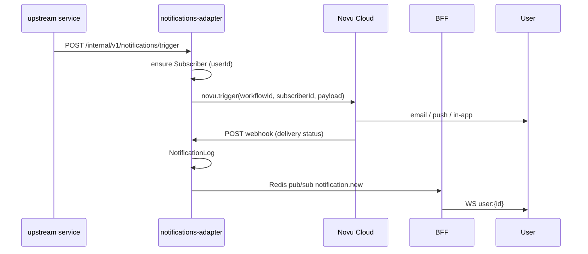

# 📬 Notifications — Novu Cloud

> **Статус:** accepted · **Решение:** [ADR-004](./adr/004-notifications-adapter.md) · **План:** Novu Cloud Free

## 🎯 Назначение

Стратегия уведомлений Tavrida Lot на базе **Novu Cloud (Free plan)**.

## ✅ Принятое решение

| Параметр | Значение |
|----------|----------|
| Платформа | [Novu Cloud](https://web.novu.co) |
| Тариф | **Free plan** (MVP + ранний prod) |
| Интеграция | `services/notifications/` — adapter на `@novu/node` |
| Workflows | Novu Dashboard (dev / prod environments) |
| Self-host | Не используем на MVP; опция при росте (Novu MIT) |

## 📋 Сценарии → Novu Workflows

| Workflow ID | Сценарий | Каналы | Trigger |
|-------------|----------|--------|---------|
| `feedback-request` | Завершение аукциона → оценить | email, push, in-app | `auction.completed` |
| `feedback-reminder` | Напоминание об отзыве | email, push | CRON → `feedback.reminder_due` |
| `auction-bid` | Новая ставка (подписан) | push, in-app, WS | `auction.bid_placed` |
| `auction-subscription-digest` | Новые лоты в категории | email digest, push | scheduled |
| `forum-reply` | Ответ в теме | email, push | HTTP trigger |
| `forum-digest` | Email digest по теме (Pro) | email | scheduled |
| `balance-charged` | Списание с кошелька | in-app | `billing.charge_completed` |
| `subscription-activated` | Активация подписки | email, in-app | `subscription.activated` |
| `subscription-expired` | Истечение подписки | email | `subscription.expired` |
| `rating-penalty` | Штраф рейтинга | in-app, email | `rating.penalty_applied` |
| `forum-post-reported` | Жалоба на пост (admin) | email | `forum.post_reported` |

## 🏗️ Архитектура

## ⚙️ Novu Cloud — настройка

### 1. Аккаунт и environments

1. Регистрация на [web.novu.co](https://web.novu.co)
2. Environments: `Development`, `Production`
3. API Keys → Bitwarden (`NOVU_API_KEY_DEV`, `NOVU_API_KEY_PROD`)

### 2. Integration providers (в Novu Dashboard)

| Канал | Provider (рекомендация) |
|-------|-------------------------|
| Email | Novu Email (dev) → custom SMTP / SendGrid (prod) |
| Push | Firebase FCM |
| In-app | Novu Inbox (built-in) |

### 3. Subscribers

- `subscriberId` = `userId` (UUID платформы)
- Email/phone/device tokens — синхронизация при регистрации/логине через adapter
- `POST /internal/v1/notifications/subscribers/upsert`

## 📊 Free plan — мониторинг

- Dashboard → Usage: events/month, subscribers
- Alert в Grafana при 80% лимита (TODO: observability)
- Fallback: отключить digest, оставить только transactional

## 🔄 Путь миграции при росте

1. **Novu Cloud Paid** — white-label, больше events
2. **Novu self-host** — Docker Swarm, полный контроль (MIT)
3. Adapter API **не меняется** — меняется только `NOVU_API_URL` + key

## 🔗 Связанные документы

- [ADR-004](./adr/004-notifications-adapter.md)
- [notifications service](../05-microservices/notifications/README.md)
- [Event catalog](./event-catalog.md)

---

**Автор:** команда разработки · **Версия:** 0.2-draft
