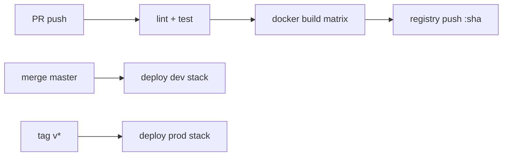

# 🚀 Деплой Tavrida Lot

> **Статус:** spec ready · **Версия:** 0.2  
> **Оркестратор:** Docker Swarm · **Edge:** Traefik v3

## 🎯 Обзор

| Env | Домены | Назначение |
|-----|--------|------------|
| `local` | `*.tavrida-lot.localhost` | Разработка (pnpm + infra compose) |
| `stage` | `*.stage.*` (TBD) | Интеграционный стенд — CD из ветки `stage` ([backlog](./stage-deployment-todo.md)) |
| `dev` | `*.193.142.148.175.nip.io` | Swarm на VPS — [docker/swarm/README.dev.md](../../docker/swarm/README.dev.md) |
| `prod` | `*.tavrida-lot.ru` | Production |

Публичный трафик: **Traefik → BFF → internal services**. Admin/tools — `*.tools.<env>` + [tinyauth](../02-infrastructure/dev-tools.md).

## 📁 Структура репозитория (целевая)

```
docker/
├── config/                  # Traefik, Keto, Postgres init (shared local + Swarm)
│   ├── traefik/
│   ├── keto/
│   └── postgres/init/
├── compose/
│   ├── infra.local.yml      # PG, Redis, RabbitMQ, MinIO, Keto, Logto (dev)
│   └── tools.local.yml      # Adminer, Dozzle, Mailpit (optional)
├── swarm/
│   ├── stack-infra.dev.yml   # Dev VPS: Traefik + data stores
│   ├── stack-platform.dev.yml # Dev VPS: GHCR core services
│   ├── dev.env.example
│   ├── deploy-dev.sh
│   ├── build-images.sh
│   ├── README.dev.md
│   ├── stack-infra.yml      # (prod/stage — TBD)
│   ├── stack-platform.yml   # BFF + implemented services
│   └── stack-tools.yml      # Portainer, observability agents
└── images/
    ├── Dockerfile.service   # Multi-stage NestJS (shared pattern)
    └── Dockerfile.frontend  # Vue static + nginx
```

> `docker/compose/infra.local.yml` — PostgreSQL, Redis, RabbitMQ, MinIO, imgproxy, **Keto**. Logto — `logto.local.yml` или Logto Cloud. Novu CE — `novu.local.yml` / `pnpm novu:up` ([ADR-019](../03-architecture/adr/019-novu-self-host.md)). Bootstrap: [bootstrap-admin](../09-security/bootstrap-admin.md).

## 🔄 CI/CD (целевой pipeline)



| Stage | Действие |
|-------|----------|
| PR | `pnpm lint`, `pnpm docs:build`, turbo build affected |
| main | Docs → **GitHub Pages**; позже — push images `:git-sha`, deploy `dev` |
| Release tag | Deploy `prod`, run migrations job |
| Rollback | Redeploy previous `:sha` — см. [runbook-rollback](./runbook-rollback.md) |

Workflows: [github-actions.md](./github-actions.md) · `.github/workflows/ci.yml`, `docs-pages.yml`.

**Документация (static):** [https://andrewb76.github.io/tavrida/](https://andrewb76.github.io/tavrida/)

Секреты CI: Bitwarden → GitHub Actions / runner env. См. [PLATFORM-SECRETS](../02-infrastructure/PLATFORM-SECRETS.md).

## 🏷️ Traefik (edge)

| Router | Host | Backend |
|--------|------|---------|
| `bff-api` | `api.{env}` | BFF `:3000` |
| `bff-ws` | `api.{env}` path `/ws/v1` | BFF WS |
| `frontend` | `app.{env}` | Vue static / CDN |
| `tools-*` | `*.tools.{env}` | Admin UIs + tinyauth |

TLS: Let's Encrypt resolver (prod), mkcert / self-signed (local).

Labels pattern — см. [swarm-stacks.md](./swarm-stacks.md).

## 🗄️ Миграции БД

Schema per service ([ADR-001](../03-architecture/adr/001-database-schema-per-service.md)).  
Процесс: [migrations.md](./migrations.md).

**Правило деплоя:** migration job **до** rolling update сервиса (expand-only migrations).

## 🩺 Health checks

Все NestJS-сервисы:

| Endpoint | Swarm check | Назначение |
|----------|-------------|------------|
| `GET /health` | liveness | Процесс жив |
| `GET /health/ready` | readiness | DB + RabbitMQ (+ Redis если нужен) |

BFF ready: upstream ping optional (fail open с degraded flag) — **TBD при реализации**.

Traefik: только route на сервисы с `ready=200`.

## 📦 Версионирование образов

```
registry.example.com/tavrida/billing:{git-sha}
registry.example.com/tavrida/billing:{semver}  # release tags only
```

Не использовать `:latest` в prod.

## 🔗 Runbooks

| Документ | Содержание |
|----------|------------|
| [stage-deployment-todo.md](./stage-deployment-todo.md) | Решения по stage + backlog (GHCR, Logto Cloud, …) |
| [swarm-stacks.md](./swarm-stacks.md) | Стеки, сети, labels |
| [migrations.md](./migrations.md) | TypeORM migrations job |
| [runbook-rollback.md](./runbook-rollback.md) | Откат релиза |
| [local-dev.md](./local-dev.md) | Локальный запуск |
| [ops-hygiene.md](../13-maintenance/ops-hygiene.md) | Ежедневно / еженедельно / перед деплоем |

## 🔗 Связанные разделы

- [Инфраструктура](../02-infrastructure/README.md)
- [Observability](../07-observability/README.md)
- [PLATFORM-SECRETS](../02-infrastructure/PLATFORM-SECRETS.md)
- [Процесс разработки](../12-dev-process/README.md)

---

**Автор:** команда разработки · **Версия:** 0.2-spec
