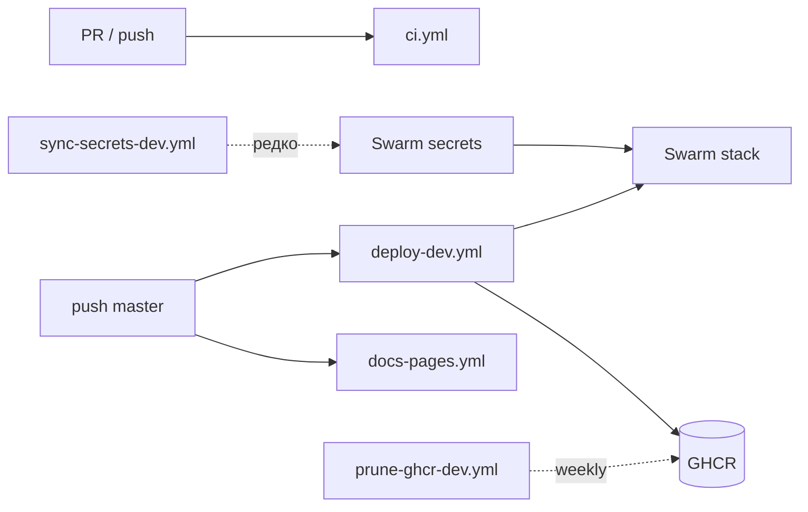

# ⚙️ GitHub Actions

> **Статус:** spec ready · **Версия:** 0.2  
> **Статический сайт:** `@tavrida/docs-site` (VitePress) · **Источник:** `docs/`

## 🎯 Обзор


| Workflow               | Файл                                                                                     | Триггер                        | Назначение                             |
| ---------------------- | ---------------------------------------------------------------------------------------- | ------------------------------ | -------------------------------------- |
| **CI**                 | `[.github/workflows/ci.yml](../../.github/workflows/ci.yml)`                             | PR + push `master`             | lint, test, turbo build                |
| **Docs Pages**         | `[.github/workflows/docs-pages.yml](../../.github/workflows/docs-pages.yml)`             | push `master`, manual          | Публикация на **GitHub Pages**         |
| **Deploy dev**         | `[.github/workflows/deploy-dev.yml](../../.github/workflows/deploy-dev.yml)`             | push `master` (paths) + manual | Build → GHCR → Swarm stack deploy      |
| **Sync secrets (dev)** | `[.github/workflows/sync-secrets-dev.yml](../../.github/workflows/sync-secrets-dev.yml)` | **manual only**                | GitHub Secrets → Swarm `tavrida_dev_*` |
| **Prune GHCR**         | `[.github/workflows/prune-ghcr-dev.yml](../../.github/workflows/prune-ghcr-dev.yml)`     | weekly + manual                | Удаление старых `tavrida-*` в GHCR     |





## 📚 Статический сайт документации


|                  |                                                                                  |
| ---------------- | -------------------------------------------------------------------------------- |
| **Опубликовано** | **[https://andrewb76.github.io/tavrida/](https://andrewb76.github.io/tavrida/)** |
| Репозиторий      | [andrewb76/tavrida](https://github.com/andrewb76/tavrida)                        |
| Пакет            | `apps/docs-site` (`@tavrida/docs-site`)                                          |
| Движок           | [VitePress](https://vitepress.dev/) 1.x                                          |
| Источник MD      | `docs/` → копия в `apps/docs-site/content` (`prebuild` sync)                     |
| Выход            | `apps/docs-site/.vitepress/dist`                                                 |


Перед `dev` / `build` скрипт `[sync-docs.mjs](../../apps/docs-site/scripts/sync-docs.mjs)` копирует `docs/` в `content/`, затем `[generate-sidebar.mjs](../../apps/docs-site/scripts/generate-sidebar.mjs)` строит левое меню из структуры каталогов (новые `.md` попадают в сайдбар автоматически).

### Локально

```bash
pnpm install
pnpm docs:dev      # http://localhost:5173
pnpm docs:build    # production build
pnpm docs:preview  # preview dist
```


### Base path

Для GitHub Pages **project site** этого репозитория:


|                  |                                                                              |
| ---------------- | ---------------------------------------------------------------------------- |
| URL              | [https://andrewb76.github.io/tavrida/](https://andrewb76.github.io/tavrida/) |
| `VITEPRESS_BASE` | `/tavrida/`                                                                  |


```bash
VITEPRESS_BASE=/tavrida/ pnpm docs:build
```

В CI переменная `VITEPRESS_BASE` выставляется из `github.event.repository.name` (в workflow — `/tavrida/`).

Для custom domain — `VITEPRESS_BASE=/`.

## 🚀 Включение GitHub Pages

1. Откройте **[Settings → Pages](https://github.com/andrewb76/tavrida/settings/pages)**
2. **Build and deployment → Source:** выберите **GitHub Actions** (не «Deploy from a branch»)
3. **Actions** → workflow **Docs (GitHub Pages)** → **Re-run all jobs** (или новый push в `master`)

После успешного deploy: [https://andrewb76.github.io/tavrida/](https://andrewb76.github.io/tavrida/)

### Troubleshooting: 404 / `Failed to create deployment (status: 404)`


| Симптом                                            | Причина                 | Решение                         |
| -------------------------------------------------- | ----------------------- | ------------------------------- |
| Deploy job: `Ensure GitHub Pages has been enabled` | Pages не включён        | Шаги 1–2 выше                   |
| Build зелёный, deploy красный                      | То же                   | Re-run после включения          |
| Сайт 404 после зелёного deploy                     | Кэш / ещё не прошёл DNS | Подождать 1–2 мин, hard refresh |


> `gh` не обязателен — достаточно UI в Settings.


## 🔐 Dev Swarm: Environment `dev`

Создайте GitHub Environment `dev` (Settings → Environments) и заполните:

### Variables (публичный конфиг)


| Variable             | Пример                                       |
| -------------------- | -------------------------------------------- |
| `DEV_SWARM_SSH_HOST` | `193.142.148.175`                            |
| `DEV_SWARM_SSH_USER` | `deploy`                                     |
| `DEV_DOMAIN`         | `193.142.148.175.nip.io`                     |
| `ACME_EMAIL`         | `andrewb@bk.ru`                              |
| `TAVRIDA_REPO_ROOT`  | `/opt/tavrida`                               |
| `GHCR_OWNER`         | `andrewb76` (опц., иначе `repository_owner`) |
| `LOGTO_ENDPOINT`     | `https://….logto.app`                        |
| `LOGTO_JWKS_URL`     | `{endpoint}/oidc/jwks`                       |
| `LOGTO_AUDIENCE`     | API resource                                 |
| `LOGTO_M2M_APP_ID`   | M2M app id                                   |
| `LOGTO_M2M_RESOURCE` | Management API resource                      |
| `FRONTEND_ORIGIN`    | `https://app.193.142.148.175.nip.io`         |


### Secrets


| Secret                 | Кто использует                                |
| ---------------------- | --------------------------------------------- |
| `DEV_SWARM_SSH_KEY`    | **оба** workflow — private key без passphrase |
| `POSTGRES_PASSWORD`    | sync-secrets                                  |
| `RABBITMQ_PASSWORD`    | sync-secrets                                  |
| `MINIO_ROOT_PASSWORD`  | sync-secrets                                  |
| `LOGTO_M2M_APP_SECRET` | sync-secrets                                  |


`GITHUB_TOKEN` для push в GHCR выдаётся автоматически (`permissions: packages: write`).

### VPS one-shot

```bash
# На manager-ноде
sudo mkdir -p /opt/tavrida
sudo chown "$USER" /opt/tavrida
git clone git@github.com:andrewb76/tavrida.git /opt/tavrida
docker swarm init   # если ещё не
# SSH: deploy user + authorized_keys для Actions
```

Bind-mounts в `stack-infra.dev.yml` идут в `${TAVRIDA_REPO_ROOT}/docker/config/…` — путь должен существовать **на VPS**. Swarm configs (`traefik.dev.yml`, `keto.yml`) читаются с runner при `stack deploy`.

### Порядок первого деплоя

1. Заполнить Environment `dev` (vars + secrets).
2. **Actions → Sync secrets (dev)** — `force=true`, `redeploy=true` (или `redeploy=false` если образов ещё нет).
3. **Actions → Deploy dev** — build + push + stack deploy.
4. Дальше: push в `master` (или manual Deploy) обновляет образы; sync — только при ротации паролей.

### GHCR: retention (старые образы)

Каждый deploy пушит `:git-sha` и плавающий **`:dev`**. Без очистки реестр растёт линейно.

| Правило | Значение |
|---------|----------|
| Keep | последние **10** версий на пакет (`KEEP_LAST`) |
| Protected tags | `dev`, `latest` — не удаляются даже если старше окна |
| Workflow | [prune-ghcr-dev.yml](../../.github/workflows/prune-ghcr-dev.yml) — cron пн 06:00 UTC + manual (`dry_run`) |
| Скрипт | `docker/swarm/prune-ghcr-dev.sh` |

Перед первым боевым prune: **Actions → Prune GHCR → dry_run=true**.

Пакеты в GHCR лучше **привязать к репозиторию** (Package settings → Repository access), иначе `GITHUB_TOKEN` может не иметь права на delete.

На VPS (локальный disk Swarm-ноды) — отдельно: `docker image prune` / `docker system prune` по желанию; это не GHCR.

Подробнее: [docker/swarm/README.dev.md](../../docker/swarm/README.dev.md).

## 📋 Roadmap pipelines


| Стадия                              | Статус                                                     |
| ----------------------------------- | ---------------------------------------------------------- |
| Lint + docs build                   | ✅ workflow                                                 |
| Actions on Node 24 (`checkout@v5`…) | ✅ workflows                                                |
| GitHub Pages                        | ✅ workflow                                                 |
| `pnpm test` в CI                    | ✅ в `ci.yml`                                               |
| Docker matrix → GHCR + Swarm deploy | ✅ `deploy-dev.yml`                                         |
| Sync secrets → Swarm                | ✅ `sync-secrets-dev.yml`                                   |
| Prune old GHCR images               | ✅ `prune-ghcr-dev.yml`                                     |
| Deploy Swarm stage on merge `stage` | TODO ([stage-deployment-todo](./stage-deployment-todo.md)) |


## 🔗 Связанные разделы

- [README](./README.md) — общий CI/CD
- [PLATFORM-SECRETS](../02-infrastructure/PLATFORM-SECRETS.md)
- [12-dev-process](../12-dev-process/README.md)
- [AGENTS.md](../../AGENTS.md)

---

**Автор:** команда разработки · **Версия:** 0.2-spec