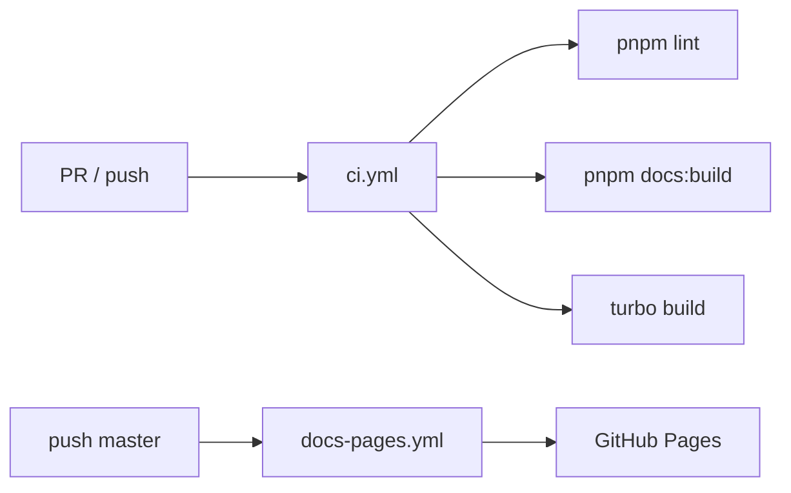

# ⚙️ GitHub Actions

> **Статус:** spec ready · **Версия:** 0.1  
> **Статический сайт:** `@tavrida/docs-site` (VitePress) · **Источник:** `docs/`

## 🎯 Обзор

| Workflow | Файл | Триггер | Назначение |
|----------|------|---------|------------|
| **CI** | [`.github/workflows/ci.yml`](../../.github/workflows/ci.yml) | PR + push `master` | lint, сборка docs, turbo build |
| **Docs Pages** | [`.github/workflows/docs-pages.yml`](../../.github/workflows/docs-pages.yml) | push `master`, manual | Публикация на **GitHub Pages** |



## 📚 Статический сайт документации

| | |
|---|---|
| **Опубликовано** | **[https://andrewb76.github.io/tavrida/](https://andrewb76.github.io/tavrida/)** |
| Репозиторий | [andrewb76/tavrida](https://github.com/andrewb76/tavrida) |
| Пакет | `apps/docs-site` (`@tavrida/docs-site`) |
| Движок | [VitePress](https://vitepress.dev/) 1.x |
| Источник MD | `docs/` → копия в `apps/docs-site/content` (`prebuild` sync) |
| Выход | `apps/docs-site/.vitepress/dist` |

Перед `dev` / `build` скрипт [`sync-docs.mjs`](../../apps/docs-site/scripts/sync-docs.mjs) копирует `docs/` в `content/` (VitePress требует src внутри пакета).

### Локально

```bash
pnpm install
pnpm docs:dev      # http://localhost:5173
pnpm docs:build    # production build
pnpm docs:preview  # preview dist
```

### Base path

Для GitHub Pages **project site** этого репозитория:

| | |
|---|---|
| URL | [https://andrewb76.github.io/tavrida/](https://andrewb76.github.io/tavrida/) |
| `VITEPRESS_BASE` | `/tavrida/` |

```bash
VITEPRESS_BASE=/tavrida/ pnpm docs:build
```

В CI переменная выставляется автоматически: `/${{ github.event.repository.name }}/` → `/tavrida/`.

Для custom domain — `VITEPRESS_BASE=/`.

## 🚀 Включение GitHub Pages

1. Repo → **Settings** → **Pages**
2. **Source:** GitHub Actions (не branch deploy)
3. После первого успешного `Docs (GitHub Pages)` workflow — сайт на [https://andrewb76.github.io/tavrida/](https://andrewb76.github.io/tavrida/) (URL также в environment `github-pages`)

## 🔐 Секреты (будущие стадии CI)

См. [PLATFORM-SECRETS](../02-infrastructure/PLATFORM-SECRETS.md). На текущем этапе workflows **не требуют** секретов.

Планируется:

| Stage | Secrets |
|-------|---------|
| Docker push | `REGISTRY_*` |
| Deploy dev/prod | `SWARM_*`, Bitwarden OIDC |

## 📋 Roadmap pipelines

| Стадия | Статус |
|--------|--------|
| Lint + docs build | ✅ workflow |
| GitHub Pages | ✅ workflow |
| `pnpm test` в CI | TODO |
| Docker matrix build | TODO ([README](./README.md)) |
| Deploy Swarm dev on merge | TODO |

## 🔗 Связанные разделы

- [README](./README.md) — общий CI/CD
- [12-dev-process](../12-dev-process/README.md)
- [AGENTS.md](../../AGENTS.md)

---

**Автор:** команда разработки · **Версия:** 0.1-spec
