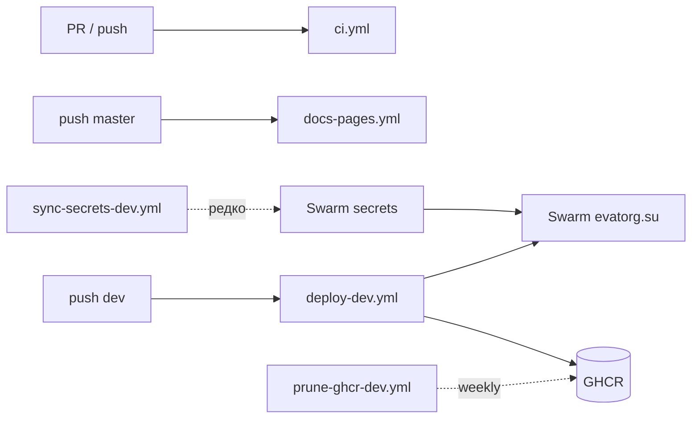

# ⚙️ GitHub Actions

> **Статус:** spec ready · **Версия:** 0.3  
> **Статический сайт:** `@tavrida/docs-site` (VitePress) · **Источник:** `docs/`

## 🎯 Обзор


| Workflow               | Файл                                                                                     | Триггер                        | Назначение                             |
| ---------------------- | ---------------------------------------------------------------------------------------- | ------------------------------ | -------------------------------------- |
| **CI**                 | `[.github/workflows/ci.yml](../../.github/workflows/ci.yml)`                             | PR + push `master`             | lint, test, turbo build                |
| **Docs Pages**         | `[.github/workflows/docs-pages.yml](../../.github/workflows/docs-pages.yml)`             | push `master`, manual          | Публикация на **GitHub Pages**         |
| **Deploy dev**         | `[.github/workflows/deploy-dev.yml](../../.github/workflows/deploy-dev.yml)`             | push **`dev`** (paths) + manual | Build → GHCR → ensure Swarm secrets → stack deploy |
| **Sync secrets (dev)** | `[.github/workflows/sync-secrets-dev.yml](../../.github/workflows/sync-secrets-dev.yml)` | **manual only**                | GitHub Secrets → Swarm `tavrida_dev_*` (rotate / force) |
| **Prune GHCR**         | `[.github/workflows/prune-ghcr-dev.yml](../../.github/workflows/prune-ghcr-dev.yml)`     | weekly + manual                | Удаление старых `tavrida-*` в GHCR     |





## 📚 Статический сайт документации


|                  |                                                                                  |
| ---------------- | -------------------------------------------------------------------------------- |
| **Опубликовано** | **[https://andrewb76.github.io/tavrida/](https://andrewb76.github.io/tavrida/)** |
| Репозиторий      | [andrewb76/tavrida](https://github.com/andrewb76/tavrida)                        |
| Пакет            | `apps/docs-site` (`@tavrida/docs-site`)                                          |
| Движок           | [VitePress](https://vitepress.dev/) 1.x                                          |
| Источник MD      | `docs/` → копия в `apps/docs-site/content` (`prebuild` sync)                     |
| Выход            | `apps/docs-site/.vitepress/dist`                                                 |


Перед `dev` / `build` скрипт `[sync-docs.mjs](../../apps/docs-site/scripts/sync-docs.mjs)` копирует `docs/` в `content/`, затем `[generate-sidebar.mjs](../../apps/docs-site/scripts/generate-sidebar.mjs)` строит левое меню из структуры каталогов (новые `.md` попадают в сайдбар автоматически).

### Локально

```bash
pnpm install
pnpm docs:dev      # http://localhost:5173
pnpm docs:build    # production build
pnpm docs:preview  # preview dist
```


### Base path

Для GitHub Pages **project site** этого репозитория:


|                  |                                                                              |
| ---------------- | ---------------------------------------------------------------------------- |
| URL              | [https://andrewb76.github.io/tavrida/](https://andrewb76.github.io/tavrida/) |
| `VITEPRESS_BASE` | `/tavrida/`                                                                  |


```bash
VITEPRESS_BASE=/tavrida/ pnpm docs:build
```

В CI переменная `VITEPRESS_BASE` выставляется из `github.event.repository.name` (в workflow — `/tavrida/`).

Для custom domain — `VITEPRESS_BASE=/`.

## 🚀 Включение GitHub Pages

1. Откройте **[Settings → Pages](https://github.com/andrewb76/tavrida/settings/pages)**
2. **Build and deployment → Source:** выберите **GitHub Actions** (не «Deploy from a branch»)
3. **Actions** → workflow **Docs (GitHub Pages)** → **Re-run all jobs** (или новый push в `master`)

После успешного deploy: [https://andrewb76.github.io/tavrida/](https://andrewb76.github.io/tavrida/)

### Troubleshooting: 404 / `Failed to create deployment (status: 404)`


| Симптом                                            | Причина                 | Решение                         |
| -------------------------------------------------- | ----------------------- | ------------------------------- |
| Deploy job: `Ensure GitHub Pages has been enabled` | Pages не включён        | Шаги 1–2 выше                   |
| Build зелёный, deploy красный                      | То же                   | Re-run после включения          |
| Сайт 404 после зелёного deploy                     | Кэш / ещё не прошёл DNS | Подождать 1–2 мин, hard refresh |


> `gh` не обязателен — достаточно UI в Settings.


## 🔐 Dev Swarm: Environment `dev`

Создайте GitHub Environment `dev` (Settings → Environments) и заполните:

### Variables (публичный конфиг)


| Variable                   | Пример / значение                                      |
| -------------------------- | ------------------------------------------------------ |
| `DEV_SWARM_SSH_HOST`       | `193.142.148.175`                                      |
| `DEV_SWARM_SSH_USER`       | `deploy`                                               |
| `DEV_DOMAIN`               | `evatorg.su`                                           |
| `ACME_EMAIL`               | `andrewb@bk.ru`                                        |
| `TAVRIDA_REPO_ROOT`        | `/opt/tavrida`                                         |
| `GHCR_OWNER`               | `andrewb76` (опц., иначе `repository_owner`)           |
| `LOGTO_ENDPOINT`           | `https://auth.evatorg.su` (Logto OSS)                   |
| `LOGTO_JWKS_URL`           | `https://auth.evatorg.su/oidc/jwks`                     |
| `LOGTO_AUDIENCE`           | `https://api.evatorg.su`                               |
| `LOGTO_M2M_APP_ID`         | M2M app id (из `https://logto.evatorg.su`)             |
| `LOGTO_M2M_RESOURCE`       | `https://default.logto.app/api` (OSS, не Cloud URL)    |
| `FRONTEND_ORIGIN`          | `https://app.evatorg.su`                               |
| `VITE_LOGTO_ENDPOINT`      | `https://auth.evatorg.su`                              |
| `VITE_LOGTO_APP_ID`        | SPA app id                                             |
| `VITE_LOGTO_API_RESOURCE`  | `https://api.evatorg.su` (= `LOGTO_AUDIENCE`)          |

Чеклист DNS / Logto / первого деплоя: [dev-evatorg.md](./dev-evatorg.md).


### Secrets


| Secret                   | Кто использует                                |
| ------------------------ | --------------------------------------------- |
| `DEV_SWARM_SSH_KEY`      | **оба** workflow — private key (**предпочтительно base64**, одна строка) |

**Как положить SSH-ключ (рекомендуется base64):**

```bash
# Linux
base64 -w0 ./tavrida-dev-swarm | xclip -selection clipboard   # или скопируйте вывод
# macOS
base64 < ./tavrida-dev-swarm | tr -d '\n' | pbcopy
```

В Environment secret `DEV_SWARM_SSH_KEY` вставьте **одну строку** base64 (без кавычек).  
CI декодирует её в `docker/swarm/ci-ssh-agent.sh`. Сырой PEM тоже принимается, но UI GitHub часто ломает переносы (`error in libcrypto`).

Проверка локально: `ssh -i ./tavrida-dev-swarm deploy@$HOST 'docker info …'` — ключ должен работать до base64.
| `POSTGRES_PASSWORD`      | sync-secrets → Swarm                          |
| `RABBITMQ_PASSWORD`      | sync-secrets → Swarm                          |
| `MINIO_ROOT_PASSWORD`    | sync-secrets → Swarm                          |
| `LOGTO_M2M_APP_SECRET`   | sync-secrets → Swarm (tenant «dev/server»)    |
| `INTERNAL_SERVICE_TOKEN` | sync-secrets → Swarm (`openssl rand -hex 32`) |

> **Локальная разработка не затрагивается.** Environment `dev` читают только Actions (`deploy-dev`, `sync-secrets-dev`). Ноутбук использует gitignored `.env.local` / `docker/swarm/dev.secrets.env` — это разные файлы и разные Logto tenants.


`GITHUB_TOKEN` для push в GHCR выдаётся автоматически (`permissions: packages: write`).

### VPS one-shot

```bash
# На manager-ноде (от root / sudo)
sudo mkdir -p /opt/tavrida
# Пользователь deploy + ключ для GitHub — см. ниже
git clone git@github.com:andrewb76/tavrida.git /opt/tavrida
cd /opt/tavrida && git checkout dev
docker swarm init   # если ещё не
```

#### Пользователь `deploy` + SSH-ключ для Actions

CI ходит так: `ssh://deploy@VPS` → `docker context` → `stack deploy` / `secret`. Нужны: членство в группе `docker`, ключ **без passphrase**.

**1. На VPS (под root / sudo):**

```bash
# Пользователь без login-пароля (только ключ)
sudo adduser --disabled-password --gecos 'Tavrida Swarm deploy' deploy
sudo usermod -aG docker deploy

# Домашний SSH
sudo mkdir -p /home/deploy/.ssh
sudo chmod 700 /home/deploy/.ssh
sudo touch /home/deploy/.ssh/authorized_keys
sudo chmod 600 /home/deploy/.ssh/authorized_keys
sudo chown -R deploy:deploy /home/deploy/.ssh

# Checkout под deploy (bind-mounts stack-infra)
sudo mkdir -p /opt/tavrida
sudo chown deploy:deploy /opt/tavrida
# дальше clone/pull от имени deploy
```

**2. Ключ на ноутбуке (не коммитить):**

```bash
ssh-keygen -t ed25519 -C 'github-actions-tavrida-dev' -f ./tavrida-dev-swarm -N ''
# public → VPS:
ssh root@193.142.148.175 'cat >> /home/deploy/.ssh/authorized_keys' < ./tavrida-dev-swarm.pub
# или: scp + sudo tee / append от root

# private → GitHub Environment secret DEV_SWARM_SSH_KEY (base64, одна строка):
base64 -w0 ./tavrida-dev-swarm   # Linux; macOS: base64 < ./tavrida-dev-swarm | tr -d '\n'
# вставьте вывод в secret (не сырой PEM — UI часто ломает multiline → libcrypto)
```

**3. Проверка с ноутбука:**

```bash
ssh -i ./tavrida-dev-swarm deploy@193.142.148.175 'docker info --format "{{.Swarm.LocalNodeState}}"'
# ожидается: active
```

GitHub Variable: `DEV_SWARM_SSH_USER=deploy`, Secret: `DEV_SWARM_SSH_KEY` = private key.

| Симптом | Причина | Решение |
|---------|---------|---------|
| `Host key verification failed` / `docker.example.com` dial-stdio | `known_hosts` пуст или устарел | Перезапустить Deploy; `ci-docker-context.sh` fail-fast + probe `ssh` |
| `Permission denied (publickey)` после keyscan ok | Неверный secret / ключ не в `authorized_keys`, либо (старый баг) `IdentitiesOnly` без `IdentityFile` | Проверить `ssh -i ./tavrida-dev-swarm deploy@HOST`; перезаписать `DEV_SWARM_SSH_KEY` base64 |
| `error in libcrypto` / `ssh-add` | Multiline PEM в secret | Перезаписать `DEV_SWARM_SSH_KEY` как **base64 одной строкой** |

Bind-mounts в `stack-infra.dev.yml` идут в `${TAVRIDA_REPO_ROOT}/docker/config/…` — путь должен существовать **на VPS**. Swarm configs (`traefik.dev.yml`, `keto.yml`) читаются с runner при `stack deploy`.

### Порядок первого деплоя

1. DNS `*.evatorg.su` + Logto tenant «dev/server» — [dev-evatorg.md](./dev-evatorg.md).
2. Заполнить Environment `dev` (vars + secrets), в т.ч. `VITE_LOGTO_*`.
3. **Actions → Sync secrets (dev)** — `force=true`, `redeploy=true` (или `redeploy=false` если образов ещё нет).
4. **Actions → Deploy / Sync** — всегда с кодом ветки **`dev`** (workflows сами делают `checkout ref: dev` на manual run). Не выбирайте `master` как источник устаревших stack-файлов.
5. Дальше: push/merge в `dev` обновляет образы; sync — только при ротации паролей.

### GHCR: retention (старые образы)

Каждый deploy пушит `:git-sha` и плавающий **`:dev`**. Без очистки реестр растёт линейно.

| Правило | Значение |
|---------|----------|
| Keep | последние **10** версий на пакет (`KEEP_LAST`) |
| Protected tags | `dev`, `latest` — не удаляются даже если старше окна |
| Workflow | [prune-ghcr-dev.yml](../../.github/workflows/prune-ghcr-dev.yml) — cron пн 06:00 UTC + manual (`dry_run`) |
| Скрипт | `docker/swarm/prune-ghcr-dev.sh` |

Перед первым боевым prune: **Actions → Prune GHCR → dry_run=true**.

Пакеты в GHCR лучше **привязать к репозиторию** (Package settings → Repository access), иначе `GITHUB_TOKEN` может не иметь права на delete.

На VPS (локальный disk Swarm-ноды) — отдельно: `docker image prune` / `docker system prune` по желанию; это не GHCR.

Подробнее: [docker/swarm/README.dev.md](../../docker/swarm/README.dev.md).

## 🧪 Test results badge

По [Publish Test Results](https://github.com/marketplace/actions/publish-test-results)
(«Create a badge from test results»):

1. Job `test` пишет JUnit (`scripts/node-test.mjs` → `**/test-results/junit.xml`).
2. `EnricoMi/publish-unit-test-result-action` → check + `steps.test-results.outputs.json`.
3. На **push `master`**: цвет/текст бейджа из `conclusion` + `formatted.stats` → `badge.svg`.
4. SVG пушится в orphan-ветку **`badges`** (`peaceiris/actions-gh-pages`), без отдельного `GIST_TOKEN`.

В [README.md](../../README.md):

```markdown

```

Первый бейдж появится после успешного CI на `master`. До этого raw-URL может отдавать 404.

Опционально (как в marketplace): Gist + secret `GIST_TOKEN` + `andymckay/append-gist-action`.

## 📋 Roadmap pipelines


| Стадия                              | Статус                                                     |
| ----------------------------------- | ---------------------------------------------------------- |
| Lint + docs build                   | ✅ workflow                                                 |
| Actions on Node 24 (`checkout@v5`…) | ✅ workflows                                                |
| GitHub Pages                        | ✅ workflow                                                 |
| `pnpm test` в CI                    | ✅ в `ci.yml` (+ JUnit check **Test Results**)              |
| Test results badge (`badges` branch)| ✅ SVG после push `master` → [README](../../README.md)       |
| Docker matrix → GHCR + Swarm deploy | ✅ `deploy-dev.yml`                                         |
| Sync secrets → Swarm                | ✅ `sync-secrets-dev.yml`                                   |
| Prune old GHCR images               | ✅ `prune-ghcr-dev.yml`                                     |
| Deploy Swarm stage on merge `stage` | TODO ([stage-deployment-todo](./stage-deployment-todo.md)) |


## 🔗 Связанные разделы

- [README](./README.md) — общий CI/CD
- [PLATFORM-SECRETS](../02-infrastructure/PLATFORM-SECRETS.md)
- [12-dev-process](../12-dev-process/README.md)
- [AGENTS.md](../../AGENTS.md)

---

**Автор:** команда разработки · **Версия:** 0.3-spec