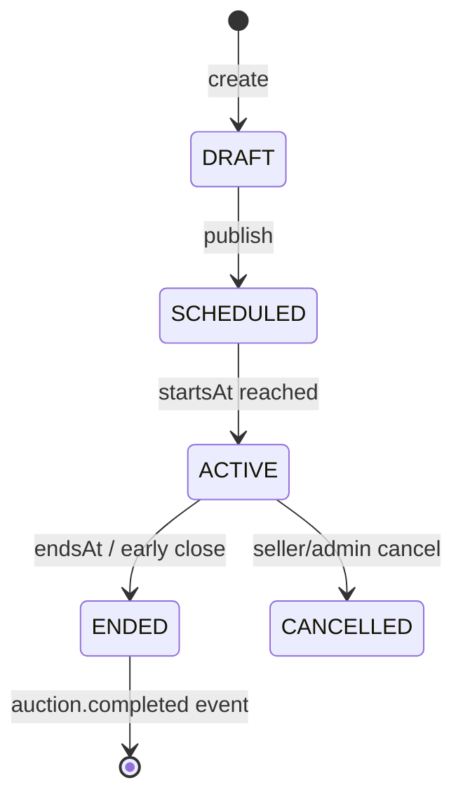

# 🔨 Сервис: auction

> **Статус:** implementing · **Версия:** 0.3 · **Schema:** `auction` · **Port:** 3003

## 🎯 Назначение

Управление **аукционами** Tavrida Lot: лоты, ставки, завершение сделок, экспертные оценки.

- Каталог list/get/create ✅ · English **bid** ✅ · Dutch **accept** ✅ · **close** / `close/run` ✅
- RMQ: `auction.created` / `bid_placed` / `completed` (если задан `RABBITMQ_URL`)
- Проверка лимитов через plan-config — ✅ (BFF `limits/check`, `features/can-use`, `resolve-tier`)
- Платные фичи / Redis WS live — next
- Dutch: ask step-down в `close/run`; live clock — later

## ✅ Реализовано (v0.3)

| Слой | Статус |
|------|--------|
| Catalog list/get + create | ✅ |
| Seed demo lots | ✅ |
| `POST …/bids` (ENGLISH) | ✅ |
| `POST …/bids` (DUTCH accept → immediate ENDED) | ✅ |
| `POST …/close` + `POST …/close/run` (+ Dutch ask drop) | ✅ |
| `winnerId` + reserve rule | ✅ |
| RMQ domain events | ✅ (optional RMQ) |
| BFF plan-config policy (create/list) | ✅ |
| `GET /health/ready` DB ping | ✅ |
| promote charge / expert POST / WS | ⏳ |

## 📖 Термины

| Термин | Описание |
|--------|----------|
| **Auction (лот)** | Торги с ценой, длительностью, продавцом |
| **Bid (ставка)** | Предложение цены участником |
| **Reserve price** | Минимальная цена продажи (Pro + оплата) |
| **ExpertAppraisal** | Экспертная оценка (роль Expert) |
| **Seller / Buyer** | Контекстные роли на конкретном лоте |

## 📄 Дополнительные документы

| Документ | Описание |
|----------|----------|
| [financial-features.md](./requirements/financial-features.md) | Лимиты и платные фичи по планам |
| [catalog-listing.md](./requirements/catalog-listing.md) | Каталог `/auctions`: фильтры, поиск, сортировка, API list |
| [dutch-bidding.md](./requirements/dutch-bidding.md) | Голландский аукцион: accept, step-down, close |

## 🗄️ Сущности

### `Auction` (`auction.auction`)

| Поле | Тип | Описание |
|------|-----|----------|
| `id` | UUID PK | — |
| `sellerId` | UUID | Владелец лота |
| `categoryId` | UUID | Категория (forum taxonomy или отдельный справочник) |
| `title`, `description` | text | Контент |
| `type` | enum | `ENGLISH` \| `DUTCH` \| … |
| `status` | enum | `DRAFT` \| `SCHEDULED` \| `ACTIVE` \| `ENDED` \| `CANCELLED` |
| `startingPrice` | decimal | Стартовая цена |
| `currentPrice` | decimal | Текущая (последняя ставка или starting) |
| `reservePrice` | decimal nullable | Резерв (если включён) |
| `bidIncrement` | decimal | Шаг ставки |
| `currency` | varchar(3) | `RUB` |
| `startsAt`, `endsAt` | timestamptz | Окно торгов |
| `winnerId` | UUID nullable | После `ENDED` с победителем |
| `promotedUntil` | timestamptz nullable | Продвижение в ленте |
| `images` | jsonb | URLs MinIO |
| `createdAt`, `updatedAt` | timestamptz | — |

### `Bid` (`auction.bid`)

| Поле | Тип | Описание |
|------|-----|----------|
| `id` | UUID PK | — |
| `auctionId` | UUID FK | — |
| `bidderId` | UUID | Участник |
| `amount` | decimal | Сумма ставки |
| `currency` | varchar(3) | — |
| `placedAt` | timestamptz | — |
| `isWinning` | boolean | Текущая лидирующая |

Индекс: `(auctionId, placedAt DESC)`.

### `ExpertAppraisal` (`auction.expert_appraisal`)

| Поле | Тип | Описание |
|------|-----|----------|
| `id` | UUID PK | — |
| `auctionId` | UUID | — |
| `expertId` | UUID | Expert role |
| `summary` | text | — |
| `estimatedValueMin`, `estimatedValueMax` | decimal nullable | — |
| `currency` | varchar(3) | — |
| `attachments` | jsonb | URLs |
| `createdAt` | timestamptz | — |

### Жизненный цикл аукциона



При `ENDED`: если `currentPrice >= reservePrice` (или reserve null) → `winnerId` = лидер; иначе лот не продан.

## 🔌 API

### Public (BFF `/api/v1/auctions/*`)

| Method | Path | Описание |
|--------|------|----------|
| GET | `/auctions` | Список лотов — [catalog-listing](./requirements/catalog-listing.md) |
| GET | `/auctions/{id}` | Детали + текущая цена |
| POST | `/auctions` | Создание (seller) |
| PATCH | `/auctions/{id}` | Редактирование (DRAFT / до startsAt) |
| POST | `/auctions/{id}/publish` | DRAFT → SCHEDULED/ACTIVE |
| POST | `/auctions/{id}/bids` | Ставка (English) / accept ask (Dutch → immediate ENDED) |
| GET | `/auctions/{id}/bids` | История ставок |
| POST | `/auctions/{id}/promote` | Платное продвижение |
| POST | `/auctions/{id}/expert-appraisals` | Expert only |
| GET | `/auctions/{id}/expert-appraisals` | Публичный просмотр |

#### `GET /api/v1/auctions` — каталог

Полная спецификация фильтров, поиска и ответа — [catalog-listing.md](./requirements/catalog-listing.md).

| Query | Тип | Default | Описание |
|-------|-----|---------|----------|
| `q` | string | — | Поиск (scope по тарифу) |
| `categoryId` | UUID | — | Категория |
| `status` | enum | `ACTIVE` | `ACTIVE` \| `ENDING_SOON` \| `SCHEDULED` \| `ENDED` \| `ALL` |
| `sort` | enum | `ENDING_SOON` | `ENDING_SOON` \| `NEWEST` \| `PRICE_ASC` \| `PRICE_DESC` \| `RELEVANCE` \| `PROMOTED` |
| `minPrice`, `maxPrice` | number | — | Pro |
| `type` | enum | — | `ENGLISH` \| `DUTCH`, Pro |
| `hasExpertAppraisal` | boolean | — | Pro |
| `cursor`, `limit` | string, number | —, `20` | Cursor pagination ([06-api](../../06-api/README.md)) |

### Internal (`/internal/v1/`)

| Method | Path | Описание |
|--------|------|----------|
| POST | `/auctions/{id}/close` | CRON / worker — принудительное завершение |
| POST | `/auctions/close/run` | Batch: SCHEDULED→ACTIVE · Dutch ask −step · ACTIVE→ENDED by `endsAt`; hourly `auction-close` |
| GET | `/health`, `/health/ready` | Liveness; readiness pings DB (`SELECT 1`) |

### `POST /api/v1/auctions` — создание

**Pre-checks (BFF или auction):**

1. `plan-config POST /limits/check` — `auction.auctionsCreatedPerDay`
2. `plan-config POST /features/can-use` — `auction.auctionTypes` (тип лота)
3. `rating` — ban check (HTTP или cached)

```json
{
  "title": "Монета 1787",
  "categoryId": "uuid",
  "type": "ENGLISH",
  "startingPrice": 1000,
  "bidIncrement": 100,
  "startsAt": "2026-07-10T10:00:00Z",
  "endsAt": "2026-07-12T10:00:00Z",
  "images": ["https://…"]
}
```

→ `201` + produce `auction.created`

### `POST /api/v1/auctions/{id}/bids`

**Pre-checks:**

1. `auction.bidsPerHour`, `auction.activeAuctions`
2. Auction `status === ACTIVE`, `now < endsAt`
3. `amount >= currentPrice + bidIncrement` (English)
4. Anti-sniping: optional extend `endsAt` if bid in last N minutes (settings TBD)

```json
{ "amount": 1500 }
```

→ `201` + `auction.bid_placed` + Redis pub/sub для BFF WS `bid.placed`

### `POST /api/v1/auctions/{id}/promote`

1. `features/can-use` → `auction.promotionEnabled`
2. `billing.charge` — `target: auction.promotion`, amount из registry / scalar-config
3. Set `promotedUntil`

## ⚙️ Переменные scalar-config

| Ключ | Тип | Default | Описание |
|------|-----|---------|----------|
| `auction.bidIncrementDefault` | number | `100` | Шаг по умолчанию (₽) |
| `auction.minStartingPrice` | number | `1` | Мин. стартовая цена |
| `auction.expertAppraisalBoost` | number | `1.2` | Множитель значимости с экспертизой |

## 💳 Переменные plan-config

Сервис **auction** регистрирует ключи при старте (`POST /internal/v1/plan-variables/register`).  
plan-config хранит матрицу; до register auction параметров в админке не будет.

| Ключ | Тип | Free | Basic | Pro | Описание |
|------|-----|------|-------|-----|----------|
| `auction.activeAuctions` | limit | 5 | 20 | ∞ | **Bidder:** торгов со ставками одновременно |
| `auction.sellerActiveLots` | limit | 2 | 5 | ∞ | **Seller:** своих лотов ACTIVE |
| `auction.bidsPerHour` | limit | 20 | 100 | ∞ | Ставок в час |
| `auction.auctionsCreatedPerDay` | limit | 3 | 10 | ∞ | **Seller:** новых лотов / сутки |
| `auction.auctionDurationMaxHours` | limit | 72 | 336 | ∞ | Макс. длительность |
| `auction.promotionEnabled` | feature | false | false | true | Продвижение (тариф) |
| `auction.reservePriceEnabled` | feature | false | false | true | Резервная цена |

Платные разовые charge — см. [financial-features.md](./requirements/financial-features.md).

> [PLATFORM-REGISTRY.md](../PLATFORM-REGISTRY.md) · [ADR-016](../../03-architecture/adr/016-financial-policy-parameter-registration.md)

## 📨 События

| Direction | Event | Когда |
|-----------|-------|-------|
| produce | `auction.created` | Лот опубликован |
| produce | `auction.bid_placed` | Успешная ставка |
| produce | `auction.completed` | Торги завершены (→ WS `auction.ended`) |
| produce | `auction.expert_appraisal_added` | Expert POST |
| consume | `rating.user_banned` | Блокировка ставок bidder |

> Redis: channel `auction:{id}` для BFF relay. Каталог: [event-catalog](../../03-architecture/event-catalog.md)

## 🔗 Взаимодействие

| Сервис | Взаимодействие | Протокол |
|--------|----------------|----------|
| plan-config | limits, features | HTTP internal |
| billing | charge (promotion, reserve) | HTTP internal |
| feedback, rating | `auction.completed` | RabbitMQ |
| notifications | bid, completed | RabbitMQ |
| BFF | REST proxy, WS relay | HTTP + Redis |
| MinIO | images | S3 API |

## 🔒 Безопасность

- Создание/редактирование — seller (`auction:{id}#owner`) или admin
- Ставка — authenticated member; не seller на своём лоте
- Expert appraisal — Keto `platform:tavrida-lot#expert@user:{id}`; не owner лота
- Moderator — hide/restore lot ([keto-schema](../../09-security/keto-schema.md))
- Internal close — service token only

## ⚙️ Окружение

| Переменная | Обяз. | Описание | Пример |
|------------|-------|----------|--------|
| `DATABASE_URL` | да | schema `auction` | postgres://… |
| `RABBITMQ_URL` | да | Events | amqp://… |
| `REDIS_URL` | да | Live bids pub/sub | redis://… |
| `PLAN_CONFIG_URL` | да | Limits | http://plan-config:3002 |
| `BILLING_URL` | да | Charges | http://billing:3001 |
| `MINIO_*` | да | Images bucket `auction-images` | — |
| `PORT` | нет | HTTP | `3003` |

> [PLATFORM-SECRETS.md](../../02-infrastructure/PLATFORM-SECRETS.md)

## 📎 Связанные разделы

- [financial-features](./requirements/financial-features.md)
- [catalog-listing](./requirements/catalog-listing.md)
- [plan-config](../plan-config/README.md)
- [billing](../billing/README.md)
- [feedback](../feedback/README.md)
- [06-api — auctions](../../06-api/README.md)

---

**Автор:** команда разработки · **Версия:** 0.2-spec
