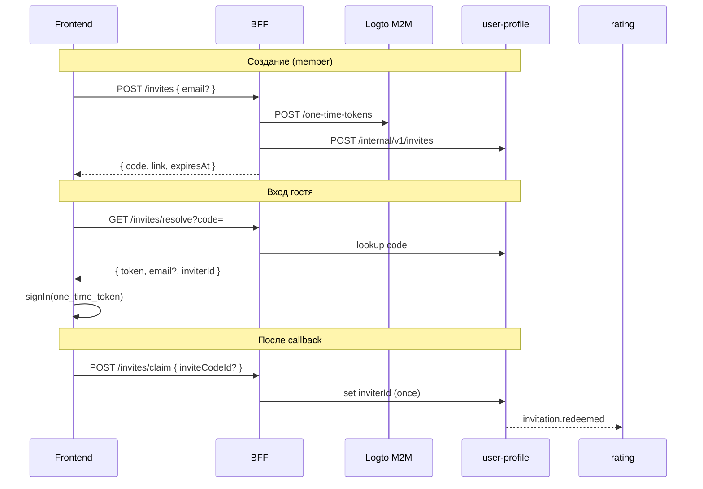

# ✉️ BFF API — инвайты (Logto one-time token)

> **Статус:** spec ready · **Версия:** 0.1  
> **ADR:** [012-club-invite-via-logto](../../03-architecture/adr/012-club-invite-via-logto.md)  
> **Продукт:** [club-access.md](../../01-goal/club-access.md)

BFF **оркестрирует** invite flow: Logto Management API (one-time token) + `user-profile` (код `TAV-…`, `inviterId`). Это **не** pass-through proxy.

---

## 🎯 Модель

| Правило | Значение |
|---------|----------|
| Member | JWT Logto tenant = доступ в клуб |
| Инвайт | Разрешает **регистрацию** нового пользователя + фиксирует **реферал** |
| Код `TAV-XXXX-XXXX` | Человекочитаемый alias ссылки `/join?code=…` |
| Ссылка | `/join?code=TAV-…` или `/join?token=…&email=…` |

Пользователи, созданные в Logto Console вручную, — members без `inviterId` (bootstrap).

---

## 🏗️ Архитектура



### Ответственность слоёв

| Слой | Делает |
|------|--------|
| **BFF** | JWT check, лимиты plan-config, вызов Logto M2M, compose `link`, resolve/claim |
| **Logto M2M** | `POST /api/one-time-tokens` |
| **user-profile** | Хранит `invite_code`, `invitation`, `inviterId` |
| **Frontend** | `/join`, `signIn({ extraParams: { one_time_token } })` |

---

## 📋 Endpoints (публичный BFF)

| Method | Path | Auth | Описание |
|--------|------|------|----------|
| `POST` | `/api/v1/invites` | Member JWT | Создать приглашение |
| `GET` | `/api/v1/invites` | Member JWT | Мои коды (история) |
| `GET` | `/api/v1/invites/resolve` | **Нет** | Код → Logto token |
| `POST` | `/api/v1/invites/claim` | Member JWT | Зафиксировать `inviterId` |

---

## `POST /api/v1/invites`

Создаёт invite: Logto one-time token + запись в `user-profile`.

### Request

```http
POST /api/v1/invites
Authorization: Bearer {member-jwt}
Content-Type: application/json

{
  "email": "friend@example.com"
}
```

| Поле | Тип | Обяз. | Описание |
|------|-----|-------|----------|
| `email` | string (email) | нет | Если не задан — BFF генерирует `invite-{id}@invite.tavrida-lot.localhost` (Logto API требует email) |

### Поведение BFF

1. Validate JWT → `issuerId = sub`.
2. Check Keto: caller is member (JWT достаточен в v1).
3. Check `club.member.invite.monthlyMax` via plan-config (admin / `CLUB_INVITES_UNLIMITED_ISSUER_IDS` — skip). Env `CLUB_INVITES_PER_MONTH` — fallback only.
4. `POST {LOGTO_ENDPOINT}/api/one-time-tokens` (M2M token):

```json
{
  "email": "friend@example.com",
  "expiresIn": 1209600
}
```

`expiresIn` = `club.invite.validityDays` × 86400 (default 14 дней). Источник: **settings** (`ClubSettingsReader`, кэш 30 с); env `CLUB_INVITE_VALIDITY_DAYS` — только fallback.

`maxUses`: `1` при `club.invite.codeType=SINGLE_USE`, `100` при `MULTI_USE`.

5. `POST user-profile /internal/v1/invites`:

```json
{
  "issuerId": "uuid",
  "logtoToken": "ott_…",
  "email": "friend@example.com",
  "expiresAt": "2026-07-23T12:00:00Z",
  "maxUses": 1
}
```

6. user-profile генерирует уникальный `code` формата `TAV-XXXX-XXXX`.

### Response `201`

```json
{
  "id": "uuid",
  "code": "TAV-K7HM-9R2Q",
  "link": "https://tavrida-lot.ru/join?code=TAV-K7HM-9R2Q",
  "email": "friend@example.com",
  "expiresAt": "2026-07-23T12:00:00Z",
  "createdAt": "2026-07-09T20:00:00Z"
}
```

`link` собирает BFF из `FRONTEND_ORIGIN` + `code` (не raw Logto token в URL для code-flow).

### Ошибки

| HTTP | type | Когда |
|------|------|-------|
| 401 | `unauthorized` | Нет JWT |
| 403 | `forbidden` | Лимит `club.member.invite.monthlyMax` |
| 422 | `validation-error` | Невалидный email |
| 502 | `upstream-error` | Logto M2M / user-profile недоступен |

### Side effects (опционально v1.1)

- Email connector: BFF или Logto отправляет письмо с `link` если `email` задан.
- Audit log: `invite.created`.

---

## `GET /api/v1/invites`

Список кодов текущего member.

### Request

```http
GET /api/v1/invites?limit=20&cursor=
Authorization: Bearer {member-jwt}
```

### Response `200`

```json
{
  "data": [
    {
      "id": "uuid",
      "code": "TAV-K7HM-9R2Q",
      "link": "https://tavrida-lot.ru/join?code=TAV-K7HM-9R2Q",
      "email": "friend@example.com",
      "usesCount": 1,
      "maxUses": 1,
      "expiresAt": "2026-07-23T12:00:00Z",
      "createdAt": "2026-07-09T20:00:00Z",
      "status": "redeemed"
    }
  ],
  "pagination": { "nextCursor": null, "hasMore": false }
}
```

| `status` | Значение |
|----------|----------|
| `active` | Не использован, не истёк |
| `redeemed` | `usesCount >= maxUses` |
| `expired` | `expiresAt < now` |

Proxy → `user-profile GET /internal/v1/invites?issuerId={sub}`.

---

## `GET /api/v1/invites/resolve`

**Публичный** endpoint для гостя перед Logto sign-in.

### Request

```http
GET /api/v1/invites/resolve?code=TAV-K7HM-9R2Q
```

Или (legacy / direct token в ссылке от BFF admin tools):

```http
GET /api/v1/invites/resolve?token=ott_…
```

| Query | Обяз. | Описание |
|-------|-------|----------|
| `code` | один из | Код `TAV-…` |
| `token` | `code` \| `token` | Raw one-time token id (если ссылка без code) |

### Response `200`

```json
{
  "token": "YHwbXSXxQfL02IoxFqr1hGvkB13uTqcd",
  "email": "friend@example.com",
  "inviterId": "uuid",
  "inviteCodeId": "uuid",
  "code": "TAV-K7HM-9R2Q"
}
```

| Поле | Назначение |
|------|------------|
| `token` | Передаётся в `signIn({ extraParams: { one_time_token } })` |
| `email` | `loginHint` в Logto SDK |
| `inviterId` | Для `claim` после входа (фронт кладёт в sessionStorage) |
| `inviteCodeId` | Опционально в `claim` для идемпотентности |

### Ошибки

| HTTP | type | detail (пример) |
|------|------|-----------------|
| 404 | `not-found` | Код не найден |
| 410 | `invite-expired` | Срок истёк |
| 409 | `invite-exhausted` | Код уже использован |
| 429 | `rate-limit-exceeded` | Brute-force на resolve |

Rate limit: **30 req/min per IP** (anonymous).

### Безопасность

- Не возвращать `logtoToken` в логах.
- Не отдавать список всех кодов — только resolve по точному `code`.
- После успешного claim инкремент `usesCount` (не на resolve).

---

## `POST /api/v1/invites/claim`

Фиксирует реферальную связь после **первого** успешного входа по invite. **Не** открывает доступ в клуб (доступ уже есть через JWT).

### Request

```http
POST /api/v1/invites/claim
Authorization: Bearer {member-jwt}
Content-Type: application/json

{
  "inviteCodeId": "uuid"
}
```

| Поле | Тип | Обяз. | Описание |
|------|-----|-------|----------|
| `inviteCodeId` | UUID | нет* | Предпочтительно — из `resolve` |
| `inviterId` | UUID | нет* | Fallback если фронт сохранил из resolve |

\* Нужен хотя бы один: `inviteCodeId` или `inviterId`.

### Поведение BFF

1. `sub` из JWT.
2. `POST user-profile /internal/v1/invites/claim`:

   - Если у `userId` уже есть `inviterId` → **200 noop** (идемпотентно).
   - Иначе: записать `inviterId`, `invitationAcceptedAt`, инкремент `usesCount` на коде.
   - Emit `invitation.redeemed` → rating.

### Response `200`

```json
{
  "userId": "uuid",
  "inviterId": "uuid",
  "invitationAcceptedAt": "2026-07-09T20:05:00Z",
  "claimed": true
}
```

`claimed: false` — если связь уже была (повторный claim).

### Ошибки

| HTTP | type | Когда |
|------|------|-------|
| 401 | `unauthorized` | Нет JWT |
| 404 | `not-found` | `inviteCodeId` не существует |
| 409 | `conflict` | `inviterId` не совпадает с кодом (tamper) |

---

## Logto Management API (BFF internal)

### M2M authentication

| Env | Описание |
|-----|----------|
| `LOGTO_ENDPOINT` | `https://{tenant}.logto.app` |
| `LOGTO_M2M_APP_ID` | Machine-to-machine application |
| `LOGTO_M2M_APP_SECRET` | Client secret |
| `LOGTO_M2M_RESOURCE` | `https://{tenant}.logto.app/api` (Cloud) · `https://default.logto.app/api` (OSS) |

Получение token:

```http
POST {LOGTO_ENDPOINT}/oidc/token
Content-Type: application/x-www-form-urlencoded

grant_type=client_credentials
&client_id={LOGTO_M2M_APP_ID}
&client_secret={LOGTO_M2M_APP_SECRET}
&resource={LOGTO_M2M_RESOURCE}
&scope=all
```

### Create one-time token

```http
POST {LOGTO_ENDPOINT}/api/one-time-tokens
Authorization: Bearer {m2m-access-token}
Content-Type: application/json

{
  "email": "friend@example.com",
  "expiresIn": 1209600
}
```

Response (пример):

```json
{
  "token": "YHwbXSXxQfL02IoxFqr1hGvkB13uTqcd",
  "expiresAt": "2026-07-23T20:00:00.000Z"
}
```

> Logto: [one-time token](https://docs.logto.io/end-user-flows/one-time-token) · [disable registration](https://docs.logto.io/end-user-flows/sign-up-and-sign-in/disable-user-registration)

### Logto Console checklist

- [ ] Sign-in experience → **Disable user registration**
- [ ] SPA app (frontend) — redirect URIs
- [ ] M2M app — Management API scopes
- [ ] (Опционально) Email connector для писем с invite

### Dev без M2M

Если `LOGTO_M2M_APP_ID` / `LOGTO_M2M_APP_SECRET` пусты, BFF генерирует `dev-*` one-time tokens и сохраняет их в user-profile. Logto Cloud **не примет** такие токены — для полного E2E нужен M2M app.

---

## user-profile (internal)

BFF вызывает:

| Method | Path | Описание |
|--------|------|----------|
| `POST` | `/internal/v1/invites` | Сохранить code + logtoToken hash/ref |
| `GET` | `/internal/v1/invites` | Список по `issuerId` |
| `GET` | `/internal/v1/invites/resolve` | Lookup by `code` or `token` |
| `POST` | `/internal/v1/invites/claim` | Записать invitation |
| `POST` | `/internal/v1/profile/ensure` | Профиль при первом JWT (без inviter) |

### `invite_code` (доп. поля для v0.1)

| Поле | Тип | Описание |
|------|-----|----------|
| `logtoToken` | varchar | One-time token (или hash — TBD security review) |
| `email` | varchar nullable | Target email |
| `status` | enum | `active` \| `redeemed` \| `expired` |

---

## События

| Event | Producer | Payload |
|-------|----------|---------|
| `invitation.redeemed` | user-profile | `{ inviteeId, inviterId, inviteCodeId }` |

Consumer: `rating` — referral tree ([karma-and-rating.md](../../01-goal/karma-and-rating.md)).

---

## Bootstrap (день 0)

1. Первый вход через Logto → скопировать `sub` с `/profile/me`.
2. Keto: `docker compose -f docker/compose/infra.local.yml up -d` (или `pnpm keto:up`).
3. Admin tuple: `pnpm grant:admin <logto_sub>` — см. [bootstrap-admin.md](../../09-security/bootstrap-admin.md).
4. Неограниченные `POST /invites` для admin (Keto check в BFF).
5. Первые invite-ссылки раздаются вручную.

**Без Keto (временно):** `CLUB_INVITES_UNLIMITED_ISSUER_IDS=<sub>` в `.env.local`.

---

## Окружение BFF (дополнение)

| Переменная | Обяз. | Описание |
|------------|-------|----------|
| `LOGTO_M2M_APP_ID` | да | M2M для Management API |
| `LOGTO_M2M_APP_SECRET` | да | Secret |
| `LOGTO_M2M_RESOURCE` | да | Management API resource |
| `FRONTEND_ORIGIN` | да | `https://tavrida-lot.ru` — для `link` |
| `USER_PROFILE_URL` | да | Upstream |
| `CLUB_INVITE_VALIDITY_DAYS` | нет | **deprecated** — fallback если settings недоступен; источник: `club.invite.validityDays` |
| `CLUB_INVITES_PER_MONTH` | нет | **deprecated** fallback; primary: plan-config `club.member.invite.monthlyMax` (1/3/10) |
| `CLUB_INVITES_UNLIMITED_ISSUER_IDS` | нет | CSV Logto `sub` без лимита (fallback без Keto) |
| `KETO_READ_URL` | нет | `http://localhost:4466` — admin check для invite quota |
| `KETO_NAMESPACE` | нет | default `TavridaLot` |
| `KETO_PLATFORM_OBJECT` | нет | default `platform:tavrida-lot` |
| `KETO_ADMIN_RELATION` | нет | default `admin` |

См. [PLATFORM-SECRETS.md](../../02-infrastructure/PLATFORM-SECRETS.md) · [bootstrap-admin.md](../../09-security/bootstrap-admin.md).

---

## Реализация (чеклист)

- [x] NestJS `InvitesController` + `LogtoManagementClient` (`services/bff`)
- [x] user-profile internal `/internal/v1/invites/*` (`services/user-profile`)
- [x] Rate limiter на `resolve` (30 req/min per IP)
- [x] Idempotent `claim`
- [x] OpenAPI fragment в `06-api/invites-api.md`
- [x] `club.invite.validityDays` / `club.invite.codeType` — BFF читает из scalar-config (`ClubSettingsReader`)
- [x] `club.registration.inviteOnly` — `GET /api/v1/settings/public` + landing/join UI
- [x] `club.member.invite.monthlyMax` — BFF quota via plan-config (`CLUB_INVITES_PER_MONTH` fallback)
- [ ] E2E: create → resolve → mock signIn → claim → event

---

## 🔗 Связанные разделы

- [bff/README.md](./README.md)
- [user-profile](../user-profile/README.md)
- [logto-setup.md](../../14-frontend/logto-setup.md)
- [06-api](../../06-api/README.md)

---

**v0.1-spec** · ADR-012
