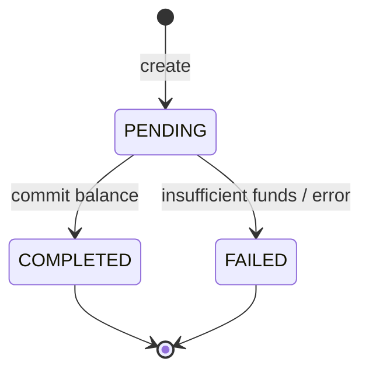

# 💰 Сервис: billing

> **Статус:** v1 scaffold · **Версия:** 0.3 · **Schema:** `billing` · **Код:** `services/billing` :3001

## 🎯 Назначение

Сервис **лицевых счётов** и **платежей** платформы Tavrida Lot.

- Хранит баланс пользователя (`UserWallet`)
- Пополнения (deposit) и списания (charge, refund)
- **Не знает** о тарифных планах — только деньги и audit trail (`Transaction`)
- Единственный источник истины для баланса

## 📖 Термины

| Термин | Описание |
|--------|----------|
| **Лицевой счёт (UserWallet)** | Баланс пользователя в валюте платформы |
| **Transaction** | Неизменяемая запись операции (`DEPOSIT`, `CHARGE`, `REFUND`) |
| **target** | Структурированный идентификатор назначения списания (`auction.promotion`, `plan-config.activate-plan:pro`) |
| **Idempotency-Key** | UUID; повтор charge с тем же ключом → тот же результат |

## 🗄️ Сущности

### `UserWallet` (`billing.user_wallet`)

| Поле | Тип | Описание |
|------|-----|----------|
| `userId` | UUID PK | ID пользователя (Logto `sub`) |
| `balance` | decimal(12,2) | Текущий баланс |
| `currency` | varchar(3) | По умолчанию `RUB` |
| `createdAt`, `updatedAt` | timestamptz | — |

Кошелёк создаётся **lazy** при первом deposit или charge.

### `Transaction` (`billing.transaction`)

| Поле | Тип | Описание |
|------|-----|----------|
| `id` | UUID PK | ID операции |
| `userId` | UUID | Владелец кошелька |
| `type` | enum | `DEPOSIT` \| `CHARGE` \| `REFUND` \| `CREDIT` |
| `amount` | decimal(12,2) | Сумма (> 0) |
| `description` | text | Человекочитаемое описание для UI |
| `target` | varchar | Только для `CHARGE` — см. выше |
| `status` | enum | `PENDING` \| `COMPLETED` \| `FAILED` |
| `idempotencyKey` | varchar nullable | Уникален per user + charge |
| `createdAt` | timestamptz | — |

> Связь с `auctionId` / `planId` — через `target` и domain-сервисы; billing не хранит FK на другие schema.

### Жизненный цикл



## 🔌 API

### Public (через BFF `/api/v1/wallets/*`)

| Method | Path | Описание |
|--------|------|----------|
| GET | `/wallets/balance` | Баланс текущего пользователя (JWT) |
| GET | `/wallets/transactions` | История (cursor pagination) |
| POST | `/wallets/deposit` | Инициировать пополнение |
| POST | `/wallets/charge` | Списание (только trusted callers через BFF proxy) |

### Internal (`/internal/v1/`)

| Method | Path | Caller | Описание |
|--------|------|--------|----------|
| GET | `/wallets/balance?userId=` | plan-config, BFF | Баланс по userId |
| POST | `/wallets/charge` | plan-config, auction | Списание с Idempotency-Key |
| POST | `/wallets/refund` | admin, plan-config | Возврат по `transactionId` |
| POST | `/wallets/credit` | referral-rewards, admin | Platform credit (реферальные выплаты, компенсации) |
| GET | `/health` | orchestrator | Liveness |
| GET | `/health/ready` | orchestrator | DB + RabbitMQ |

### `GET /internal/v1/wallets/balance`

```http
GET /internal/v1/wallets/balance?userId=user-uuid
Authorization: Bearer {service-jwt}
```

```json
{ "userId": "uuid", "balance": 500, "currency": "RUB" }
```

### `POST /internal/v1/wallets/charge`

```http
POST /internal/v1/wallets/charge
Authorization: Bearer {service-jwt}
Idempotency-Key: {uuid}
Content-Type: application/json
```

```json
{
  "userId": "user-uuid",
  "amount": 200,
  "target": "plan-config.activate-plan:pro",
  "description": "Pro-подписка (1 мес.)"
}
```

**Ответы:**

| HTTP | Когда |
|------|-------|
| 200 | Списание выполнено (или idempotent replay) |
| 402 | `insufficient-balance` |
| 409 | Конфликт idempotency (другой payload с тем же ключом) |

```json
{ "transactionId": "uuid", "status": "COMPLETED", "balanceAfter": 300 }
```

### `POST /internal/v1/wallets/deposit`

Вызывается после подтверждения платёжного провайдера (webhook → BFF → billing).

```json
{
  "userId": "user-uuid",
  "amount": 500,
  "externalReference": "payment-provider-id"
}
```

### `POST /internal/v1/wallets/credit`

Зачисление **без внешнего платёжного провайдера** — реферальные выплаты, компенсации admin.

```json
{
  "userId": "user-uuid",
  "amount": 99,
  "target": "referral.reward:accrual-uuid",
  "description": "Реферальное вознаграждение",
  "source": "referral-rewards",
  "idempotencyKey": "referral-accrual-uuid"
}
```

**Ответ:** как у charge — `{ transactionId, status, balanceAfter }`.

## ⚙️ Переменные scalar-config

| Ключ | Тип | Default | Scope | Описание |
|------|-----|---------|-------|----------|
| `billing.currencyDefault` | string | `RUB` | global | Валюта по умолчанию |
| `billing.minDepositAmount` | number | `100` | global | Минимальное пополнение (₽) |

> Полный реестр: [PLATFORM-REGISTRY.md](../PLATFORM-REGISTRY.md)

## 💳 Переменные plan-config

Не применимо — billing не зависит от тарифа.

## 📨 События

| Direction | Event | Когда |
|-----------|-------|-------|
| produce | `billing.deposit_completed` | Deposit → `COMPLETED` |
| produce | `billing.charge_completed` | Charge → `COMPLETED` |
| produce | `billing.charge_failed` | Charge → `FAILED` (недостаточно средств) |
| produce | `billing.refund_completed` | Refund → `COMPLETED` |
| produce | `billing.credit_completed` | Credit (platform) → `COMPLETED` |

> Каталог payload: [event-catalog](../../03-architecture/event-catalog.md)

## 🔗 Взаимодействие

| Сервис | Взаимодействие | Протокол | Направление |
|--------|---------------|----------|-------------|
| plan-config | balance, charge | HTTP internal | plan-config → billing |
| auction | charge (promotion, reserve) | HTTP internal | auction → billing |
| referral-rewards | credit (payout) | HTTP internal | referral-rewards → billing |
| BFF | proxy public + deposit webhook | HTTP | BFF ↔ billing |
| notifications | consume events | RabbitMQ | billing → RMQ |

## 🔒 Безопасность

- Charge/refund — **только internal** или BFF с service token; клиент не вызывает charge напрямую
- Атомарность: `SELECT … FOR UPDATE` на `user_wallet` или advisory lock per `userId`
- Idempotency: уникальный индекс `(userId, idempotencyKey)` для charge
- Audit: все `Transaction` immutable после `COMPLETED`
- Минимальный deposit — из scalar-config

## ⚙️ Окружение

| Переменная | Обяз. | Описание | Пример |
|------------|-------|----------|--------|
| `DATABASE_URL` | да | PostgreSQL, schema `billing` | postgres://…/tavrida_lot |
| `RABBITMQ_URL` | да | Publisher событий | amqp://… |
| `PORT` | нет | HTTP | `3001` |
| `LOG_LEVEL` | нет | — | `info` |

> Полный реестр: [PLATFORM-SECRETS.md](../../02-infrastructure/PLATFORM-SECRETS.md)

## 📎 Связанные разделы

- [plan-config](../plan-config/README.md)
- [06-api — wallets](../../06-api/README.md)
- [MICROSERVICE-SPEC](../MICROSERVICE-SPEC.md)
- [Event catalog](../../03-architecture/event-catalog.md)
- [10-data — billing schema](../../10-data/README.md)

---

**Автор:** команда разработки · **Версия:** 0.2-spec
