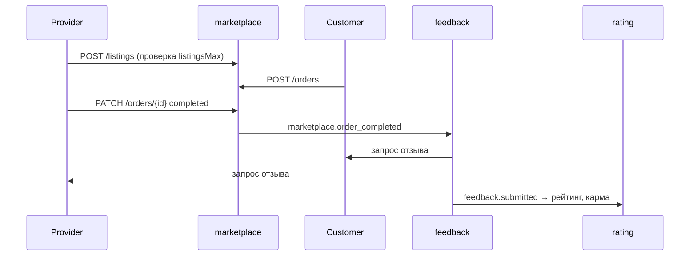

# 🛒 Сервис: marketplace

> **Статус:** spec ready · **Версия:** 0.2 · **Schema:** `marketplace`

## 🎯 Назначение

**Marketplace** — каталог услуг, которые пользователи предлагают друг другу.

- Поставщик создаёт **перечень услуг** с описанием, ценой и **портфолио**
- Заказчик выбирает услугу и оформляет **заказ**
- После выполнения — **feedback** (как после аукциона) → рейтинг и карма
- Количество активных услуг ограничено **тарифом** ([PLATFORM-REGISTRY.md](../PLATFORM-REGISTRY.md))

> **Юридическое и монетизация платформы** (комиссия %, договор оферты) — отдельный документ, **не утверждено**.  
> Текущая модель: **цена задаёт поставщик**, расчёт **между пользователями**; платформа не удерживает комиссию до отдельного решения.

---

## 📖 Термины

| Термин | Описание |
|--------|----------|
| **ServiceListing** | Услуга в справочнике (название, цена, описание) |
| **PortfolioItem** | Пример работы в портфолио услуги (фото, описание) |
| **ServiceOrder** | Заказ услуги: поставщик ↔ заказчик |
| **Provider** | Пользователь, создавший услугу |
| **Customer** | Пользователь, заказавший услугу |
| **Expert** | Роль (назначает admin) — см. [roles.md](../../01-goal/roles.md) |

---

## 🔄 Жизненный цикл



### Статусы заказа

| Статус | Описание |
|--------|----------|
| `PENDING` | Заказ создан, ожидает подтверждения поставщиком |
| `ACCEPTED` | Поставщик принял |
| `IN_PROGRESS` | В работе |
| `COMPLETED` | Выполнено → feedback |
| `CANCELLED` | Отменён |
| `DISPUTED` | Спор *(модерация, позже)* |

---

## 🗄️ Сущности (TypeORM)

Schema: `marketplace`

### `ServiceListing`

```ts
@Entity({ schema: 'marketplace', name: 'service_listing' })
export class ServiceListing {
  @PrimaryGeneratedColumn('uuid')
  id: string

  @Column('uuid')
  providerId: string

  @Column('varchar')
  title: string

  @Column('text')
  description: string

  @Column('decimal')
  price: number

  @Column('varchar', { length: 3, default: 'RUB' })
  currency: string

  @Column('varchar', { nullable: true })
  category?: string // restoration, appraisal, delivery, ...

  @Column('enum', { enum: ['DRAFT', 'ACTIVE', 'PAUSED', 'ARCHIVED'] })
  status: string

  @CreateDateColumn()
  createdAt: Date
}
```

### `PortfolioItem`

```ts
@Entity({ schema: 'marketplace', name: 'portfolio_item' })
export class PortfolioItem {
  @PrimaryGeneratedColumn('uuid')
  id: string

  @Column('uuid')
  listingId: string

  @Column('varchar')
  title: string

  @Column('text', { nullable: true })
  description?: string

  @Column('varchar')
  imageUrl: string // MinIO

  @Column('int')
  sortOrder: number
}
```

> Портфолио **публичное** — видят все пользователи (в т.ч. гости) на странице услуги.

### `ServiceOrder`

```ts
@Entity({ schema: 'marketplace', name: 'service_order' })
export class ServiceOrder {
  @PrimaryGeneratedColumn('uuid')
  id: string

  @Column('uuid')
  listingId: string

  @Column('uuid')
  providerId: string

  @Column('uuid')
  customerId: string

  @Column('decimal')
  agreedPrice: number

  @Column('enum', {
    enum: ['PENDING', 'ACCEPTED', 'IN_PROGRESS', 'COMPLETED', 'CANCELLED', 'DISPUTED'],
  })
  status: string

  @Column('datetime', { nullable: true })
  completedAt?: Date
}
```

---

## 🔌 API

### Public (BFF `/api/v1/marketplace/*`)

```http
GET /api/v1/marketplace/listings?category=restoration&providerId=
GET /api/v1/marketplace/listings/{id}
```

### Управление услугами (provider)

```http
POST /api/v1/marketplace/listings
PATCH /api/v1/marketplace/listings/{id}
DELETE /api/v1/marketplace/listings/{id}
```

Перед созданием: `financial-policy` → `marketplace.listingsMax`.

```http
POST /api/v1/marketplace/listings/{id}/portfolio
DELETE /api/v1/marketplace/listings/{id}/portfolio/{itemId}
```

Лимит: `marketplace.portfolioItemsMax` per listing.

### Заказы

```http
POST /api/v1/marketplace/orders
PATCH /api/v1/marketplace/orders/{id}/status
GET /api/v1/marketplace/orders?role=provider|customer
```

### Internal (`/internal/v1/`)

| Method | Path | Описание |
|--------|------|----------|
| POST | `/marketplace/orders/{id}/complete` | Завершение заказа (provider) |
| GET | `/health`, `/health/ready` | — |

---

## 👨‍🔬 Экспертная оценка лота (роль Expert)

Роль **Expert** назначается **админом** ([roles.md](../../01-goal/roles.md)).  
Эксперт может добавить **оценку к лоту аукциона** — повышает доверие и «значимость» лота в каталоге.

> Реализация сущности `ExpertAppraisal` — в сервисе **auction** (привязка к лоту).  
> Проверка роли — **Keto** `platform#expert@user:{id}`.

```http
POST /api/v1/auctions/{auctionId}/expert-appraisals
Authorization: Bearer {expert-token}
```

```json
{
  "summary": "Монета XVIII века, сохранность VF",
  "estimatedValueMin": 5000,
  "estimatedValueMax": 8000,
  "currency": "RUB",
  "attachments": ["https://..."]
}
```

- На одном лоте — **несколько** оценок от разных экспертов
- Отображаются на странице лота публично
- Влияние на сортировку/бейдж — через `auction.expertAppraisalBoost` (settings)

Подробнее: [auction/README.md](../auction/README.md#-экспертные-оценки).

---

## ⚙️ Переменные settings

| Ключ | Default | Описание |
|------|---------|----------|
| `marketplace.orderAcceptTimeoutHours` | 48 | Автоотмена, если поставщик не ответил |

> Множитель экспертизы на лоте: `auction.expertAppraisalBoost` (settings, сервис auction).

> Полный реестр: [PLATFORM-REGISTRY.md](../PLATFORM-REGISTRY.md)

---

## 💳 Переменные financial-policy

| Ключ | Free | Basic | Pro | Описание |
|------|------|-------|-----|----------|
| `marketplace.listingsMax` | **0** | 3 | ∞ | Активных услуг в справочнике |
| `marketplace.ordersPerMonth` | 2 | 10 | ∞ | Заказов в месяц (заказчик) |
| `marketplace.portfolioItemsMax` | — | 5 | 20 | Фото в портфолио на услугу |

> Free = **0** → бесплатный тариф **не может** публиковать услуги, только заказывать (в лимите).

---

## 📨 События

| Event | Когда |
|-------|-------|
| `marketplace.order_completed` | status → COMPLETED |
| `marketplace.order_cancelled` | status → CANCELLED |

→ [event-catalog.md](../../03-architecture/event-catalog.md)

---

## 🔗 Взаимодействие

| Сервис | Взаимодействие |
|--------|----------------|
| financial-policy | `limits/check` при создании listing/order |
| feedback | `marketplace.order_completed` → PendingFeedback |
| rating | через feedback |
| user-profile | provider profile, portfolio links |
| auction | expert appraisals (роль Expert) |
| MinIO | изображения портфолио |
| notifications | статусы заказа |

## 🔒 Безопасность

- CRUD listing — только `providerId = current user`
- Заказ — customer или provider участника
- Expert appraisal — Keto `expert` + не owner лота (рекомендуется)

## ⚙️ Окружение

| Переменная | Описание |
|------------|----------|
| `DATABASE_URL` | да | schema `marketplace` |
| `MINIO_*` | да | bucket `marketplace-portfolio` |
| `RABBITMQ_URL` | да | order events |
| `FINANCIAL_POLICY_URL` | да | Limits |
| `PORT` | нет | HTTP |

## 📋 Открытые вопросы

- [ ] Комиссия платформы с услуг — **TBD** (юридически)
- [ ] Оплата через balance vs напрямую — **TBD**
- [ ] Dispute flow

## 📎 Связанные разделы

- [requirements](./requirements/README.md)
- [feedback](../feedback/README.md)
- [roles](../../01-goal/roles.md)
- [PLATFORM-REGISTRY](../PLATFORM-REGISTRY.md)

---

**Автор:** команда разработки · **Версия:** 0.2-spec
