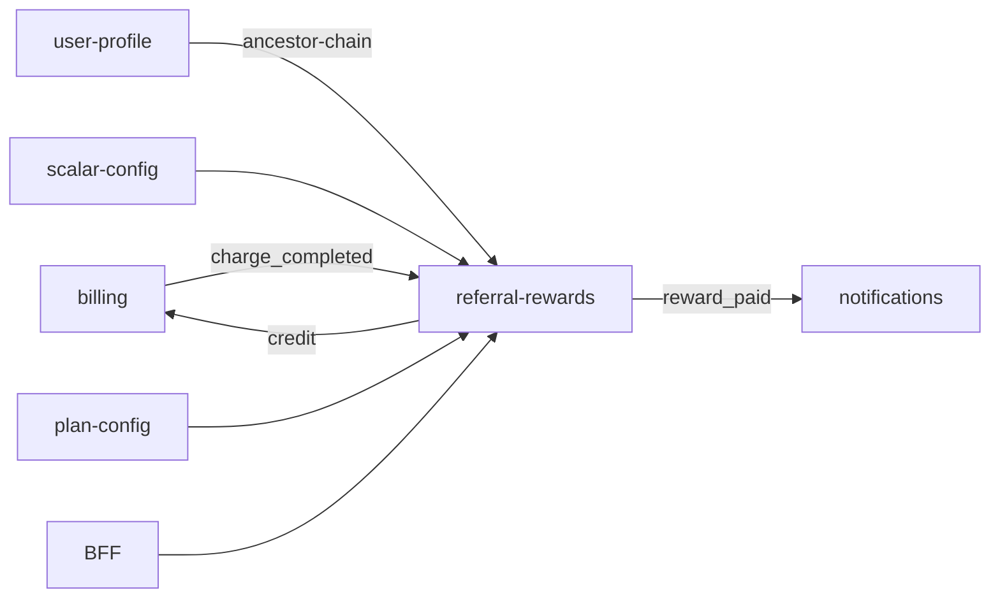

# 🎁 Сервис: referral-rewards

> **Статус:** spec ready · **Версия:** 0.2 · **Schema:** `referral_rewards`  
> **ADR:** [013-referral-rewards-service](../../03-architecture/adr/013-referral-rewards-service.md)  
> **Анализ схем:** [requirements/analysis.md](./requirements/analysis.md)

## 🎯 Назначение

**Денежные реферальные вознаграждения** Tavrida Lot — расчёт, hold, выплата и отмена бонусов за активность приглашённой сети.

- Слушает события **billing** (списания / возвраты) и **user-profile** (новый member по инвайту)
- Читает цепочку `inviterId` → предки (не хранит граф как SoT)
- Применяет **настраиваемые правила** из `scalar-config` + лимиты из `plan-config`
- Выплачивает на баланс клуба через **billing credit** (internal)

> **Не путать** с репутационным referral в `rating` (`rating.referral.*`, `referralKarma`). Там — карма и рейтинг; здесь — ₽.

## 📖 Термины

| Термин | Описание |
|--------|----------|
| **Invitee** | Пользователь, совершивший действие-триггер (платёж, регистрация) |
| **Beneficiary** | Inviter (или предок на глубине d), получающий вознаграждение |
| **Rule** | Запись в `referralRewards.rules` — когда и сколько начислять |
| **Accrual** | Запись о начислении (held → paid / reversed) |
| **Hold period** | Задержка перед выплатой (защита от refund) |
| **NET amount** | `amount` из billing event минус уже reversed части |
| **Ancestor chain** | `[inviter, inviter.inviter, …]` до `maxDepth` |

## 🗄️ Сущности

### `RewardAccrual` (`referral_rewards.reward_accrual`)

| Поле | Тип | Описание |
|------|-----|----------|
| `id` | UUID PK | — |
| `ruleId` | varchar | Id правила из scalar-config snapshot |
| `rulesSnapshotVersion` | varchar | Хеш/версия rules на момент расчёта |
| `sourceEventId` | UUID | `eventId` из RMQ envelope |
| `sourceEventType` | varchar | `billing.charge_completed`, … |
| `sourceTransactionId` | UUID nullable | FK логический на `billing.transaction` |
| `inviteeId` | UUID | Кто заплатил / зарегистрировался |
| `beneficiaryId` | UUID | Кто получает |
| `depth` | int | 1 = прямой inviter |
| `grossAmount` | decimal(12,2) | До caps |
| `netAmount` | decimal(12,2) | После caps / multiplier |
| `currency` | varchar(3) | `RUB` |
| `status` | enum | `PENDING` \| `HELD` \| `PAID` \| `REVERSED` \| `SKIPPED` |
| `skipReason` | varchar nullable | `CAP_EXCEEDED`, `FP_DISABLED`, … |
| `holdUntil` | timestamptz nullable | Когда можно платить |
| `paidAt` | timestamptz nullable | — |
| `billingCreditTransactionId` | UUID nullable | Связь с billing CREDIT |
| `createdAt` | timestamptz | — |

**Unique:** `(sourceEventId, ruleId, beneficiaryId, depth)` — идемпотентность.

### `RewardPayoutBatch` (`referral_rewards.payout_batch`) _(optional v1)_

Агрегат cron-выплат за период; в v1 можно платить по одному accrual.

### `BeneficiaryMonthlyStats` (`referral_rewards.beneficiary_monthly_stats`)

Денормализация для cap `maxEarnedPerMonth` без full scan.

| Поле | Тип |
|------|-----|
| `beneficiaryId`, `yearMonth` | PK composite |
| `accruedTotal`, `paidTotal` | decimal |

## ⚙️ Модель правил (`referralRewards.rules`)

### Глобальные параметры (settings, приоритет над rule)

| Ключ | Назначение |
|------|------------|
| `referralRewards.maxDepth` | Потолок глубины для всех денежных правил |
| `referralRewards.depthCoefficients` | `[1.0, 0.25, …]` — вес уровня d |
| `referralRewards.enabledChargeCategories` | Какие [категории платежей](./requirements/charge-categories.md) участвуют |
| `referralRewards.inviteeBonus.*` | [Двусторонний бонус](#двусторонний-бонус-invitee) invitee |

Эффективная глубина правила: `min(rule.maxDepth ?? global, referralRewards.maxDepth)`.

### Правила inviter

Settings: **массив объектов**. Пример:

```json
{
  "id": "subscription-share",
  "enabled": true,
  "trigger": "billing.charge_completed",
  "chargeCategory": "SUBSCRIPTION",
  "beneficiaryMode": "ANCESTOR_CHAIN",
  "calculation": {
    "type": "PERCENT",
    "percent": 10,
    "base": "TRIGGER_NET_AMOUNT",
    "rounding": "FLOOR_TO_RUBLE"
  },
  "minTriggerAmount": 1,
  "capPerEvent": 500,
  "holdDays": 14,
  "qualifiers": {
    "minBeneficiaryEffectiveRating": 2.0,
    "requireInviteeFirstChargeOnly": false
  }
}
```

> `chargeCategory` должна быть в `enabledChargeCategories`. Паттерны target — в [charge-categories.md](./requirements/charge-categories.md).

### Двусторонний бонус (invitee)

Отдельно от `rules` — настройки `referralRewards.inviteeBonus`:

| Поле | Описание |
|------|----------|
| `enabled` | Вкл/выкл бонус приглашённому |
| `amount` | Фикс (₽) на баланс invitee |
| `trigger` | `ON_REGISTRATION` — при `invitation.redeemed`; `ON_FIRST_QUALIFYING_CHARGE` — первый charge из включённых категорий |

Выплата: `billing.credit`, `target: referral.invitee-bonus:{inviteeId}`, один раз на user.

### Юридический scope

**GMV сделок** (цена лота, заказ marketplace) — **не участвует**. Только платежи платформе. Подробно: [legal-scope.md](./requirements/legal-scope.md).

### `trigger` (enum, расширяемый)

| Значение | Источник |
|----------|----------|
| `billing.charge_completed` | Списание с кошелька |
| `billing.refund_completed` | Clawback (отмена связанных HELD/PAID) |
| `invitation.redeemed` | Фикс за приглашение (CPA) |

> `billing.deposit_completed` **не поддерживается** в v1 (анти-паттерн — см. analysis).

### `calculation.type`

| Тип | Формула |
|-----|---------|
| `FIXED` | `fixedAmount × depthCoefficients[d-1]` |
| `PERCENT` | `triggerAmount × percent / 100 × depthCoefficients[d-1]` |
| `TIERED_PERCENT` | `percent` из tier по сумме trigger |

### Алгоритм `processEvent(event)`

1. Если `!referralRewards.globalEnabled` → no-op.  
2. **Invitee bonus** (если `inviteeBonus.enabled` и trigger совпал) → отдельный credit, idempotent per invitee.  
3. Загрузить rules; отфильтровать `enabled` + matching `trigger`.  
4. Для charge: `chargeCategory` rule ∈ `enabledChargeCategories` **и** `payload.target` матчит каталог.  
5. `inviteeId` = `payload.userId` (charge) или `payload.inviteeId` (invitation).  
6. `GET ancestor-chain?maxDepth=referralRewards.maxDepth` → user-profile.  
7. Для каждого rule × beneficiary на глубине d:  
   - коэффициент = `referralRewards.depthCoefficients[d-1]`  
   - plan-config: `programEnabled`, `payoutMultiplier`, `maxEarnedPerMonth`  
   - rating: `effectiveRating` ≥ qualifier  
   - gross → multiplier → caps → accrual `HELD`  
8. `billing.refund_completed` → reverse по `sourceTransactionId`.

**Deny:** события сделок (`auction.completed`, `marketplace.order_completed`) — не consume. GMV targets — reject в валидаторе.

### Cron `releaseHeldAccruals`

Каждые N минут: `status = HELD AND holdUntil <= now` → `POST billing /wallets/credit` → `PAID`.

## 🔌 API

### Public (BFF `/api/v1/referral-rewards/*`)

| Method | Path | Описание |
|--------|------|----------|
| GET | `/referral-rewards/summary` | Доход: pending, paid month, invited count (direct) |
| GET | `/referral-rewards/accruals` | История начислений (cursor) |

```json
{
  "directInvitees": 12,
  "pendingAmount": 340,
  "paidThisMonth": 1200,
  "currency": "RUB",
  "programEnabled": true
}
```

### Internal (`/internal/v1/`)

| Method | Path | Caller | Описание |
|--------|------|--------|----------|
| POST | `/referral-rewards/reconcile` | admin, CRON | Переобработка события (support) |
| POST | `/referral-rewards/simulate` | admin | Dry-run правила на гипотетическом event |
| GET | `/health` | orchestrator | — |

### user-profile (dependency, не наш API)

| Method | Path | Описание |
|--------|------|----------|
| GET | `/internal/v1/users/{userId}/ancestor-chain` | `[{ userId, depth }, …]` |

> Если endpoint ещё нет — добавить в user-profile spec (обход по `inviterId`).

## ⚙️ Переменные scalar-config

| Ключ | Тип | Default | Описание |
|------|-----|---------|----------|
| `referralRewards.globalEnabled` | boolean | `false` | Kill switch |
| `referralRewards.maxDepth` | number | `1` | Глубина денежного дерева |
| `referralRewards.depthCoefficients` | number[] | `[1.0]` | Веса уровней 1…N |
| `referralRewards.enabledChargeCategories` | enum[] | `["SUBSCRIPTION"]` | [Категории](./requirements/charge-categories.md): `SUBSCRIPTION`, `AUCTION_SERVICES`, `MARKETPLACE_SERVICES`, `FORUM_REACTIONS` |
| `referralRewards.inviteeBonus.enabled` | boolean | `false` | Бонус invitee |
| `referralRewards.inviteeBonus.amount` | number | `0` | ₽ |
| `referralRewards.inviteeBonus.trigger` | enum | `ON_REGISTRATION` | Когда начислять invitee |
| `referralRewards.rules` | object[] | `[]` | Правила inviter |
| `referralRewards.defaultHoldDays` | number | `14` | Hold fallback |
| `referralRewards.payoutCronMinutes` | number | `15` | Cron |
| `referralRewards.minPayoutAmount` | number | `1` | Мин. выплата |
| `referralRewards.globalBudgetPerMonth` | number | null | Бюджет программы |
| `referralRewards.excludedTargets` | string[] | `["referral.reward:"]` | Deny prefix |

> Полный реестр: [PLATFORM-REGISTRY.md](../PLATFORM-REGISTRY.md)

### Пример конфигурации (default draft)

```json
{
  "referralRewards.globalEnabled": false,
  "referralRewards.maxDepth": 1,
  "referralRewards.depthCoefficients": [1.0],
  "referralRewards.enabledChargeCategories": ["SUBSCRIPTION"],
  "referralRewards.inviteeBonus.enabled": false,
  "referralRewards.inviteeBonus.amount": 0,
  "referralRewards.inviteeBonus.trigger": "ON_REGISTRATION",
  "referralRewards.rules": [
    {
      "id": "subscription-share",
      "enabled": true,
      "trigger": "billing.charge_completed",
      "chargeCategory": "SUBSCRIPTION",
      "beneficiaryMode": "ANCESTOR_CHAIN",
      "calculation": { "type": "PERCENT", "percent": 10 },
      "holdDays": 14
    }
  ]
}
```

## 💳 Переменные plan-config

| Ключ | Тип | Free | Basic | Pro | Описание |
|------|-----|------|-------|-----|----------|
| `referralRewards.programEnabled` | feature | false | true | true | Участие тарифа в денежной программе |
| `referralRewards.payoutMultiplier` | limit | 0.5 | 1.0 | 1.5 | Множитель к расчётной сумме |
| `referralRewards.maxEarnedPerMonth` | limit | 500 | 3000 | 10000 | Cap начислений (gross) / месяц на user |

> `payoutMultiplier = 0` при `programEnabled = false` — эквивалентно отключению.

## 📨 События

| Direction | Event | Когда |
|-----------|-------|-------|
| consume | `billing.charge_completed` | Расчёт accrual |
| consume | `billing.refund_completed` | Reverse / clawback |
| consume | `invitation.redeemed` | CPA-правила |
| consume | `billing.credit_completed` | Подтверждение выплаты (опционально sync) |
| produce | `referral.reward_accrued` | Создан accrual HELD |
| produce | `referral.reward_paid` | Выплата на баланс |
| produce | `referral.reward_reversed` | Отмена |

### `referral.reward_paid` payload

```json
{
  "accrualId": "uuid",
  "beneficiaryId": "uuid",
  "inviteeId": "uuid",
  "amount": 99,
  "currency": "RUB",
  "ruleId": "subscription-l1",
  "depth": 1,
  "billingTransactionId": "uuid"
}
```

> Каталог: [event-catalog](../../03-architecture/event-catalog.md)

## 🔗 Взаимодействие

| Сервис | Взаимодействие | Протокол |
|--------|---------------|----------|
| billing | consume charge/refund; POST credit | RMQ + HTTP |
| user-profile | ancestor chain | HTTP internal |
| scalar-config | rules, global flags | HTTP internal |
| plan-config | limits, multiplier | HTTP internal |
| rating | effectiveRating (qualifier) | HTTP internal или cache event |
| notifications | consume reward_paid | RMQ |
| BFF | public summary | HTTP |



## 🔒 Безопасность

- Публичный API — только **свои** accruals (JWT `sub`)
- `simulate` / `reconcile` — admin / service JWT
- Начисление только по **immutable** billing transactions (`COMPLETED`)
- Исключить target `referral.reward:*` из триггеров (нет рекурсии)
- Audit: accrual immutable после `PAID` (reversal = новая запись)

## 🌍 Окружение

| Переменная | Обяз. | Описание | Пример |
|------------|-------|----------|--------|
| `DATABASE_URL` | да | schema `referral_rewards` | postgres://…/tavrida_lot |
| `RABBITMQ_URL` | да | Consumer + producer | amqp://… |
| `USER_PROFILE_URL` | да | Internal base URL | http://user-profile:3020 |
| `BILLING_URL` | да | Credit API | http://billing:3001 |
| `SCALAR_CONFIG_URL` | да | Rules | http://settings:… |
| `PLAN_CONFIG_URL` | да | Tariff limits | http://plan-config:3002 |
| `PORT` | нет | HTTP | `3012` |

## 📋 Зависимости (до реализации)

| Задача | Сервис |
|--------|--------|
| `POST /internal/v1/wallets/credit` + `billing.credit_completed` | billing |
| `GET /internal/v1/users/{id}/ancestor-chain` | user-profile |
| Ключи в PLATFORM-REGISTRY | settings, plan-config registration |

## 📎 Связанные разделы

- [analysis](./requirements/analysis.md)
- [charge-categories](./requirements/charge-categories.md)
- [legal-scope](./requirements/legal-scope.md)
- [billing](../billing/README.md)
- [user-profile](../user-profile/README.md)
- [rating](../rating/README.md) — репутационный referral
- [karma-and-rating](../../01-goal/karma-and-rating.md)
- [club-access](../../01-goal/club-access.md)
- [MICROSERVICE-SPEC](../MICROSERVICE-SPEC.md)

---

**Автор:** команда разработки · **Версия:** 0.1-spec
