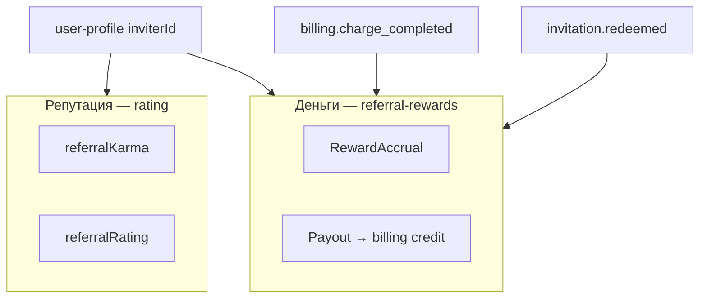
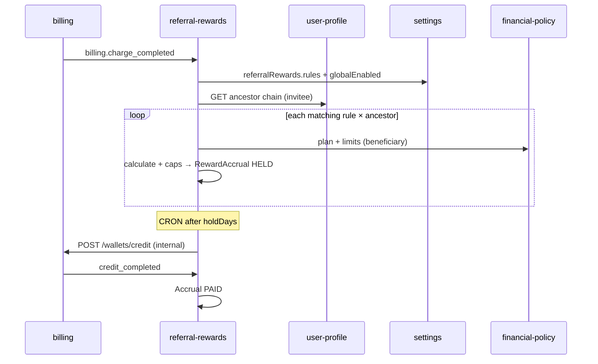

# 🔍 Анализ реферальных схем и решений

> **Статус:** draft · **Версия:** 0.1  
> **Итог:** [ADR-013](../../../03-architecture/adr/013-referral-rewards-service.md) · [спека сервиса](../README.md)

Документ для продуктовой и архитектурной дискуссии перед внедрением **денежного** реферального модуля.  
Репутационный referral (карма/рейтинг от дерева инвайтов) уже описан в [karma-and-rating.md](../../../01-goal/karma-and-rating.md) и живёт в `rating` — **не дублируем**.

---

## 1. Контекст Tavrida Lot

| Факт | Следствие для реферальной программы |
|------|-------------------------------------|
| Закрытый клуб, вход только по инвайту | Каждый member уже имеет `inviterId` — граф связей **есть** |
| Дерево сохраняется навсегда | Можно строить multi-level, но нужны **жёсткие лимиты глубины** |
| Платформа зарабатывает на подписках и разовых charge | Триггер — `billing.charge_completed`, не P2P между участниками |
| Billing не escrow сделок аукциона | Комиссия с **сделки между buyer/seller** — отдельная фаза (marketplace fee) |
| Два реестра конфигурации | Формулы и правила → **settings**; лимиты/фичи по тарифу → **financial-policy** |

---

## 2. Обзор типовых схем (рынок)

### 2.1. Классификация по вознаграждению

| Схема | Суть | Примеры | Плюсы | Минусы |
|-------|------|---------|-------|--------|
| **CPA** (Cost Per Acquisition) | Фикс за факт привлечения / первое целевое действие | Airbnb host referral, многие fintech «приведи друга — 500 ₽» | Просто объяснить | Легко накрутить фейковыми регистрациями |
| **CPS / Rev-share** | % или фикс от **платежа** приглашённого | Партнёрки SaaS, биржи (rebate от комиссии) | Привязка к выручке | Нужен hold + clawback при refund |
| **Recurring** | % с каждого продления подписки | Notion affiliate, VPN-партнёрки | LTV-ориентированность | Дорого при высоком %; нужен cap |
| **Двусторонний бонус** | Получают и inviter, и invitee | Dropbox storage, Uber credits | Высокая конверсия | Удваивает cost of acquisition |
| **Немонетарный** | Инвайты, статус, карма | Clubhouse, наш `rating.referral.*` | Нет риска отмывания | Не мотивирует «охотников за бонусом» |
| **MLM / multi-level** | Цепочка предков с затуханием | Криптобиржи, сетевой маркетинг | Вирусный рост | Регуляторика, репутационные риски, сложный учёт |

### 2.2. Классификация по триггеру

| Триггер | Когда начислять | Риск |
|---------|-----------------|------|
| Регистрация / `invitation.redeemed` | Сразу после входа в клуб | Спам-инвайты без монетизации |
| Первая оплата (first charge) | Первый `billing.charge_completed` | Баланс fraud / self-referral |
| Любой charge | Каждое списание с кошелька | Предсказуемый cost; нужны фильтры по `target` |
| Подписка / продление | `subscription.activated` + renew charges | Ядро для SaaS-клуба |
| Депозит на баланс | `billing.deposit_completed` | **Обычно плохой триггер** — пользователь кладёт свои деньги |
| Завершение сделки (GMV) | `auction.completed` / marketplace | Нужна **платформенная комиссия** как база расчёта |

### 2.3. Референсы (сжато)

| Продукт | Модель | Урок для нас |
|---------|--------|--------------|
| **Dropbox** | Двусторонний немонетарный бонус (место) | Простота > сложные %; прозрачный лимит |
| **Stripe / SaaS affiliates** | % от MRR, hold 30–60 дней, clawback | Обязательны hold + отмена при chargeback |
| **Binance / биржи** | Multi-level rebate от trading fee | Глубина 2–3, decay, жёсткий cap/месяц |
| **Superhuman / закрытые клубы** | Инвайт = статус, без денег | У нас уже есть; деньги — **дополнительный** слой |
| **Patreon / Gumroad affiliates** | CPS с cookie/window | Window не нужен — граф жёсткий по `inviterId` |

---

## 3. Риски и митигации

| Риск | Описание | Митигация |
|------|----------|-----------|
| **Self-referral** | A создаёт B, платит с B | Один `inviterId` навсегда; KYC позже; min rating; hold |
| **Кольца** | A→B→C→A | Дерево ациклично (один inviter); audit на bootstrap |
| **Накрутка инвайтов** | Массовые пустые аккаунты | CPA только после qualifying event; лимит `club.invitesPerMonth` |
| **Двойное начисление** | Retry RMQ | Idempotency `(sourceEventId, ruleId, beneficiaryId, depth)` |
| **Отмывание** | Вывод бонусов без активности | Начисление **на баланс клуба**, не прямой вывод; min activity |
| **Refund / chargeback** | Возврат после выплаты | Hold period; `billing.refund_completed` → reverse |
| **Регуляторика MLM** | Многоуровневые % | Cap depth ≤ 3; decay; прозрачность в UI; legal review TBD |
| **Размытие bounded context** | Всё в rating/billing | Отдельный сервис `referral-rewards` |

---

## 4. Рекомендуемая модель для v1

> **Каталог preset-моделей и параметры по модели:** [referral-models-catalog.md](./referral-models-catalog.md)  
> Ниже — rule engine и консервативный default (`revshare_single`).

### 4.1. Разделение каналов

| Канал | Сервис | Настройки | Эффект |
|-------|--------|-----------|--------|
| Репутация | `rating` | `rating.referral.*` | effectiveKarma / effectiveRating |
| Деньги | `referral-rewards` | `referralRewards.*` | Зачисление на `UserWallet` |

### 4.2. Движок правил (Rule Engine)

Правила — **JSON-массив** в settings `referralRewards.rules` (версионируется snapshot при accrual).  
Каждое правило описывает:

- **trigger** — тип события (`billing.charge_completed`, `invitation.redeemed`, …)
- **targetFilter** — какие `target` billing проходят (glob/regex)
- **beneficiaryMode** — `DIRECT_INVITER` \| `ANCESTOR_CHAIN`
- **maxDepth** — глубина (1…N), коэффициенты по уровням
- **calculation** — `FIXED` \| `PERCENT` \| `TIERED_PERCENT`
- **caps** — на событие, на бенефициара/месяц, глобальный бюджет
- **holdDays** — задержка перед выплатой
- **qualifiers** — min amount, min effectiveRating inviter, feature flag FP

**financial-policy** задаёт **потолки и множители по тарифу** пригласившего:

- `referralRewards.programEnabled` — участвует ли тариф в программе
- `referralRewards.payoutMultiplier` — множитель к расчётной сумме
- `referralRewards.maxEarnedPerMonth` — cap начислений/месяц

### 4.3. Дефолтные правила (консервативный старт)

Модуль **выключен глобально** (`referralRewards.globalEnabled = false`).

| Параметр | Default | Где |
|----------|---------|-----|
| Глубина | `maxDepth = 1`, `depthCoefficients = [1.0]` | settings |
| Категории | `enabledChargeCategories = ["SUBSCRIPTION"]` | settings |
| Invitee bonus | `inviteeBonus.enabled = false` | settings |
| GMV сделок | **запрещено** | [legal-scope.md](./legal-scope.md) |

При включении — один rule `subscription-share`: 10% от подписки, depth из global settings.

### 4.4. Принятые продуктовые решения (2026-07-10)

| # | Вопрос | Решение |
|---|--------|---------|
| 1 | Глубина дерева | **settings:** `maxDepth`, `depthCoefficients` |
| 2 | Бонус invitee | **settings:** `inviteeBonus.*` |
| 3 | От каких платежей % | **settings:** `enabledChargeCategories` — `SUBSCRIPTION`, `AUCTION_SERVICES`, **`MARKETPLACE_SERVICES`**, `FORUM_REACTIONS` |
| 4 | GMV сделок | **Не участвуем** — юридические ограничения, жёсткий deny-list |

### 4.5. Поток начисления

Выплата — **внутренний credit** на баланс клуба (`target: referral.reward:{accrualId}`), не внешний deposit.

### 4.6. Почему не встроить в rating или billing

| Вариант | Почему нет |
|---------|------------|
| В `rating` | Смешение репутации и денег; разные формулы и lifecycle |
| В `billing` | Billing = ledger; правила и граф — другой домен |
| В `financial-policy` | FP проверяет лимиты, не ведёт accrual ledger |
| В `user-profile` | Профиль хранит ребро графа, не расчёты |

---

## 5. Гибкость конфигурации (чеклист)

Админ без деплоя может менять:

- [x] Глубину дерева и коэффициенты уровней (`maxDepth`, `depthCoefficients`)
- [x] Двусторонний бонус invitee (`inviteeBonus.*`)
- [x] Набор категорий платежей (`enabledChargeCategories`)
- [ ] Вкл/выкл программу глобально и по тарифу (FP)
- [ ] % / фикс в `rules`
- [ ] Hold period и caps

Требует деплоя:

- Новая категория в каталоге (не GMV)
- Новые типы calculation

---

## 6. Остаётся открытым

1. **Вывод** реферальных средств на карту — out of scope v1 (только баланс клуба).
2. **Legal review** перед `maxDepth > 1` с деньгами в production.

---

## 🔗 Связанные документы

- [referral-models-catalog.md](./referral-models-catalog.md)
- [referral-rewards README](../README.md)
- [charge-categories.md](./charge-categories.md)
- [legal-scope.md](./legal-scope.md)
- [ADR-013](../../../03-architecture/adr/013-referral-rewards-service.md)
- [karma-and-rating.md](../../../01-goal/karma-and-rating.md)
- [billing](../../billing/README.md)
- [PLATFORM-REGISTRY](../../PLATFORM-REGISTRY.md)

---

**Автор:** команда разработки · **Версия:** 0.1-draft
