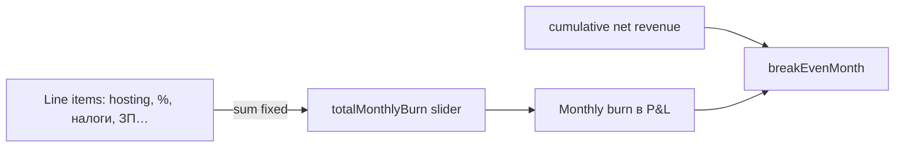

# ⚙️ Vanga — конфиг и UX параметров

> **Статус:** draft · **Версия:** 0.1  
> **Файл defaults:** [`config/vanga.defaults.yaml`](../../../config/vanga.defaults.yaml)  
> **Сервис:** [README.md](./README.md)

## 🎯 Решения (2026-07-11)

| # | Решение |
|---|---------|
| 1 | Аудитория: **только founder/admin**. Экспорт PDF/CSV → backlog |
| 2 | Defaults: **YAML в репо**; на совещании правим руками; позже — централизованно в `scalar-config` domain `vanga.*` или admin Vanga |
| 3 | **Максимум вариативности**: рост, активность, продажи, attach rates; **сценарии** (base / optimistic / pessimistic) + модели роста |
| 4 | **Затраты**: line items → сумма → общий ползунок; ручной общий ползунок → только **месяц окупаемости** |
| 5 | **Реферал**: по умолчанию **выкл**; отдельная вкладка; дерево + распределение по глубине ветки |

---

## 📁 Конфиг-файл

Путь: **`config/vanga.defaults.yaml`**

| Поле в YAML | Назначение |
|-------------|------------|
| `min` / `max` / `default` / `step` | Границы ползунков в UI |
| `enabled` | Чекбокс потока дохода |
| `scenarioMultipliers` | Коэффициенты для preset-сценариев |
| `byPlan` | Разные значения для Free / Basic / Pro |

**Жизненный цикл:**

1. **Сейчас** — git-tracked YAML, правки на совещании → commit.
2. **Фаза 2** — BFF `GET /admin/vanga/defaults` читает YAML (+ overlay из plan-config/scalar-config где есть факт).
3. **Фаза 4** — domain `vanga.*` в `scalar-config` или presets в `services/vanga` (admin UI «Сохранить как default»).

> Не путать с production: `club.*`, `referralRewards.*` в scalar-config — это **боевые** ключи. Vanga YAML — **только симуляция**, пока не промотируем значения осознанно.

---

## 📈 Сценарии — зачем

**Сценарий** — именованный набор assumptions (не одна цифра «регистраций»).

| Тип | Пример | Польза |
|-----|--------|--------|
| **Preset** | base / optimistic / pessimistic | Три кривые на одном графике — вилка дохода |
| **Growth model** | linear / exponential / logistic S-curve | Регистрации не обязаны быть плоскими 40/мес |
| **Saved** (backlog) | «Запуск рекламы Q3» | Вернуться к договорённостям совещания |

Без сценариев симулятор отвечает только на «что если ровно N регистраций». Со сценариями — **диапазон исходов** и чувствительность к churn / mix Pro.

---

## 🖥️ Структура UI `/admin/vanga`

Вкладки:

| Вкладка | Содержание |
|---------|------------|
| **Обзор** | Период, preset-сценарий(и), итог gross/net, **месяц окупаемости**, график |
| **Приток** | Модель роста, регистрации, mix планов, churn, auto-renew |
| **Активность** | Аукционы, promotion attach, форум, маркет, **число продаж** (GMV инфо) |
| **Цены** | Подписки, one-time targets (чекбоксы + ₽) |
| **Реферал** | Флаг программы, глубина, категории charges, **дерево** (см. ниже) |
| **Затраты** | Line items + общий ползунок |

### Затраты и окупаемость



| Действие пользователя | Что меняется |
|----------------------|--------------|
| Двигает **line item** | Пересчёт **суммы** → общий ползунок → net по месяцам → **breakEvenMonth** |
| Двигает **общий ползунок** вручную | Line items **не** меняются; пересчёт только **breakEvenMonth** (burn для порога окупаемости = ручное значение) |
| Variable % (эквайринг, налог) | Считаются от gross/deposits/net по формуле в engine |

**breakEvenMonth** = первый месяц `t`, где `Σ_{m=1..t} net[m] ≥ 0` при выбранном burn (или накопленный net покрывает `t × burn` — уточнить при реализации; default: cumulative net ≥ 0).

### Реферал (отдельная вкладка)

- **programEnabled** — default `false` (как `referralRewards.globalEnabled`).
- При включении — outflow в net; сравнение «до/после» на графике.
- **Дерево:**
  - `avgInviteesPerInviterPerMonth` — fan-out;
  - `branchStudyDepth` — глубина изучаемой ветки;
  - `payoutDistributionByDepth` — доля выплат по уровням d=1…N вдоль ветки;
  - визуализация: bar chart «₽ по глубине» для выбранной ветки (не PII, только агрегаты).

Связь с prod: коэффициенты из `referralRewards.depthCoefficients`, категории — [charge-categories](../referral-rewards/requirements/charge-categories.md).

---

## 🔌 API (дополнение)

| Method | Path | Описание |
|--------|------|----------|
| GET | `/admin/vanga/defaults` | Парсит `config/vanga.defaults.yaml` + live overlay plan-config/scalar-config |
| POST | `/admin/vanga/simulate` | `{ assumptions, costs, referral, scenarios[], period }` |
| POST | `/admin/vanga/compare` | До 3 сценариев → overlay time series |

Response fields:

```json
{
  "months": [{ "mrr": 0, "oneTime": 0, "gross": 0, "referralOut": 0, "costs": 0, "net": 0 }],
  "totals": { "gross": 0, "net": 0 },
  "breakEvenMonth": 8,
  "referralByDepth": [{ "depth": 1, "payout": 1200 }]
}
```

---

## 📤 Backlog

- [ ] Экспорт CSV / PDF отчёта
- [ ] Сохранённые сценарии в БД (`SavedScenario`)
- [ ] Monte Carlo: N прогонов в пределах `min`/`max` из YAML
- [ ] Промоция YAML → `vanga.*` settings после совещания
- [ ] «План vs факт» из billing aggregates

---

## 🔗 Связанные

- [monetization-catalog.md](../../01-goal/monetization-catalog.md)
- [PLATFORM-REGISTRY.md](../PLATFORM-REGISTRY.md)
- [ADR-014](../../03-architecture/adr/014-vanga-revenue-forecast.md)
