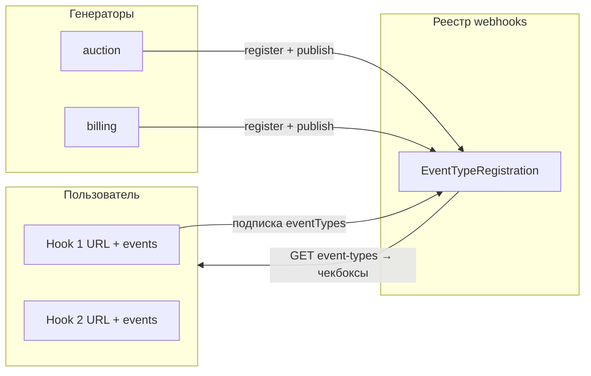
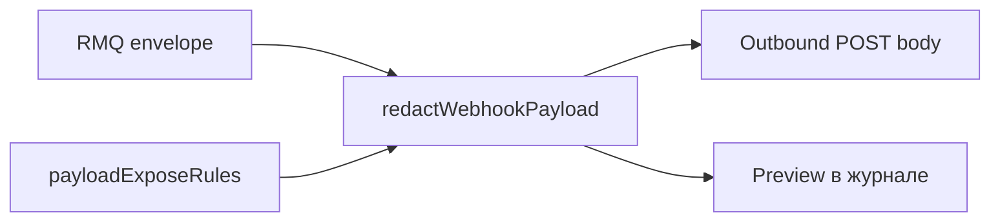
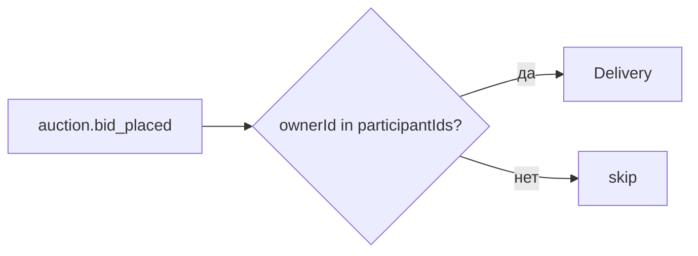

# 🔗 Сервис: webhooks

> **Статус:** spec ready · **Версия:** 0.4 · **Schema:** `webhooks` · **Port (draft):** 3011  
> **ADR:** [011-centralized-outbound-webhooks](../../03-architecture/adr/011-centralized-outbound-webhooks.md)

## 🎯 Назначение

**Исходящие HTTP webhooks** — **machine-to-machine** интеграции. Не заменяет [subscriptions](../subscriptions/README.md) и [notifications](../notifications/README.md) (machine-to-human: email, push, in-app).

- **Генераторы событий** (доменные сервисы: `auction`, `billing`, …) **регистрируют** типы в реестре `webhooks` и **публикуют** факты в RabbitMQ
- `webhooks` **слушает** очередь `webhooks.events` ([messaging](../../03-architecture/messaging.md))
- При совпадении типа с подпиской hook — HTTP POST на URL владельца (timeout, retry, журнал)
- Payload проходит **redaction** — наружу и в UI только безопасное подмножество

> **Не этот сервис:** входящие webhooks платёжки (billing), Logto → BFF, Novu delivery status (notifications).

## 👤 Модель для пользователя

У каждого участника может быть **несколько hooks** (лимит по тарифу — см. [financial-policy](#-переменные-financial-policy)). Один hook = одна интеграция «куда слать».

| Поле hook (MVP UI) | Обязательно | Описание |
|--------------------|-------------|----------|
| **Название** | да | Метка в списке («CRM», «Notion bot») |
| **URL** | да | HTTPS endpoint, куда уходят POST |
| **События** | да (≥1) | Чекбоксы из **реестра платформы** — только типы, уже зарегистрированные генераторами и доступные для `USER` scope |
| **Включён** | да | `enabled` — пауза без удаления |
| **Секрет** | авто | Выдаётся при создании / rotate; для проверки подписи на стороне интегратора |

Опционально (не блокирует создание): per-event HTTP timeout, пользовательский default timeout — см. [таймауты](#️-таймауты-http).



Wireframe: [W17 — Интеграции / Webhooks](../../11-ux-ui/wireframes/webhooks.md).

## 📡 Реестр событий (генераторы)

**Генератор** — доменный сервис, который **производит** события (producer в [event-catalog](../../03-architecture/event-catalog.md)).

| Шаг | Кто | Действие |
|-----|-----|----------|
| 1 | Генератор @ startup | `POST /internal/v1/webhooks/event-types/register` — тип, scope, redaction rules, `userFilterStrategy` |
| 2 | Генератор @ runtime | Публикует envelope в `tavrida-lot.events` после commit в своей БД |
| 3 | `webhooks` | Whitelist binding очереди `webhooks.events` только на **зарегистрированные** типы |
| 4 | UI / BFF | `GET /webhooks/event-types` — список для чекбоксов (без «придуманных» пользователем типов) |

Пользователь **не** создаёт новые типы событий — только выбирает из каталога, который наполняют генераторы.

## 📖 Термины

| Термин | Описание |
|--------|----------|
| **Hook** (webhook endpoint) | URL + secret + выбранные event types + минимальные настройки |
| **Генератор событий** | Доменный producer: регистрирует тип в `webhooks` и публикует в RMQ |
| **Event type** | `domain.action` из event-catalog, запись в `EventTypeRegistration` |
| **Scope** | `PLATFORM` (admin) \| `USER` (владелец hook) |
| **Webhook endpoint** | Сущность hook в БД: URL + secret + `eventTypes[]` + опциональные таймауты |
| **Payload redaction** | Фильтрация полей перед отправкой и отображением |
| **Delivery** | Одна отправка (событие × endpoint) |
| **Участник аукциона** | Продавец **или** любой пользователь, сделавший ≥1 ставку на этот лот (роль не важна) |
| **USER filter** | Автоматическое ограничение: endpoint получает событие только если `ownerId` — участник |

## 🗄️ Сущности

### `EventTypeRegistration` (`webhooks.event_type_registration`)

| Поле | Тип | Описание |
|------|-----|----------|
| `eventType` | varchar PK | `auction.completed` |
| `sourceDomain` | varchar | `auction` |
| `subscriberScope` | enum | `PLATFORM` \| `USER` \| `BOTH` |
| `description` | text | Для UI / docs |
| `payloadExposeRules` | jsonb | Правила redaction (см. ниже) |
| `userFilterStrategy` | enum | Как ограничить USER scope (см. ниже) |
| `publicPayloadSchema` | jsonb nullable | Схема **после** redaction — для UI и доков |
| `registeredAt` | timestamptz | — |

### `WebhookEndpoint` (`webhooks.webhook_endpoint`)

| Поле | Тип | Описание |
|------|-----|----------|
| `id` | UUID PK | — |
| `scope` | enum | `PLATFORM` \| `USER` |
| `ownerId` | UUID nullable | User для `USER`; null для `PLATFORM` |
| `name` | varchar | Метка в UI |
| `url` | varchar | HTTPS only (SSRF) |
| `secret` | varchar | HMAC; plain только при create/rotate |
| `eventTypes` | varchar[] | Подмножество зарегистрированных типов |
| `eventTimeouts` | jsonb | Пер-таймаут по типу: `{ "auction.completed": 5000 }` |
| `customHeaders` | jsonb | Без `Authorization` |
| `enabled` | boolean | — |
| `createdAt`, `updatedAt` | timestamptz | — |

### `WebhookDelivery` / `WebhookDeliveryAttempt`

Без изменений v0.1 — журнал попыток, hash body (не полный payload в логах).

## 🧹 Payload redaction

Полный RMQ envelope **никогда** не уходит наружу и не показывается в UI целиком.



### `redactWebhookPayload(envelope, rules)`

Центральная функция сервиса. Вызывается **всегда** перед POST и перед записью preview.

**`payloadExposeRules` (при register):**

```json
{
  "includeEnvelope": ["eventId", "eventType", "eventVersion", "timestamp", "producer"],
  "includePayload": ["auctionId", "sellerId", "buyerId", "finalPrice", "currency"],
  "denyPaths": ["*.email", "*.phone", "payload.internalNotes"],
  "mask": { "buyerId": "partial" }
}
```

| Правило | Действие |
|---------|----------|
| `includePayload` | Allow-list полей payload (остальное отбрасывается) |
| `denyPaths` | Glob-запрет чувствительных путей |
| `mask` | `partial` — последние 4 символа UUID; `hash` — только hash |

Доменный сервис регистрирует rules вместе с event type. `publicPayloadSchema` — для OpenAPI/docs и UI «что придёт на URL».

## 🎯 USER scope: фильтрация по участию

Для `scope=USER` endpoint **не получает** все события типа — только те, где владелец hook **затронут** событием. Стратегия задаётся в `EventTypeRegistration.userFilterStrategy` (не в UI).

| `userFilterStrategy` | Когда доставляем USER endpoint |
|----------------------|--------------------------------|
| `NONE` | Только `PLATFORM` (тип не для пользователей) |
| `AUCTION_PARTICIPANT` | `ownerId` ∈ участники аукциона из payload |
| `ACTOR` | `ownerId` совпадает с прямым актором в payload (`bidderId`, `buyerId`, …) |

### Участник аукциона (`AUCTION_PARTICIPANT`)

**Принято:** события аукциона (в т.ч. `auction.bid_placed`) — только если пользователь **участвует в этом лоте**, независимо от роли (продавец, ставивший, победитель).

```
participants(auctionId) = { sellerId } ∪ { все userId, сделавшие ≥1 ставку на auctionId }
```

При `auction.bid_placed` webhook уходит владельцу endpoint, если `ownerId ∈ payload.participantIds`.

Producer (`auction`) **обогащает** payload полями `sellerId` и `participantIds` (снимок на момент события) — без синхронных HTTP из `webhooks`. См. [event-catalog](../../03-architecture/event-catalog.md).



**Пример регистрации типа:**

```json
{
  "eventType": "auction.bid_placed",
  "subscriberScope": "USER",
  "userFilterStrategy": "AUCTION_PARTICIPANT",
  "payloadExposeRules": { "includePayload": ["auctionId", "bidId", "bidderId", "amount", "currency", "placedAt"] }
}
```

`PLATFORM` endpoints (`scope=PLATFORM`) — **без** participant-фильтра (все события типа).

## ⏱️ Таймауты HTTP

Приоритет (от высшего к низшему):

| # | Источник | Пример |
|---|----------|--------|
| 1 | `endpoint.eventTimeouts[eventType]` | 5 с только для `auction.completed` |
| 2 | `settings` scope `user:{ownerId}` → `webhooks.user.defaultTimeoutMs` | 15 с для всех hooks пользователя |
| 3 | `webhooks.delivery.timeoutMs` (global) | 10 с платформа |

## 🔌 API

### Public — User (BFF `/api/v1/webhooks/*`)

| Method | Path | Описание |
|--------|------|----------|
| GET | `/webhooks/event-types` | Реестр для UI: типы с `description` + `publicPayloadSchema` (чекбоксы) |
| GET | `/webhooks` | Список hooks пользователя |
| POST | `/webhooks` | Создать hook: `name`, `url`, `eventTypes[]` (+ опц. `eventTimeouts`) |
| PATCH | `/webhooks/{id}` | URL, `eventTypes[]` (чекбоксы), `eventTimeouts`, `enabled` |
| DELETE | `/webhooks/{id}` | — |
| GET | `/webhooks/{id}/deliveries` | Журнал (**redacted** preview) |
| POST | `/webhooks/{id}/deliveries/{deliveryId}/replay` | Replay (лимит FP) |
| PATCH | `/webhooks/preferences` | `userDefaultTimeoutMs` → settings user scope |

### Public — Admin

`/api/v1/admin/webhooks/*` — platform endpoints.

### Internal

| Method | Path | Caller |
|--------|------|--------|
| POST | `/webhooks/event-types/register` | domain @ startup |
| POST | `/webhooks/retries/run` | CRON |
| GET | `/health`, `/health/ready` | orchestrator |

### Исходящий POST

```http
POST https://example.com/hooks/tavrida
X-Tavrida-Event: auction.completed
X-Tavrida-Delivery-Id: uuid
X-Tavrida-Signature: sha256=...
X-Tavrida-Timestamp: 1730000000
```

Тело — **только redacted** envelope. Подпись: `HMAC-SHA256(secret, timestamp + "." + rawBody)`.

### Подпись запроса (зачем это нужно)

Ваш сервер на `example.com` должен убедиться, что POST пришёл от Tavrida, а не от злоумышленника.

| Механизм | MVP | Суть |
|----------|-----|------|
| **HMAC + shared secret** | ✅ accepted | При создании hook выдаём `secret`. Мы подписываем тело; интегратор пересчитывает подпись тем же secret |
| OAuth2 / mTLS | Phase 2 | Для enterprise-интеграций с ротацией токенов |

Инструкция для интегратора: проверять `X-Tavrida-Timestamp` (±5 мин) и `X-Tavrida-Signature`.

## 📨 События

### Consume

Очередь `webhooks.events`, bindings — whitelist из `EventTypeRegistration`. См. [messaging.md](../../03-architecture/messaging.md).

После match: создать `WebhookDelivery`, **ack RMQ**, HTTP — async worker (не блокировать очередь на медленном URL).

### Produce

| Event | Когда |
|-------|-------|
| `webhooks.delivery_failed` | Статус `DEAD` |
| `webhooks.endpoint_disabled` | Auto-disable (если включено в settings) |

## ⚙️ Переменные settings

| Ключ | Default | Scope | Описание |
|------|---------|-------|----------|
| `webhooks.delivery.maxAttempts` | 5 | global | Попыток на delivery |
| `webhooks.delivery.initialBackoffSeconds` | 30 | global | Первая задержка retry |
| `webhooks.delivery.maxBackoffSeconds` | 3600 | global | Cap backoff |
| `webhooks.delivery.timeoutMs` | 10000 | global | Fallback HTTP timeout |
| `webhooks.user.defaultTimeoutMs` | null | `user:{id}` | Дефолт timeout для всех hooks пользователя |
| `webhooks.payload.maxBytes` | 65536 | global | Max body после redaction |
| `webhooks.signature.header` | `X-Tavrida-Signature` | global | — |
| `webhooks.autoDisable.onDead` | **true** | global | Отключать endpoint после серии DEAD |
| `webhooks.autoDisable.deadStreak` | 10 | global | Подряд DEAD до disable |
| `webhooks.ssrf.allowPrivateIPs` | false | global | Запрет private IP в URL |

## 💳 Переменные financial-policy

| Ключ | Free | Basic | Pro | Описание |
|------|------|-------|-----|----------|
| `webhooks.member.01endpoint.max` | 0 | 2 | 10 | Hooks (endpoints) на аккаунт |
| `webhooks.member.02replay.dailyMax` | 0 | 5 | 50 | Ручных replay / сутки |
| `webhooks.member.03userScope.enabled` | false | true | true | USER hooks доступны |

> Канонические ключи — [PLATFORM-REGISTRY](../PLATFORM-REGISTRY.md#webhooks-1).

## 🔗 Взаимодействие

| Сервис | Роль |
|--------|------|
| генераторы (producers) | register event types + RMQ publish |
| settings | timeouts, retry, autoDisable |
| financial-policy | лимиты endpoints |
| notifications | опционально alert на `delivery_failed` |
| subscriptions | параллельно: подписка → human notify, не webhook |

## 🔒 Безопасность

- SSRF: HTTPS, no private IP
- Secret: hashed at rest
- Redaction обязательна — PII не в outbound по умолчанию
- Журнал: hash + redacted preview, не full payload

### Юридика (accepted draft, до review юристов)

Пункты для L-01 / отдельного L-17 (интеграции):

- Пользователь указывает **свой** URL и несёт ответственность за обработку данных на стороне интеграции.
- Платформа доставляет события после redaction по правилам типа; **не гарантирует** uptime внешнего URL.
- При auto-disable endpoint из-за ошибок — уведомление владельцу (notifications).

См. [legal-documents.md](../../01-goal/legal-documents.md) (L-17).

## ⚙️ Окружение

| Переменная | Обяз. | Описание |
|------------|-------|----------|
| `DATABASE_URL` | да | schema `webhooks` |
| `RABBITMQ_URL` | да | Consumer `webhooks.events` |
| `SETTINGS_URL` | да | — |
| `FINANCIAL_POLICY_URL` | да | — |
| `PORT` | нет | `3011` |

## 📎 Связанные разделы

- [messaging.md](../../03-architecture/messaging.md) — exchange, fan-out, несколько слушателей
- [ADR-011](../../03-architecture/adr/011-centralized-outbound-webhooks.md)
- [event-catalog](../../03-architecture/event-catalog.md)
- [PLATFORM-REGISTRY](../PLATFORM-REGISTRY.md)

---

**Автор:** команда разработки · **Версия:** 0.4-spec
