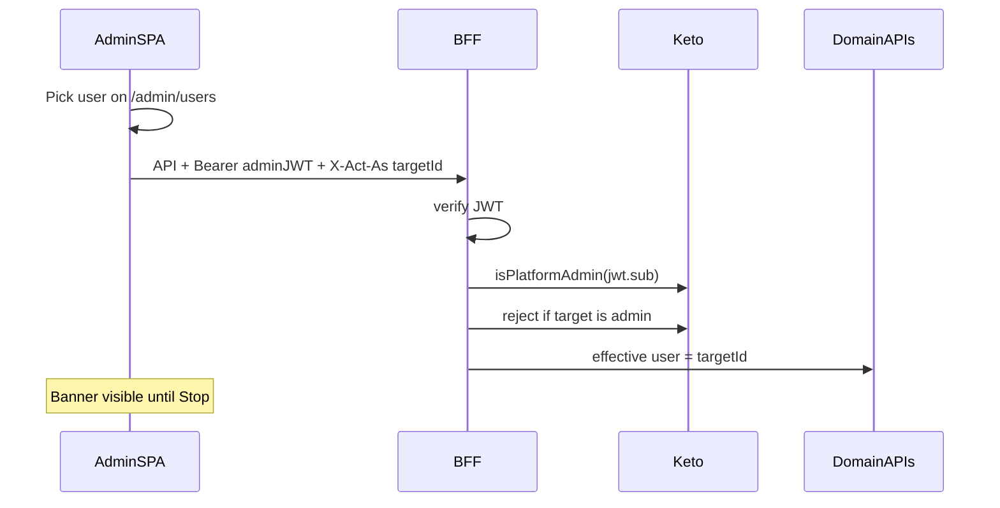

# 🎭 Admin impersonation

> **Статус:** implemented · **Версия:** 0.1 · **ADR:** [018](../03-architecture/adr/018-admin-impersonation.md)

## 🎯 Назначение

Админ временно **действует от имени** выбранного участника: те же права (Keto / plan), те же данные и UI. Для тестирования и поддержки.

## 🔄 Flow

## 🔌 API / headers

| | |
|---|---|
| Header | `X-Act-As: <logtoUserId>` |
| Auth | `Authorization: Bearer` — всегда JWT **админа** |
| Effective id | BFF `AuthUser.sub` = target |
| Actor id | BFF `AuthUser.actorSub` = admin (только при impersonation) |

Права и ownership на всех `/api/v1/*` (кроме проверки права *слать* `X-Act-As`) используют **effective** `sub`.

Исключение: `POST /api/v1/me/identity` синхронизирует claims реального JWT-актора и поэтому
всегда пишет профиль `actorSub`, а frontend отправляет запрос без `X-Act-As`. Это не даёт
перезаписать имя, email или avatar target-пользователя данными администратора.

## 🖥️ UI

- Кнопка **«Подключиться»** в [Admin → Users](/admin/users)
- Неактивна для **себя** и для пользователей с ролью **admin** (подсказка под кнопкой)
- Баннер сверху (только в режиме): `Админ {actor} · как {target}` + **Выйти**
- Стиль: компактная полоса, высокий контраст (напр. warning / amber), `z-index` выше header
- `/profile/me` показывает effective target; Logto-данные администратора в этом режиме не отображаются

## 🔒 Правила

- Только platform admin (Keto `admin` / bootstrap env)
- Нельзя `X-Act-As` на другого admin
- Нельзя выдать себе права target через подделку заголовка без admin JWT
- При logout админа — сброс act-as в SPA

## 🔗 Связанные

- [security README](./README.md)
- [bootstrap-admin](./bootstrap-admin.md)
- [BFF](../05-microservices/bff/README.md)
- [WORK-PLAN-NEXT](../00-meta/WORK-PLAN-NEXT.md)
