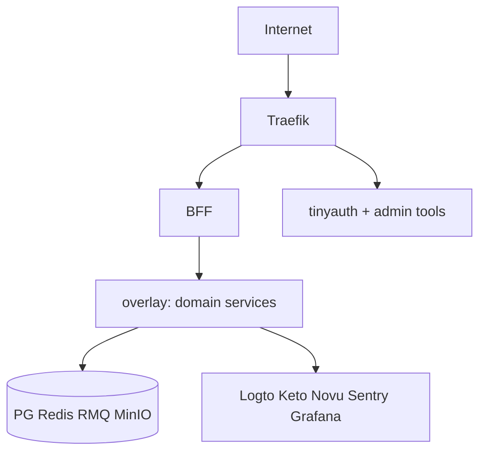

# 🛡️ Security operations

> **Статус:** spec ready · **Версия:** 0.2

## 🎯 Модель угроз (кратко)

| Угроза | Митигация |
|--------|-----------|
| Public access to internal APIs | Swarm overlay, no Traefik route; BFF only |
| JWT theft | HTTPS, short-lived tokens, Logto rotation |
| Privilege escalation | Keto checks; admin-only moderator assign |
| Secret leak in git | Bitwarden, `.env.local` gitignored, pre-commit scan TBD |
| IDOR on resources | Ownership tuples + BFF user context |
| RabbitMQ poison message | DLQ, idempotent consumers |

## 🌐 Network zones

**Правило:** domain services **не** publish ports на host в prod.

## 🔐 Secrets lifecycle

| Действие | Частота |
|----------|---------|
| Rotate `NOVU_API_KEY`, DB passwords | 90d prod |
| Review Bitwarden access | quarterly |
| `.env.example` sync with PLATFORM-SECRETS | each new env var |

Inject: Swarm secrets → file or env at runtime. **Never** bake secrets in Docker image.

## 👮 RBAC ops

- Moderator assignment: **admin only** — [moderator-mapping](./moderator-mapping.md)
- Keto tuple changes: audit log (TBD admin-ui)
- Expert role: admin assigns; no self-service

## 📋 Incident response (light)

1. Contain — disable deploy, block IP if abuse
2. Assess — Sentry + Grafana + Loki
3. Rotate creds if leak suspected
4. Postmortem — blameless, action items in docs/ADR if architectural

## 🔍 Dependency security

- `pnpm audit` in CI (warn on high)
- Pin major versions in monorepo
- SaaS: Logto, Novu, Grafana — vendor trust boundary

## 🔗 Связанные разделы

- [README](./README.md)
- [keto-schema.md](./keto-schema.md)
- [PLATFORM-SECRETS](../02-infrastructure/PLATFORM-SECRETS.md)
- [BFF security](../05-microservices/bff/README.md)

---

**Автор:** команда разработки · **Версия:** 0.2-spec
