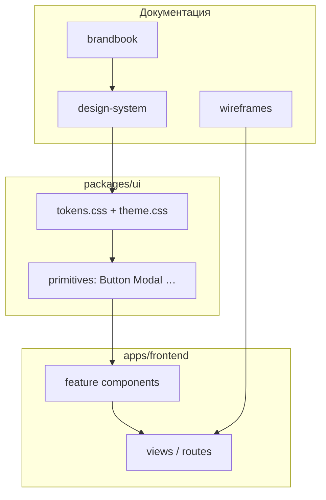

# 🧩 Дизайн-система Tavrida Lot — v0.1

> **Статус:** draft · **Версия:** 0.1 · **Дата:** 2026-07-10  
> **Аудитория:** frontend, дизайн, PM, ревью экранов  
> **Стек:** Vue 3 · Tailwind v4 · `@tavrida/ui` (Reka UI) · [14-frontend](../14-frontend/README.md)

Дизайн-система описывает **как строить интерфейс в коде** — токены, компоненты, паттерны, состояния.  
Она **дополняет** [брендбук](./brandbook.md) и **не переопределяет** его без явного решения.

---

## 1. Разделение с брендбуком

| Документ | Вопрос | Примеры |
|----------|--------|---------|
| **[brandbook.md](./brandbook.md)** | *Зачем и каково ощущение?* | Позиционирование, Tone of Voice, палитра «морские чернила и патина», анти-референсы, логотип |
| **Этот документ** | *Как собрать экран в продукте?* | CSS-токены, API `Button`, карточка лота, sticky bid bar, empty state |
| **[design-tokens.md](./design-tokens.md)** | *Справочник имён токенов* | Таблица `--token-*` ↔ Tailwind |
| **[wireframes/](./wireframes/README.md)** | *Структура экранов* | W01–W16, component tree |

### Правило приоритета

1. Конфликт по **смыслу/тону/цвету бренда** → побеждает **брендбук**.  
2. Конфликт по **технической реализации** (имя класса, props) → побеждает **дизайн-система**.  
3. Старый seed в `packages/ui/styles/tokens.css` (`primary` / Inter) — **legacy**, миграция на токены брендбука — [§15](#15-миграция-кода).

---

## 2. Архитектура UI



### Слои (снизу вверх)

| Слой | Где | Ответственность |
|------|-----|-----------------|
| **Tokens** | `packages/ui/styles/` | CSS variables, Tailwind `@theme` |
| **Primitives** | `packages/ui/src/primitives/` | Headless + стили; без бизнес-логики |
| **Patterns** | `apps/frontend/src/components/` | LotCard, BidPanel, TopicRow — доменные блоки |
| **Views** | `apps/frontend/src/views/` | Страницы, роуты, data fetching |

**Запрещено:** хардкод `#1F7A6E` в Vue — только токены / Tailwind из темы.  
**Запрещено:** дублировать примитив в app, если он есть в `@tavrida/ui`.

---

## 3. Design tokens

Канонические **имена и значения** — [brandbook §5–7](./brandbook.md#5-цветовая-система).  
Здесь — **роли в UI** и маппинг в код.

### 3.1. Цвета (семантические роли)

| Роль UI | Токен брендбука | Назначение |
|---------|-----------------|------------|
| `text-default` | `ink` | Основной текст |
| `text-secondary` | `muted` | Мета, подписи |
| `bg-page` | `chalk` | Фон приложения |
| `bg-subtle` | `mist` | Секции, зебра |
| `bg-elevated` | `foam` | Карточки, инпуты |
| `border-default` | `line` | Разделители |
| `action-primary` | `patina` | Главный CTA, ссылки, focus ring |
| `action-primary-hover` | `patina-deep` | Hover primary |
| `action-bid` | `copper` | Ставка, «горячее» |
| `action-bid-hover` | `copper-deep` | Hover bid |
| `accent-warm` | `sand` | Теги, декоративные акценты |
| `surface-inverse` | `ink` / `ink-soft` | Шапка, hero scrim |

#### Фоновая фактура приложения

Глобальный page background реализован в `apps/frontend/src/assets/main.css`:

- light: `assets/backgrounds/tavrida-light.webp` + `chalk` overlay;
- dark: `assets/backgrounds/tavrida-dark.webp` + `ink` overlay;
- `cover center no-repeat`; на desktop — fixed, на mobile / reduced motion — scroll;
- layout shell прозрачный, а header/cards остаются семантическими `surface`.

Исходные PNG не грузятся в приложение: WebP-варианты оптимизированы до ~149 KB / ~92 KB.

**Статусы** (всегда + иконка или текст, не только цвет — brandbook §5):

| Роль | Токен | Пример |
|------|-------|--------|
| `status-live` | `live` | Идёт аукцион, перебили |
| `status-success` | `success` | Ставка принята |
| `status-warning` | `warning` | Резерв не достигнут |
| `status-danger` | `danger` | Ошибка, бан |
| `status-info` | `info` | Подсказка |

### 3.2. CSS variables (целевая схема)

Префикс `--token-*` — единый источник. Имена **совпадают с брендбуком**:

```css
/* packages/ui/styles/tokens.css — target (v0.2) */
--token-ink: #0b1f24;
--token-ink-soft: #16333a;
--token-chalk: #f2f4f3;
--token-mist: #e4eae8;
--token-foam: #fafbfa;
--token-patina: #1f7a6e;
--token-patina-deep: #155e55;
--token-copper: #c47a3a;
--token-copper-deep: #a35f28;
--token-sand: #c9b89a;
--token-muted: #5c6b70;
--token-line: #cdd6d4;
/* semantic */
--token-live: #d94a2a;
--token-success: #2f7d4a;
--token-warning: #c4922a;
--token-danger: #b42318;
--token-info: #2b6b8c;
```

Tailwind `@theme inline` экспортирует утилиты: `bg-chalk`, `text-ink`, `bg-patina`, `text-copper`, …

### 3.3. Типографика

| Токен | CSS | Tailwind / class |
|-------|-----|------------------|
| Display | `Unbounded` | `font-display` |
| UI body | `Onest` | `font-sans` |
| Mono / tabular | `JetBrains Mono`, `tabular-nums` | `font-mono`, `tabular-nums` |

Шкала — [brandbook §6](./brandbook.md#6-типографика). В коде — utility-классы или `@apply`:

| Class | Mobile | md+ |
|-------|--------|-----|
| `text-display` | 40/44 | 56/60 |
| `text-h1` | 32/38 | 40/46 |
| `text-h2` | 24/30 | — |
| `text-h3` | 20/26 | — |
| `text-body` | 16/24 | — |
| `text-body-sm` | 14/20 | — |
| `text-caption` | 12/16 | — |
| `text-price` | 20/24 semibold | 28/32 |
| `text-timer` | 16/20 medium + tabular-nums | — |

### 3.4. Spacing, radius, shadow

4px-база (Tailwind default). Ключевые значения — [brandbook §7](./brandbook.md#7-ui-основа-токены-интерфейса).

| Токен | px | Tailwind |
|-------|-----|----------|
| page gutter mobile | 16 | `px-4` |
| page gutter desktop | 24–32 | `px-6` / `px-8` |
| section gap | 32 | `gap-8` |
| `radius-sm` | 6 | `rounded-sm` |
| `radius-md` | 10 | `rounded-md` |
| `radius-lg` | 16 | `rounded-lg` |

Тени — умеренно: `shadow-sm` / `shadow-md` / `shadow-lg` из брендбука; предпочитать `border-line` + `bg-foam`.

### 3.5. Layout widths

| Контекст | max-width |
|----------|-----------|
| Каталог, форум список | 1200px (`max-w-catalog`) |
| Статья / правила | 720px (`max-w-prose`) |
| Модалка narrow | 480px |
| Модалка wide | 640px |

**Страница лота (desktop):** медиа ~58% · панель ставки ~42%.

---

## 4. Breakpoints

Согласовано с [information-architecture.md](./information-architecture.md):

| Token | min-width | Поведение |
|-------|-----------|-----------|
| default | 0 | Mobile-first, bottom tabs |
| `sm` | 640px | 2-col catalog |
| `md` | 768px | Top nav появляется |
| `lg` | 1024px | 3–4 col catalog, lot 2-col |
| `xl` | 1280px | max-width контейнера |

---

## 5. Иконки

- Набор: **Lucide** (outline, stroke 1.75–2px).  
- Размеры: 16 (inline), 20 (кнопки), 24 (навигация).  
- Цвет: `currentColor`, кроме статусных (`text-live`, …).  
- Не смешивать filled и outline в одном ряду.

Доменные пиктограммы категорий находок — опционально, простые силуэты, палитра `ink` / `patina`.

---

## 6. Примитивы (`@tavrida/ui`)

Headless: **Reka UI**. Стили — CVA + токены темы.

### 6.1. Button

| Prop `intent` | Вид | Когда |
|---------------|-----|-------|
| `primary` | `bg-patina`, белый текст | **Один** главный CTA на view |
| `bid` | `bg-copper`, белый текст | Сделать ставку / перебить |
| `secondary` | outline `ink` / ghost | Вторичное действие |
| `danger` | soft `danger` | Удалить, снять лот |
| `ghost` | текст + иконка | Третичное |

| Prop `size` | Height | |
|-------------|--------|---|
| `sm` | 32px | фильтры, чипы |
| `md` | 40px | default |
| `lg` | 48px | sticky CTA mobile |

**Состояния:** `disabled` (opacity 50%), `loading` (spinner + `aria-busy`), focus ring `patina` 2px.

```vue
<Button intent="bid" size="lg">Перебить · 4 200 ₽</Button>
```

### 6.2. Badge

| Variant | Token | Use |
|---------|-------|-----|
| `plan-free` | `mist` + `muted` | Тариф |
| `plan-basic` | `info` soft | |
| `plan-pro` | `sand` / `patina` soft | |
| `auction-live` | `live` | Идёт торг |
| `auction-leading` | `success` | Лидируете |
| `auction-outbid` | `live` | Перебили |
| `karma` | neutral | Карма в форуме |

Всегда текст + цвет (не цвет alone).

### 6.3. Input / Textarea / Select

- Фон `foam`, border `line`, radius `sm`.  
- Focus: `ring-2 ring-patina ring-offset-2 ring-offset-chalk`.  
- Error: border `danger` + `text-caption text-danger` под полем.  
- Label: `text-body-sm text-ink`; hint: `text-caption text-muted`.  
- Сумма: suffix `₽`, `tabular-nums`, inputmode `decimal`.

### 6.4. Card

| Variant | Описание |
|---------|----------|
| `lot` | Фото edge-to-edge, без лишней тени |
| `topic` | Форум: заголовок + мета |
| `service` | Маркет: портфолио thumb |
| `wallet` | Строка транзакции |

По умолчанию: `bg-foam border border-line rounded-md` — не «плавающая» тень без нужды.

### 6.5. Modal / Drawer

- Reka `Dialog`; overlay `ink/60`.  
- Mobile: full-screen или bottom sheet для ставки.  
- Desktop: centered, `max-w-md` / `max-w-lg`.  
- Закрытие: Esc, клик overlay, явная кнопка «Отмена».

### 6.6. Toast

- Mobile: bottom center, safe-area.  
- Desktop: top-right.  
- Variants: `success` | `error` | `info` — спокойные, без confetti.  
- Авто-dismiss 5s; пауза при hover.

### 6.7. Avatar

- Sizes: `sm` 32 · `md` 40 · `lg` 64.  
- `rounded-full`, fallback initials на `mist`.  
- Rating chip рядом — не внутри аватара.

### 6.8. Skeleton

- `bg-mist` animate-pulse, те же размеры что контент.  
- Для лота: rect image + 2 text lines.

### 6.9. Tabs / Chip filter

- Active chip: `bg-patina/10 text-patina border-patina`.  
- Inactive: `bg-transparent text-muted border-line`.

### 6.10. Статус реализации

| Primitive | Статус в `@tavrida/ui` |
|-----------|----------------------|
| Button | 🚧 seed (intents без `bid`) |
| Modal | 🚧 seed |
| Badge, Input, Toast, Card, … | ⏳ spec |

---

## 7. Паттерны (domain)

Паттерны живут в `apps/frontend`, собираются из примитивов. Wireframe → паттерн:

| Паттерн | Wireframe | Ключевые правила |
|---------|-----------|------------------|
| **LotCard** | W02 | Фото доминирует; `text-price` + таймер; рейтинг одной строкой |
| **LotDetail** | W03 | 58/42 desktop; sticky `Button bid` на mobile |
| **BidPanel** | W03 | Текущая цена `text-price`; таймер `text-timer`; flash при WS `bid.placed` |
| **BidModal** | W03 | Шаг ставки, min next bid, confirm |
| **AuctionStatus** | W02–W03 | Badge из §6.2 + текст |
| **TopicRow** | W05 | Заголовок `text-h3`; карма badge; без лишних панелей |
| **CommentThread** | W06 | Вложенность по plan-config; markdown sanitize |
| **WalletRow** | W08 | Сумма `tabular-nums`; тип операции текстом |
| **PlanCard** | W08 | Таблица Free/Basic/Pro; без glitter |
| **InviteRow** | W13 | Код + copy; срок действия `caption` |
| **EmptyState** | все | Иллюстрация + заголовок + **один** CTA (brandbook §9) |
| **PaywallSheet** | W16 | Что блокирует + `Button primary` → `/plans` |

### 7.1. Realtime (аукцион)

| Событие WS | UI-реакция |
|------------|------------|
| `bid.placed` | Обновить цену; краткая подсветка `copper/10` 220ms |
| `auction.ended` | Badge → завершён; disable bid |
| `balance.updated` | Chip в шапке |

`prefers-reduced-motion`: без подсветки, мгновенная смена цифры.

### 7.2. Фото лота

- `aspect-ratio` сохранять; `object-fit: cover`.  
- Gallery: swipe mobile, thumbnails desktop.  
- Scrim `ink` gradient снизу, если текст поверх фото.

### 7.3. Novu Inbox (W15)

- Bell в utility zone; badge count `live` только если > 0.  
- Стили inbox — максимально близко к токенам (`chalk`, `ink`); кастом через Novu theming API.

### 7.4. D3 / графики

Цвета серии: `patina`, `copper`, `ink-soft`, `sand`, `info`.  
Оси: `muted`. Легенда вне chart area. См. brandbook §9.

---

## 8. Состояния интерфейса

| Состояние | Паттерн |
|-----------|---------|
| **Loading** | Skeleton или spinner в кнопке; не блокировать весь экран без нужды |
| **Empty** | `EmptyState` + copy из Tone of Voice |
| **Error** | Заголовок человеческий + действие («Повторить», «На главную»); без raw API codes |
| **Offline** | Banner `warning` + retry |
| **Permission** | Paywall или «нужен Pro» — не пустая страница |
| **Optimistic** | Ставка: pending на кнопке до ответа API |

---

## 9. Формы и валидация

- Ошибки inline под полем.  
- Submit disabled пока invalid или loading.  
- Destructive confirm — `Modal` с `intent="danger"`.  
- Длинные формы (создание лота W04): прогресс шагов опционально; один primary внизу.

---

## 10. Доступность

- Контраст: [brandbook §5 WCAG](./brandbook.md#контраст-wcag).  
- Focus visible на всех интерактивах.  
- `aria-live="polite"` на блоке цены/таймера лота.  
- Модалки: focus trap, `aria-modal`.  
- Статусы: `aria-label` дублирует цвет.  
- Touch targets ≥ 44×44px на mobile.

---

## 11. Motion

[brandbook §7 Motion](./brandbook.md#motion). В коде:

```css
--duration-fast: 150ms;
--duration-normal: 200ms;
--duration-bid-flash: 220ms;
--ease-out: cubic-bezier(0, 0, 0.2, 1);
```

```css
@media (prefers-reduced-motion: reduce) {
  *, *::before, *::after {
    animation-duration: 0.ms !important;
    transition-duration: 0.ms !important;
  }
}
```

---

## 12. Темизация

- **v1:** `data-theme="light"` (default).  
- **v2:** `dark` — инверсия поверхностей, те же роли токенов (brandbook §5).  
- Переключение: `html[data-theme]`; токены в `tokens.css`, не в компонентах.

---

## 13. Копирайт в UI

Тон — [brandbook §2](./brandbook.md#2-характер-и-tone-of-voice): «ты», коротко, без канцелярита.  
Форматирование: `Intl` для ₽ и дат. Ключи `vue-i18n`, не хардкод в шаблонах.

---

## 14. Чеклист PR (UI)

- [ ] Один `primary` CTA на экране  
- [ ] Токены / Tailwind theme — нет raw hex  
- [ ] Цена и таймер читаемы на 375px  
- [ ] Статус не только цветом  
- [ ] Wireframe ID в описании PR (W0x)  
- [ ] `prefers-reduced-motion` для анимаций  
- [ ] Соответствие антипримерам brandbook §12  

---

## 15. Миграция кода

| Сейчас (legacy seed) | Цель (brandbook) |
|----------------------|------------------|
| `--token-primary` `#1B4D6E` | `--token-patina` |
| `--token-accent` `#C4A35A` | `--token-copper` / `sand` |
| `--token-bg` `#FAFAF8` | `--token-chalk` |
| `--token-surface` `#FFFFFF` | `--token-foam` |
| `--token-text` | `--token-ink` |
| `Inter` | `Onest` + `Unbounded` |
| `Button intent` без `bid` | добавить `bid` → copper |

Задачи:

1. Обновить `packages/ui/styles/tokens.css` + `theme.css`  
2. Google Fonts / self-host Unbounded + Onest в `apps/frontend`  
3. Расширить `buttonVariants.ts`  
4. Storybook или `/dev/ui` gallery *(optional)*  

Детальная таблица токенов: [design-tokens.md](./design-tokens.md).

---

## 16. Roadmap

| Этап | Содержание |
|------|------------|
| ✅ v0.1 | Документ DS + связка с брендбуком |
| ⏳ v0.2 | Токены в коде = брендбук |
| ⏳ v0.3 | Полный набор primitives |
| ⏳ v0.4 | Паттерны аукциона + форума в frontend |
| ⏳ v0.5 | Figma library sync |

---

## 🔗 Связанные документы

- [brandbook.md](./brandbook.md) — идентичность и визуальное направление  
- [design-tokens.md](./design-tokens.md) — справочник `--token-*`  
- [information-architecture.md](./information-architecture.md) — навигация  
- [wireframes/](./wireframes/README.md) — экраны W01–W16  
- [14-frontend](../14-frontend/README.md) — стек SPA  
- [stack-decisions](../14-frontend/stack-decisions.md) — Tailwind v4, Reka UI  

---

**Автор:** команда разработки · **Версия:** 0.1-draft
