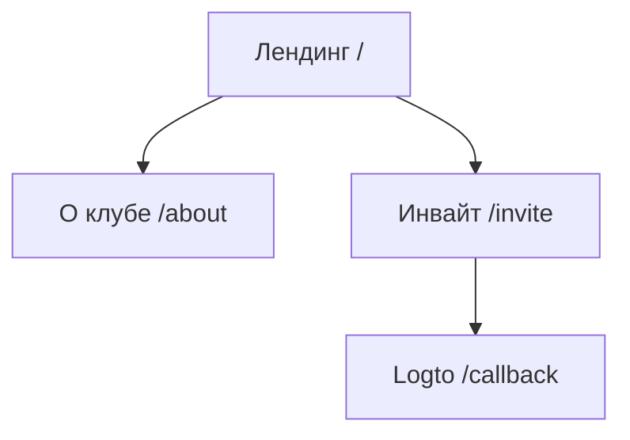
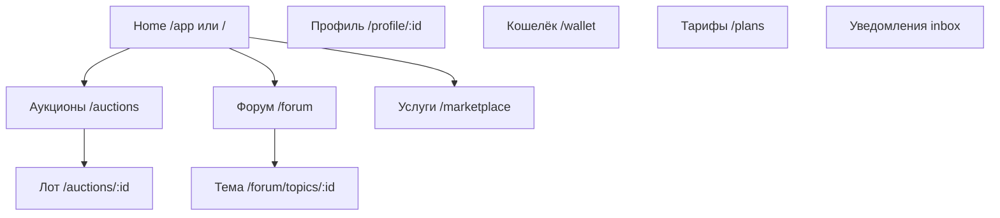

# 🗺️ Information Architecture

> **Статус:** spec ready · **Версия:** 0.3

## 🌐 Sitemap

### Public (Visitor — без member)

### Club SPA (Member — после redeem инвайта)

> Реализация: один SPA, router guard `requireMember` на club-ветке. См. [14-frontend](../14-frontend/README.md).

## 🧭 Global navigation

| Zone | Mobile | Desktop |
|------|--------|---------|
| Primary (member) | Bottom tab: Home, Auctions, Forum, Profile | Top nav + logo |
| Secondary | Hamburger: Wallet, Plans, Invites, Settings | User menu dropdown |
| Utility | Novu Inbox bell, balance chip | same |

**Visitor:** только лендинг + `/invite`; CTA «У меня есть инвайт».

**Member:** полная навигация; пункт **Invites** (выдача кодов) в user menu.

## 👤 Role-aware items

| Item | Visitor | Member | Moderator | Admin |
|------|---------|--------|-----------|-------|
| Club content | ❌ | ✅ | ✅ | ✅ |
| Create auction | — | ✅ | ✅ | ✅ |
| Issue invite | — | ✅ | ✅ | ✅ |
| Moderation queue | — | — | ✅ | ✅ |
| Admin tools link | — | — | — | ✅ (→ tools.*) |

Moderator UI — inline на контенте (не отдельное app v1).

## 🔀 Key flows → routes

| Flow | Route sequence |
|------|----------------|
| Join club | `/` → `/invite` → Logto → redeem → `/auctions` |
| Sell find | `/auctions/new` → `/auctions/:id` (live) |
| Buy / bid | `/auctions` → `/auctions/:id` → bid modal |
| Ask community | `/forum` → `/forum/new` → `/forum/topics/:id` |
| Invite friend | user menu → `/invites` → share code |
| Upgrade Pro | `/plans` → confirm → `/wallet` if low balance |
| Post-deal feedback | notification → `/feedback/:dealId` modal |
| Order service | `/marketplace` → `/marketplace/:id` → order |

## 📱 Breakpoints

| Name | Width | Layout notes |
|------|-------|--------------|
| `sm` | 640px | 2-col catalog |
| `md` | 768px | side filters visible |
| `lg` | 1024px | forum sidebar categories |
| `xl` | 1280px | max catalog width |

## 🔗 Связанные разделы

- [club-access.md](../01-goal/club-access.md)
- [wireframes](./wireframes/README.md)
- [14-frontend routes](../14-frontend/README.md#-маршруты)
- [platform-for-users](../01-goal/platform-for-users.md)

---

**Автор:** команда разработки · **Версия:** 0.3-spec
