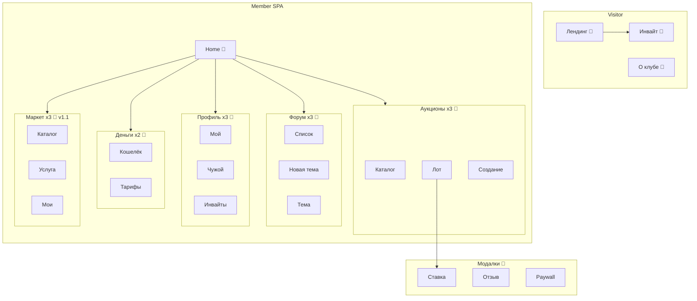

# 🌳 Дерево экранов (Screen Tree)

> **Статус:** spec ready · **Версия:** 0.2  
> **Назначение:** оценка **масштаба** UI — название, предназначение, **наличие wireframe**.  
> **Детали:** [wireframes](./wireframes/README.md) · **маршруты:** [14-frontend](../14-frontend/README.md#-маршруты) · **IA:** [information-architecture](./information-architecture.md)

**Легенда wireframe:** `📐 Wxx` — есть спека · `⬜` — пока нет

---

## 📊 Масштаб (сводка)

| Категория | Кол-во | MVP | Wireframes |
|-----------|--------|-----|------------|
| Публичные страницы (Visitor) | 4 | ✅ | 3 📐 · 1 ⬜ |
| Страницы клуба (Member) | 16 | 13 ✅ · 3 ⏳ v1.1 | 16 📐 |
| Оверлеи / модалки | 8 | 6 ✅ · 2 ⏳ | 7 📐 · 1 ⬜ |
| Admin / tools (отдельно) | 4+ | ⏳ post-MVP | 0 📐 |
| **Итого UX-единиц** | **~32** | **~23 на MVP** | **~26 / ~32** |

> Одна «UX-единица» = отдельный экран, full-page view или самостоятельный modal/drawer с собственным сценарием.

---

## 🌐 Tavrida Lot — дерево

```
Tavrida Lot (SPA + landing)
│
├─── 🚪 Публичная зона (Visitor, без member)
│    ├── Лендинг (/)
│    │     Входная точка клуба: hero, правила, CTA «У меня есть инвайт».     📐 W01
│    ├── О клубе (/about)
│    │     Статическое описание миссии, как попасть в клуб.                   📐 W12
│    ├── Инвайт (/invite)
│    │     Ввод кода приглашения перед/после Logto.                           📐 W11
│    └── OAuth callback (/callback)
│          Технический экран возврата из Logto (без UI или spinner).          ⬜
│
├─── 🏠 Клуб — главная и навигация
│    ├── Home — member (/)
│    │     Дашборд после входа: live-аукционы, teaser форума, баланс.         📐 W01
│    └── Центр уведомлений (Inbox, overlay)
│          Novu Inbox: push/email/in-app история (bell в header).             📐 W15
│
├─── 🔨 Аукционы
│    ├── Каталог лотов (/auctions)
│    │     Поиск и фильтры, сетка лотов, live/promoted badges.                📐 W02
│    ├── Страница лота (/auctions/:id)
│    │     Торги: галерея, таймер, ставки, экспертиза, WS.                     📐 W03
│    └── Создание лота (/auctions/new)
│          Мастер выставления находки на аукцион.                              📐 W04
│
├─── 🗣️ Форум
│    ├── Список тем (/forum, /forum/categories/:id)
│    │     Категории, сортировка, лента тем, FAB «новая тема».                  📐 W05
│    ├── Новая тема (/forum/new)
│    │     Создание темы с учётом лимитов тарифа.                             📐 W14
│    └── Страница темы (/forum/topics/:id)
│          Markdown-тело, комментарии, реакции, Pro-чат.                      📐 W06
│
├─── 👤 Профиль и социальное
│    ├── Мой профиль (/profile/me)
│    │     Редактирование, статистика, активность, heatmap.                   📐 W07
│    ├── Профиль участника (/profile/:userId)
│    │     Публичная визитка: рейтинг, сделки, форум; private note.           📐 W07
│    └── Инвайты (/invites)
│          Выдача и управление кодами приглашений (лимит FP).                 📐 W13
│
├─── 💳 Деньги и тариф
│    ├── Кошелёк (/wallet)
│    │     Баланс, пополнение, история операций.                              📐 W08
│    └── Тарифы (/plans)
│          Free / Basic / Pro, активация и автопродление.                     📐 W08
│
├─── 🛒 Маркет услуг (v1.1)
│    ├── Каталог услуг (/marketplace)                                         📐 W09 ⏳
│    │     Объявления поставщиков: реставрация, экспертиза и т.п.
│    ├── Страница услуги (/marketplace/:id)                                   📐 W09 ⏳
│    │     Портфолио, цена, заказ у поставщика.
│    └── Мои услуги (/marketplace/my-listings)                                📐 W09 ⏳
│          CRUD объявлений поставщика.
│
├─── 🧩 Оверлеи и модалки (не отдельные routes)
│    ├── Ставка на лот (modal)
│    │     Сумма, подтверждение, ошибки 402/403/429.                          📐 W03
│    ├── Отзыв после сделки (modal / drawer)
│    │     Чеклист сделки, звёзды, комментарий, фото.                         📐 W10
│    ├── Пополнение баланса (modal)
│    │     Выбор суммы, redirect на платёжку.                                 📐 W08
│    ├── Активация тарифа (modal)
│    │     Подтверждение списания с кошелька.                                 📐 W08
│    ├── Paywall Pro-фичи (modal)
│    │     Объяснение лимита + ссылка на /plans.                              📐 W16
│    ├── Платная реакция на форуме (modal)
│    │     Выбор реакции, confirm charge.                                     📐 W06*
│    ├── Заказ услуги (modal)                                                 📐 W09 ⏳
│    │     Согласование цены, создание order.
│    └── Интеграции / Webhooks (settings panel)
│          `/profile/integrations` — CRUD hooks, чекбоксы событий, журнал.   📐 W17
│
└─── 🛡️ Admin / moderator (inline + tools, post-MVP)
     ├── Очередь модерации (inline + queue TBD)                               ⬜
     │     Жалобы на контент, скрытие, ban на лоте.
     ├── Назначение модераторов / экспертов (admin)                           ⬜
     │     Keto mapping, scoped forum/auction.
     ├── Настройки платформы (admin-ui TBD)                                    ⬜
     │     settings, FP, registry — отдельное app или BFF /admin.
     └── Tools subdomain (*.tools.tavrida-lot.ru)                              ⬜
           Portainer, Grafana links — вне SPA.
```

> \* W06 — paid reaction описана в зонах страницы темы; отдельный modal ASCII — backlog.

---

## 📋 Таблица покрытия wireframes

| Экран | Route / тип | Wireframe | MVP |
|-------|-------------|-----------|-----|
| Лендинг | `/` | 📐 W01 | ✅ |
| О клубе | `/about` | 📐 W12 | ✅ |
| Инвайт | `/invite` | 📐 W11 | ✅ |
| OAuth callback | `/callback` | ⬜ | ✅ |
| Home member | `/` | 📐 W01 | ✅ |
| Inbox | overlay | 📐 W15 | ✅ |
| Каталог лотов | `/auctions` | 📐 W02 | ✅ |
| Страница лота | `/auctions/:id` | 📐 W03 | ✅ |
| Создание лота | `/auctions/new` | 📐 W04 | ✅ |
| Список тем | `/forum` | 📐 W05 | ✅ |
| Новая тема | `/forum/new` | 📐 W14 | ✅ |
| Страница темы | `/forum/topics/:id` | 📐 W06 | ✅ |
| Мой профиль | `/profile/me` | 📐 W07 | ✅ |
| Профиль участника | `/profile/:userId` | 📐 W07 | ✅ |
| Инвайты | `/invites` | 📐 W13 | ✅ |
| Кошелёк | `/wallet` | 📐 W08 | ✅ |
| Тарифы | `/plans` | 📐 W08 | ✅ |
| Маркет ×3 | `/marketplace…` | 📐 W09 | ⏳ |
| Modal ставка | overlay | 📐 W03 | ✅ |
| Modal отзыв | overlay | 📐 W10 | ✅ |
| Modal deposit / plan | overlay | 📐 W08 | ✅ |
| Paywall | overlay | 📐 W16 | ✅ |
| Paid reaction | overlay | 📐 W06* | ✅ |
| Order service | overlay | 📐 W09 | ⏳ |
| Webhooks / интеграции | `/profile/integrations` | 📐 W17 | ⏳ Basic+ |
| Admin ×4 | various | ⬜ | ⏳ |

---

## 🗺️ Mermaid (обзор)



---

## 🔗 Связь с wireframes

| Wireframe | Экраны в дереве |
|-----------|-----------------|
| W01 | Лендинг, Home member |
| W02–W04 | Каталог, лот, создание (+ modal ставки) |
| W05–W06, W14 | Список, новая тема, тема (+ paid reaction) |
| W07 | Мой / чужой профиль |
| W08 | Кошелёк, тарифы (+ deposit/activate modals) |
| W09 | Маркет ×3 (+ order modal) |
| W10 | Отзыв modal |
| W11–W13 | Инвайт, о клубе, управление инвайтами |
| W15–W16 | Inbox, Paywall |

---

## 📎 Связанные разделы

- [platform-for-users](../01-goal/platform-for-users.md)
- [wireframes/TEMPLATE.md](./wireframes/TEMPLATE.md)
- [DOCS-ROADMAP](../00-meta/DOCS-ROADMAP.md)

---

**Автор:** команда разработки · **Версия:** 0.2-spec
