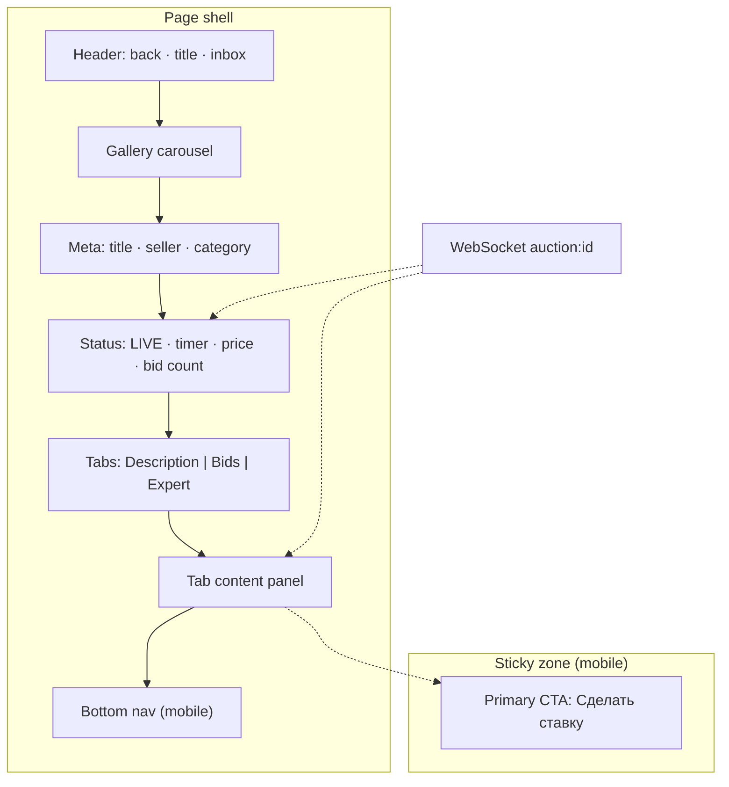

# 🧪 Format Lab — W03 Страница лота

> **Экран:** W03 · **Route:** `/auctions/:id`  
> **Цель:** один и тот же экран в **5 форматах** wireframe — выбрать глобальный стандарт для остальных W01–W10.

**Продукт:** [platform-for-users](../../01-goal/platform-for-users.md) · **Токены:** [design-tokens](../design-tokens.md) · **Текущий W03:** [auctions.md#страница-лота](./auctions.md#страница-лота)

---

## 📋 Содержание экрана (общее для всех форматов)


| Зона        | Элементы                                       | Поведение                |
| ----------- | ---------------------------------------------- | ------------------------ |
| Header      | Назад, share (optional), inbox bell            | Inbox → `/notifications` |
| Gallery     | Swipe 1–N фото                                 | MinIO CDN, pinch-zoom v2 |
| Meta        | Title, seller chip (avatar + rating), category | → `/profile/:sellerId`   |
| Status bar  | Timer, current price, bid count, Live badge    | WS + countdown `endsAt`  |
| Primary CTA | «Сделать ставку» sticky (mobile)               | Modal → `POST …/bids`    |
| Tabs        | Описание                                       | Ставки                   |
| Bid list    | Table/list, WS `bid.placed`                    | Realtime prepend         |
| Owner strip | Edit / Promote / Cancel                        | Only `sellerId === me`   |
| Pro block   | «Обсуждение лота → forum»                      | Paywall if not Pro       |
| Footer nav  | Bottom tabs (mobile)                           | IA global                |


**States:** loading skeleton · active · ending soon (<1h) · ended · error (403/402/429)

**API:** `GET /api/v1/auctions/:id` · `GET …/bids` · WS `auction:{id}`

---


## A · ASCII box (текущий стандарт)

> **Плюсы:** diff-friendly, быстро в Markdown, не нужны инструменты.  
> **Минусы:** слабая иерархия, нет responsive-колонок.

```
┌─────────────────────────────────────┐
│ ← Lot #1842              🔔         │
├─────────────────────────────────────┤
│ ┌─────────────────────────────────┐ │
│ │         [ Gallery swipe ]       │ │
│ │              ● ○ ○              │ │
│ └─────────────────────────────────┘ │
│ Серебряный денarius · III в.        │
│ 👤 seller42  ★4.8  ·  Античность    │
├─────────────────────────────────────┤
│ 🔴 LIVE    ⏱ 02:14:33               │
│ Текущая ставка        1 500 ₽       │
│ 12 ставок                           │
├─────────────────────────────────────┤
│ [ Описание ] [ Ставки ] [ Эксперт ] │
│ ─────────────────────────────────── │
│  (tab content area)                 │
│  …                                  │
├─────────────────────────────────────┤
│ ░░░░░░░░░░░░░░░░░░░░░░░░░░░░░░░░░░  │
│ [      Сделать ставку  1 550 ₽   ]  │  ← sticky mobile
└─────────────────────────────────────┘
│ Home │ Auctions │ Forum │ Profile   │  bottom nav
└─────────────────────────────────────┘
```

---


## B · Mermaid block layout

> **Плюсы:** рендер на GitHub Pages / VitePress, видна композиция.  
> **Минусы:** mermaid иногда ломается в CI; сложные sticky не передать.




---


## C · Component tree (ID + hierarchy)

> **Плюсы:** 1:1 с Vue-компонентами и Storybook; удобно для dev handoff.  
> **Минусы:** PM/дизайнеру тяжелее «увидеть» экран без preview.

```yaml
LotPage (W03):
  - AppHeader
      backLink: /auctions
      actions: [NotificationBell]
  - LotGallery
      props: { images[], auctionId }
      a11y: aria-label "Фото лота"
  - LotHeader
      - LotTitle
      - SellerChip → ProfileLink
      - CategoryBadge
  - LotStatusBar
      - LiveBadge (if ACTIVE)
      - CountdownTimer → endsAt
      - CurrentPrice
      - BidCount
      - BidStep
  - LotTabs
      - TabPanel "description" → LotDescription
      - TabPanel "bids" → BidHistoryList (WS)
      - TabPanel "expert" → ExpertAppraisalList
  - LotOwnerActions (v-if owner)
      - EditButton | PromoteButton | CancelButton
  - ForumLinkBlock (v-if plan.forum.auctionTopicLink)
  - StickyBidBar (mobile)
      - BidButton → BidModal
  - AppBottomNav
```


| Component ID     | Props / data | API / WS                       |
| ---------------- | ------------ | ------------------------------ |
| `LotPage`        | `auctionId`  | `GET /auctions/:id`            |
| `BidHistoryList` | `auctionId`  | `GET …/bids` + WS `bid.placed` |
| `BidModal`       | `minNextBid` | `POST …/bids`                  |
| `CountdownTimer` | `endsAt`     | sync on `auction.ended`        |


---


## D · Zone spec matrix (annotation table)

> **Плюсы:** полное покрытие states/errors/API; QA и docs.  
> **Минусы:** нет визуала «с первого взгляда».


| Zone ID | Component     | Desktop             | Mobile            | States                      | API / WS                     |
| ------- | ------------- | ------------------- | ----------------- | --------------------------- | ---------------------------- |
| Z1      | Header        | inline top          | inline top        | default                     | —                            |
| Z2      | Gallery       | 16:9 left 50%       | full width swipe  | empty-img error             | CDN urls from auction        |
| Z3      | Meta block    | beside gallery      | under gallery     | seller banned → badge       | `sellerId`, rating aggregate |
| Z4      | Status        | row                 | stacked           | LIVE / ending / ended       | WS + `endsAt`                |
| Z5      | Tabs          | horizontal          | horizontal scroll | lazy per tab                | tab APIs                     |
| Z5a     | Bids tab      | table               | cards             | empty "нет ставок"          | `GET bids`, WS               |
| Z6      | Sticky CTA    | inline under status | fixed bottom      | disabled if ended / own lot | `POST bid`                   |
| Z7      | Owner actions | toolbar             | overflow menu     | DRAFT vs ACTIVE             | PATCH, promote               |
| Z8      | Bottom nav    | hidden              | fixed             | —                           | router                       |


| Error | UI                                |
| ----- | --------------------------------- |
| 402   | Banner + link `/wallet`           |
| 403   | «Недоступно» + reason (ban/limit) |
| 429   | Toast + retry after N sec         |


---


## E · HTML gray-box (browser preview)

> **Плюсы:** ближе к ощущению реального UI; можно кликать табы (demo).  
> **Минусы:** второй артеfact (файл); не в diff Markdown.

**Файл:** [W03-lot-page.html](./W03-lot-page.html) — открыть в Cursor/VS Code и нажать **Show Preview** (иконка в правом верхнем углу редактора, как у Markdown).

### Preview HTML в редакторе

1. Установить расширение **[Live Preview](https://marketplace.visualstudio.com/items?itemName=ms-vscode.live-server)** (`ms-vscode.live-server`) — Cursor предложит его из `.vscode/extensions.json`.
2. Открыть `.html` wireframe → **Show Preview** / **Show Preview to the Side**.
3. Обновление: `livePreview.autoRefreshPreview` = при изменении файла (см. `.vscode/settings.json`).

Альтернатива без расширения: `xdg-open W03-lot-page.html` или перетащить файл в браузер.

---


## ⚖️ Сравнение форматов


| Критерий           | A ASCII | B Mermaid | C Tree | D Matrix | E HTML    |
| ------------------ | ------- | --------- | ------ | -------- | --------- |
| Скорость написания | ★★★★★   | ★★★       | ★★★★   | ★★       | ★★        |
| Diff / git review  | ★★★★★   | ★★★       | ★★★★   | ★★★★     | ★★        |
| VitePress / Pages  | ★★★★    | ★★★★      | ★★★★★  | ★★★★★    | ★★ (link) |
| Handoff → Vue      | ★★      | ★★        | ★★★★★  | ★★★★     | ★★★★      |
| PM / stakeholder   | ★★★     | ★★★★      | ★★     | ★★★      | ★★★★★     |
| States & errors    | ★★      | ★         | ★★★    | ★★★★★    | ★★★       |


### Рекомендация (draft)

**Гибрид по умолчанию:**

1. **A ASCII** — первый набросок экрана в PR (5 минут).
2. **C Component tree** — обязательный блок для MVP-экранов (связь с `@tavrida/ui`).
3. **D Matrix** — для экранов с оплатой, WS, ролями (W03, W08, W10).
4. **E HTML** — только ключевые экраны (W01, W03, W06) как reference preview.
5. **B Mermaid** — опционально в architecture/IA, не дублировать на каждый экран.

---


## ✅ Выбор (зафиксировано 2026-07-09)

**Глобально для W01–W10:** Содержание экрана + **A ASCII** + **C Component tree**.

| Формат | Глобально |
|--------|-----------|
| Содержание экрана | ✅ |
| A ASCII | ✅ |
| C Component tree | ✅ |
| B Mermaid | ❌ |
| D Zone matrix | ❌ |
| E HTML gray-box | ❌ (остался в lab) |

Шаблон: [../TEMPLATE.md](../TEMPLATE.md) · индекс: [../README.md](../README.md)

---

**Автор:** команда разработки · **Версия:** 0.1-lab