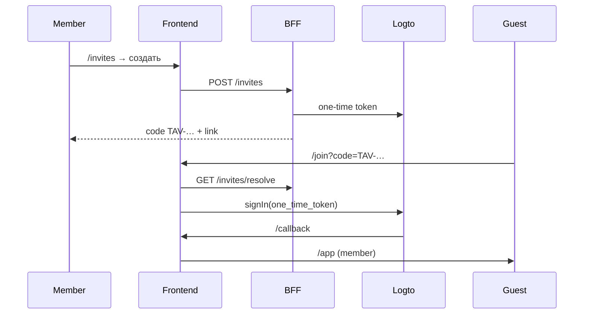

# Logto — настройка (Cloud / OSS / Swarm)

> **Статус:** local — `logto.local.yml` · **dev Swarm — OSS** (`auth.` / `logto.` на `evatorg.su`) · Cloud — опционально.  
> **Модель доступа:** [ADR-012](../03-architecture/adr/012-club-invite-via-logto.md) · [club-access.md](../01-goal/club-access.md)

## Кратко

| | |
|---|---|
| **Member** | Любой пользователь с JWT Logto нашего tenant |
| **Инвайт** | Magic link / код `TAV-…` → регистрация нового пользователя (sign-up выключен) + реферал |
| **Visitor** | Не вошёл — лендинг, `/join` |

Без Logto env фронт работает в **dev/mock** (`signInDev`).

| Среда | Endpoint | Management API resource |
|-------|----------|-------------------------|
| Local compose | `http://localhost:3301` | `https://default.logto.app/api` |
| **Dev Swarm OSS** | `https://auth.evatorg.su` | `https://default.logto.app/api` |
| Logto Cloud | `https://<tenant>.logto.app` | `https://<tenant>.logto.app/api` |

---

## 1. Dev Swarm — Logto OSS

Стек: `logto` + `logto-db-init` в [stack-infra.dev.yml](../../docker/swarm/stack-infra.dev.yml).  
Чеклист DNS / Console / GH vars: [dev-evatorg.md](../04-deployment/dev-evatorg.md).

```env
LOGTO_ENDPOINT=https://auth.evatorg.su
LOGTO_JWKS_URL=https://auth.evatorg.su/oidc/jwks
LOGTO_AUDIENCE=https://api.evatorg.su
LOGTO_M2M_RESOURCE=https://default.logto.app/api
VITE_LOGTO_ENDPOINT=https://auth.evatorg.su
VITE_LOGTO_APP_ID=<spa-id>
VITE_LOGTO_API_RESOURCE=https://api.evatorg.su
```

Admin: `https://logto.evatorg.su`. После смены endpoint — **rebuild** frontend (`VITE_*` bake-in).

### Branding (Sign-in experience)

Console: **Sign-in & account → Branding** (или скрипт ниже).

| Поле | Значение |
|------|----------|
| Brand color (light) | `#1F7A6E` (patina) |
| Brand color (dark) | `#3D9B8E` |
| Logo / favicon | `https://app.evatorg.su/branding/tavrida-wordmark.svg` |
| Custom CSS | файл [`docker/config/logto/tavrida-sign-in.css`](../../docker/config/logto/tavrida-sign-in.css) |

```bash
# M2M + LOGTO_ENDPOINT в .env.local (или env); FRONTEND_ORIGIN=https://app.evatorg.su
pnpm setup:logto-branding
# DRY_RUN=1 pnpm setup:logto-branding   # только посмотреть payload
```

Скрипт: `PATCH /api/sign-in-exp` (цвет + logoUrl + customCss). После деплоя frontend wordmark должен быть доступен по URL выше.

Вручную: вставь CSS из файла в **Custom CSS**, сохрани, **Live preview**.

---

## 2. Logto Cloud (опционально)

1. [cloud.logto.io](https://cloud.logto.io) → tenant.
2. **Sign-in experience** → **Disable user registration** — включайте для invite-only (`club.registration.inviteOnly=true`).  
   Если в админке сняли галочку inviteOnly, **снимите и этот флаг в Logto** — иначе «Зарегистрироваться» откроет форму входа.
3. **Applications → Single page app → Vue** (first-party, не Third-party).
4. Redirect URIs:

| Поле | Local dev | Dev Swarm |
|------|-----------|-----------|
| Redirect | `http://localhost:5173/callback` | `https://app.evatorg.su/callback` |
| Sign-out | `http://localhost:5173/` | `https://app.evatorg.su/` |
| CORS | `http://localhost:5173` | `https://app.evatorg.su` |
| **Unknown session redirect URL** (Advanced) | `http://localhost:5173/auth/unknown-session` | `https://app.evatorg.su/auth/unknown-session` |

5. **M2M app** (для BFF): Machine-to-machine → роль с **Logto Management API** permission `all` → scopes `one-time-tokens` (если доступны).

   Resource indicator для token request:
   - **Cloud:** `https://<tenant>.logto.app/api` (тот же tenant, что в `LOGTO_ENDPOINT`)
   - **OSS:** `https://default.logto.app/api`
6. **API Resource** (нужен для BFF JWT с `aud`) — создайте resource и назначьте SPA:

| Поле | Local / Swarm |
|------|----------------|
| API identifier | `https://api.tavrida-lot.localhost` или `https://api.evatorg.su` |
| Permissions | назначить SPA-приложению |

> `VITE_LOGTO_API_RESOURCE` должен **точно** совпадать с `LOGTO_AUDIENCE` на BFF.
> Когда resource задан, фронт добавляет его в `LogtoConfig.resources` и больше
> не подставляет ID token (у ID token `aud` = client id → BFF всегда ответит 401).
> После смены resource / первого включения — **выйдите и войдите снова**.

```env
VITE_LOGTO_ENDPOINT=https://<tenant>.logto.app
VITE_LOGTO_APP_ID=<app-id>
VITE_LOGTO_API_RESOURCE=https://api.tavrida-lot.localhost
```

```bash
pnpm check:logto
pnpm --filter @tavrida/frontend dev
```

Если API Resource ещё не создан в Console — **не** задавайте `VITE_LOGTO_API_RESOURCE`
и либо временно `BFF_ALLOW_DEV_TOKENS=true`, либо отложите JWKS audience check.

---

## 3. Local compose OSS

```bash
docker compose -f docker/compose/logto.local.yml up -d
# Admin http://localhost:3302 · OIDC http://localhost:3301
```

---

## 4. Поток invite (новая модель)



- **Существующий пользователь Logto** — «Войти» на лендинге, без инвайта.
- **Новый пользователь** — только по `/join` (код или ссылка).

---

## 5. Код во фронте

| Файл | Роль |
|------|------|
| `src/config/logto.ts` | env, redirect URIs |
| `src/composables/useAuth.ts` | `signIn`, `signInWithInvite` |
| `src/views/public/JoinView.vue` | код / ссылка → Logto |
| `src/views/member/InvitesView.vue` | выдача приглашений |
| `src/services/invite.ts` | mock → BFF contract |

---

## 6. BFF (целевой контракт)

Полный контракт: [bff/invites-api.md](../05-microservices/bff/invites-api.md).

```http
POST /api/v1/invites
GET  /api/v1/invites/resolve?code=
POST /api/v1/invites/claim
```

BFF внутри: Logto Management API `POST /api/one-time-tokens`, сохранение `code → token, inviterId` в `user-profile`.

---

## 7. Webhooks → user-profile

Идентичность пользователя (имя, email, аватар) синхронизируется в **user-profile** через Logto Webhooks.

| | |
|---|---|
| Endpoint | `POST /api/v1/webhooks/logto` (BFF, без JWT) |
| События | `User.Created`, `PostRegister`, `User.Data.Updated`, `User.Deleted`, `User.SuspensionStatus.Updated` |
| Env | `LOGTO_WEBHOOK_SIGNING_KEY` |
| Backfill | `pnpm sync:logto-users` |
| Настройка hook | `pnpm setup:logto-webhook` |

Полная инструкция: [logto-webhooks.md](./logto-webhooks.md).

---

## 8. Troubleshooting

| Симптом | Решение |
|---------|---------|
| `Error found in the callback URI` | Logto вернул `?error=` — часто API resource в sign-in до создания в Console; сейчас `resources` убраны из config |
| 404 / unknown session на странице Logto | Прямой заход на `/sign-in`, истёкшая сессия — настроить **Unknown session redirect URL**: `http://localhost:5173/auth/unknown-session` |
| `invalid_scope` | Убрать лишние scopes в `logto.ts` или whitelist в Console |
| `invalid_client` | Redirect URI / CORS не совпадают с Console |

См. также предыдущие разделы про `RouterView` в layouts.

---

## Связанные документы

- [club-access.md](../01-goal/club-access.md)
- [logto-webhooks.md](./logto-webhooks.md)
- [frontend README](./README.md)
