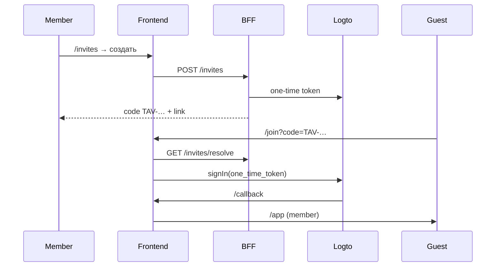

# Logto — настройка (Cloud → self-host)

> **Статус:** Cloud (SaaS) для dev/staging · self-host — позже с тем же env-контрактом.  
> **Модель доступа:** [ADR-012](../03-architecture/adr/012-club-invite-via-logto.md) · [club-access.md](../01-goal/club-access.md)

## Кратко

| | |
|---|---|
| **Member** | Любой пользователь с JWT Logto нашего tenant |
| **Инвайт** | Magic link / код `TAV-…` → регистрация нового пользователя (sign-up выключен) + реферал |
| **Visitor** | Не вошёл — лендинг, `/join` |

Без Logto env фронт работает в **dev/mock** (`signInDev`).

---

## 1. Logto Cloud

1. [cloud.logto.io](https://cloud.logto.io) → tenant.
2. **Sign-in experience** → **Disable user registration** — включайте для invite-only (`club.registration.inviteOnly=true`).  
   Если в админке сняли галочку inviteOnly, **снимите и этот флаг в Logto** — иначе «Зарегистрироваться» откроет форму входа.
3. **Applications → Single page app → Vue** (first-party, не Third-party).
4. Redirect URIs:

| Поле | Local dev |
|------|-----------|
| Redirect | `http://localhost:5173/callback` |
| Sign-out | `http://localhost:5173/` |
| CORS | `http://localhost:5173` |
| **Unknown session redirect URL** (Advanced) | `http://localhost:5173/auth/unknown-session` |

5. **M2M app** (для BFF): Machine-to-machine → роль с **Logto Management API** permission `all` → scopes `one-time-tokens` (если доступны).

   Resource indicator для token request:
   - **Cloud:** `https://<tenant>.logto.app/api` (тот же tenant, что в `LOGTO_ENDPOINT`)
   - **OSS:** `https://default.logto.app/api`
6. **API Resource** (опционально, для JWT с `aud` API) — **не нужен** для первого входа; локально BFF принимает ID token.

| Поле | Local dev |
|------|-----------|
| API identifier | `https://api.tavrida-lot.localhost` |
| Permissions | назначить SPA-приложению |

> Не добавляйте `resources` в `createLogtoConfig()` до создания resource в Console — иначе callback вернёт `Error found in the callback URI`.

```env
VITE_LOGTO_ENDPOINT=https://<tenant>.logto.app
VITE_LOGTO_APP_ID=<app-id>
VITE_LOGTO_API_RESOURCE=https://api.tavrida-lot.localhost
```

```bash
pnpm check:logto
pnpm --filter @tavrida/frontend dev
```

---

## 2. Поток invite (новая модель)



- **Существующий пользователь Logto** — «Войти» на лендинге, без инвайта.
- **Новый пользователь** — только по `/join` (код или ссылка).

---

## 3. Код во фронте

| Файл | Роль |
|------|------|
| `src/config/logto.ts` | env, redirect URIs |
| `src/composables/useAuth.ts` | `signIn`, `signInWithInvite` |
| `src/views/public/JoinView.vue` | код / ссылка → Logto |
| `src/views/member/InvitesView.vue` | выдача приглашений |
| `src/services/invite.ts` | mock → BFF contract |

---

## 4. BFF (целевой контракт)

Полный контракт: [bff/invites-api.md](../05-microservices/bff/invites-api.md).

```http
POST /api/v1/invites
GET  /api/v1/invites/resolve?code=
POST /api/v1/invites/claim
```

BFF внутри: Logto Management API `POST /api/one-time-tokens`, сохранение `code → token, inviterId` в `user-profile`.

---

## 5. Troubleshooting

| Симптом | Решение |
|---------|---------|
| `Error found in the callback URI` | Logto вернул `?error=` — часто API resource в sign-in до создания в Console; сейчас `resources` убраны из config |
| 404 / unknown session на странице Logto | Прямой заход на `/sign-in`, истёкшая сессия — настроить **Unknown session redirect URL**: `http://localhost:5173/auth/unknown-session` |
| `invalid_scope` | Убрать лишние scopes в `logto.ts` или whitelist в Console |
| `invalid_client` | Redirect URI / CORS не совпадают с Console |

См. также предыдущие разделы про `RouterView` в layouts.

---

## Связанные документы

- [club-access.md](../01-goal/club-access.md)
- [frontend README](./README.md)
