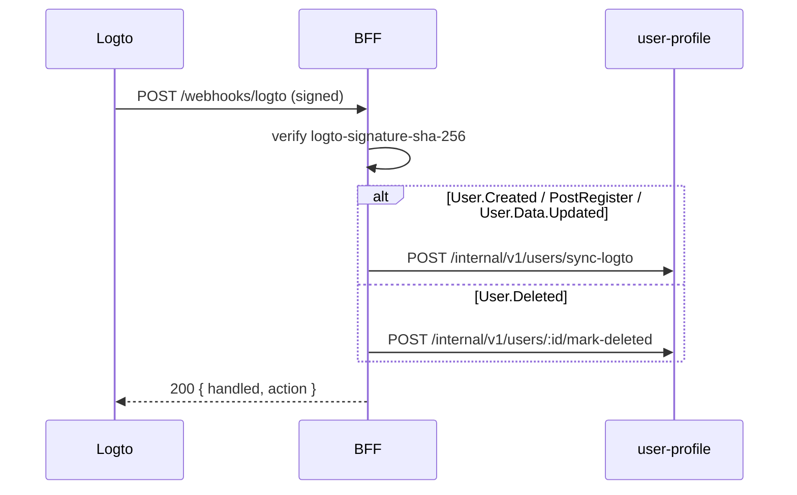

# Logto Webhooks → user-profile

> **Статус:** implemented (scaffold) · **BFF endpoint:** `POST /api/v1/webhooks/logto`

Logto — source of truth для идентичности (имя, email, аватар). **user-profile** хранит локальную копию для списков, админки и агрегации на BFF.

## События

| Logto event | Действие BFF → user-profile |
|-------------|----------------------------|
| `User.Created` | `POST /internal/v1/users/sync-logto` |
| `PostRegister` | то же (sign-up через Experience API) |
| `User.Data.Updated` | sync (email, avatar, name, …) |
| `User.SuspensionStatus.Updated` | sync `isSuspended` |
| `User.Deleted` | `POST /internal/v1/users/:id/mark-deleted` (soft delete) |

## Поля в `user_profile.user_profile`

| Поле | Источник Logto |
|------|----------------|
| `userId` | `id` / JWT `sub` |
| `displayName` | `name` → fallback `username` |
| `email` | `primaryEmail` |
| `username` | `username` |
| `avatarUrl` | `avatar` |
| `primaryPhone` | `primaryPhone` |
| `isSuspended` | `isSuspended` |
| `logtoSyncedAt` | время последнего webhook/backfill |
| `deletedAt` | `User.Deleted` |

Реферал (`inviterId`, `invitationAcceptedAt`) по-прежнему через `POST /invites/claim`, не через webhook.

## Настройка в Logto Console

1. **Console → Webhooks → Create webhook**
2. **Endpoint URL** — публичный URL BFF:
   - prod: `https://api.<domain>/api/v1/webhooks/logto`
   - local: туннель (ngrok / cloudflared) → `https://<tunnel>/api/v1/webhooks/logto`
3. **Events** — отметить:
   - `User.Created`
   - `PostRegister`
   - `User.Data.Updated`
   - `User.Deleted`
   - `User.SuspensionStatus.Updated`
4. Скопировать **Signing key** → `.env.local`:

```env
LOGTO_WEBHOOK_SIGNING_KEY=<signing-key-from-console>
```

5. Перезапустить BFF.

### CLI (Management API)

```bash
# Публичный URL, куда Logto шлёт POST (через туннель для local)
export LOGTO_WEBHOOK_ENDPOINT_URL=https://<tunnel>/api/v1/webhooks/logto
pnpm setup:logto-webhook
# → печатает LOGTO_WEBHOOK_SIGNING_KEY для .env.local
```

## Backfill существующих пользователей

До включения webhook или для разовой синхронизации:

```bash
pnpm sync:logto-users
```

Скрипт: Logto `GET /api/users` → `user-profile` `sync-logto` для каждого.

Дополнительно без скрипта:

- SPA после логина: `POST /api/v1/me/identity` (claims/userinfo → user-profile)
- BFF forum enrich: если в профиле пусто name/avatar — lazy backfill через Logto Management `GET /api/users/{id}` (нужен M2M)

## Безопасность

- Заголовок `logto-signature-sha-256` — HMAC-SHA256 hex от **raw body**
- BFF: `LOGTO_WEBHOOK_SIGNING_KEY`; в `production` без ключа endpoint отклоняет запросы
- В `development` без ключа проверка отключена (удобно для локальной отладки)

См. [Logto — Secure webhooks](https://docs.logto.io/developers/webhooks/secure-webhooks).

## Поток



## Связанные документы

- [logto-setup.md](./logto-setup.md)
- [user-profile README](../05-microservices/user-profile/README.md)
- [bff README](../05-microservices/bff/README.md)
- [ADR-012](../03-architecture/adr/012-club-invite-via-logto.md)
